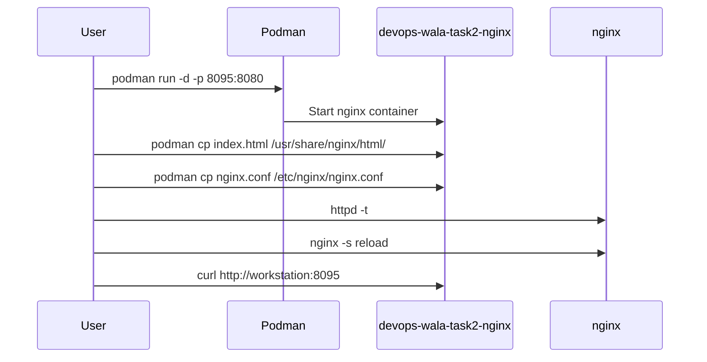

# 🚀 Task 2 — Run NGINX, Copy HTML and Config, Reload nginx
## 🎯 Prepare the lab for this question.
```
mkdir -p /home/student/task2-nginx

cat <<EOF > /home/student/task2-nginx/index.html
Welcome to https://devops-wala.com Website for task2-nginx.
EOF

podman run --rm \
  registry.ocp4.example.com:8443/redhattraining/podman-nginx-helloworld \
  cat /etc/nginx/nginx.conf > /home/student/task2-nginx/nginx.conf
sed -i 's-/usr/share/nginx/html/public-/usr/share/nginx/html/-' /home/student/task2-nginx/nginx.conf
```

## Requirement Summary

### Task: Start a container with these parameters:

- ➡️ Image: `registry.ocp4.example.com:8443/redhattraining/podman-nginx-helloworld`
- ➡️ Container name: `devops-wala-task2-nginx` and the container must be **running** state.
- ➡️ Detached mode
- ➡️ Host port `8095` mapped to container port `8080`
- ➡️ Copy `/home/student/task2-nginx/index.html` into the container as `/usr/share/nginx/html/`
- ➡️ Copy `/home/student/task2-nginx/nginx.conf` to `/etc/nginx/nginx.conf`
- ➡️ Execute `nginx -s reload` inside the running container


## Process Graphic



## 👨‍💻 Explanation

This task is different from Task 1 because files are copied **inside** the container using `podman cp`. After copying the nginx configuration file, nginx must be reloaded so that it reads the new configuration.

- `nginx -t` checks if the configuration syntax is valid.
- `nginx -s reload` reloads nginx without stopping the container.
- The container persists because we do not use `--rm`.

### ➡️ Step 1 — Pull Image (This step is not necessary as the image will be downloaded if it is not found locally.)

### ✅ Before that, we must login into the Registry.
```
podman login -u developer -p developer registry.ocp4.example.com:8443
```

```bash
podman images
podman pull registry.ocp4.example.com:8443/redhattraining/podman-nginx-helloworld
podman images
```

### ➡️ Step 2 — Run Container Detached

```bash
podman run -d \
  --name devops-wala-task2-nginx \
  -p 8095:8080 \
  registry.ocp4.example.com:8443/redhattraining/podman-nginx-helloworld
```

### ➡️ Step 3 — Verify Default nginx Page. One can observe the port 8080 is Listen by default. 

```bash
podman ps
```
```
curl http://workstation:8095
```

You should see the default nginx welcome page.

### ➡️ Step 4 Copy HTML Directory into Container

```
podman cp /home/student/task2-nginx/index.html \
  devops-wala-task2-nginx:/usr/share/nginx/html/index.html
```

### ➡️ Step 5 — Copy nginx Configuration File

```bash
podman cp /home/student/task2-nginx/nginx.conf \
  devops-wala-task2-nginx:/etc/nginx/nginx.conf
```

### ➡️ Step 6 — 🧩 Validate and Reload nginx

```bash
podman exec devops-wala-task2-nginx nginx -t
podman exec devops-wala-task2-nginx nginx -s reload
```

### ➡️ Step 7  ✅ Test Updated Page ✅

```bash
curl http://workstation:8095
```

## ✅ Expected message: 

```text
Welcome to https://devops-wala.com Website for task2-nginx.
```

## ✅✅ Useful Verification Commands

```bash
podman exec devops-wala-task2-nginx ls -l /usr/share/nginx/html/
podman exec devops-wala-task2-nginx cat /etc/nginx/nginx.conf
podman logs devops-wala-task2-nginx
podman inspect devops-wala-task2-nginx
```

## Post checks
```bash
podman inspect devops-wala-task2-nginx |  if [[ $? -eq 0 ]]; then     echo "container created OK"; else     echo "Mentioned container is not created"; fi
```
```
podman inspect devops-wala-task2-nginx | grep "8095:8080" |  if [[ $? -eq 0 ]]; then echo "Port is bind OK"; else echo "Port is not correctly bind"; fi
```
```
curl http://workstation:8095 2> 1 /devnull | grep "Welcome to https://devops-wala.com Website for task2-nginx."  |  if [[ $? -eq 0 ]]; then echo "Webpage is load the correct content OK"; else echo "Webpage is not load the correct content"; fi
```
---


