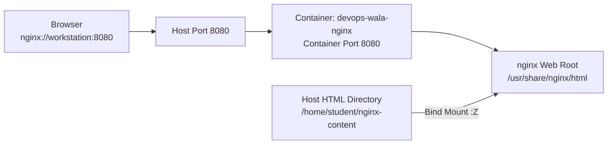

🚀 # Run an NGINX Container with Live HTML Bind Mount
---
## 🎯 Prepare the lab for this question.
```
mkdir -p /home/student/nginx-content
cat <<EOF > /home/student/nginx-content/index.html
Welcome to https://devops-wala.com Website, task1-nginx.
EOF
```

## Task: Create an nginx container with the following requirements:

- ➡️ Image: **`registry.ocp4.example.com:8443/redhattraining/podman-nginx-helloworld`**
- ➡️ Container name: **`devops-wala-nginxd`** and it container must be **running** state.
- ➡️ Container port **`8080`** mapped to host/external port **`8080`**
- ➡️ Container must serve the current **`index.html`** from the host directory **`/home/student/nginx-content`** to container folder **`/usr/share/nginx/html/public`**
- ➡️ The page must be accessible at: **`http://workstation:8080`**
- ➡️ Updates the below content to the host **`index.html`** must reflect to container (without restarting the nginxd service or container)
	-	➡️➡️➡️ **`Live update test from host`**

## Architecture Graphic



## 👨‍💻 Explanation

NGINX serves web pages from its internal web root directory. In most nginx images, the default web root is: **`/usr/share/nginx/html`**

To make changes visible immediately, use a **bind mount**. A bind mount connects a host directory directly to a container directory. When the host file changes, the container sees the change instantly.

## 👨‍💻➡️ Solution

### ➡️ Step 1 — Pull and Verify Image

### Before that, we must login into the Registry.
```
podman login -u developer -p developer registry.ocp4.example.com:8443
```
```bash
podman images
podman pull registry.ocp4.example.com:8443/redhattraining/podman-nginx-helloworld
podman images
```

### ➡️ Step 2 — Check SELinux context?
On SELinux-enabled systems, containers may not be allowed to read normal host directories. The `:Z` option in the volume mount relabels the directory for private container access.

```bash
ls -ltr /home/student
ls -Zd /home/student
```
The Breakdown of the Current StateStrict Unix Permissions (drwx------): 

Only the user student can read, write, or enter this directory. 

If a container runs as a different internal user (like nginx or www-data), it will face a Permission Denied error at the OS level.

SELinux Label (user_home_dir_t): This label blocks container runtimes from accessing the folder. 

SELinux will block the container even if Unix permissions are open.

The Best FixesYou can resolve this depending on your specific use case:Use the :Z flag (Recommended)If you append :Z to your volume mount, the container engine automatically changes the SELinux label to `container_file_t`.


### ➡️ Step 3 — Run the Container

```bash
podman run -d \
  --name devops-wala-nginxd \
  -p 8080:8080 \
  -v /home/student/nginx-content:/usr/share/nginx/html/public:Z \
  registry.ocp4.example.com:8443/redhattraining/podman-nginx-helloworld
```

### ➡️ Step 4  🧩 Verify Container

```bash
podman ps
```

### One can check the Root directory and Listen port number.
```
podman exec devops-wala-nginxd cat /etc/nginx/nginx.conf | egrep -i "root|listen"
```

### ➡️ Step 5 — ✅ Test Web Page ✅

```bash
curl http://localhost:8080
```
### From node name. It should result the same output
```
curl http://workstation:8080
```

Or open in browser:

```text
http://workstation:8080
```

### ➡️ Step 6 — ✅ Confirm Live Update Works ✅

```bash
echo "Live update test from host" >> /home/student/nginx-content/index.html
```
```
curl http://workstation:8080
```

## ✅ If the updated text appears, the bind mount is working correctly.

---
### Post Checks.
```bash
podman inspect devops-wala-nginxd |  if [[ $? -eq 0 ]]; then     echo "container created OK"; else     echo "Mentioned container is not created"; fi
```
```
podman inspect devops-wala-nginxd | grep "/home/student/nginx-content:/usr/share/nginx/html/public:Z"  | if [[ $? -eq 0 ]]; then     echo "volume mount OK"; else     echo "Volume is not mounted correctly"; fi
```
```
podman inspect devops-wala-nginxd | grep 8080 |  if [[ $? -eq 0 ]]; then echo "Port is bind OK"; else echo "Port is not correctly bind"; fi
```
