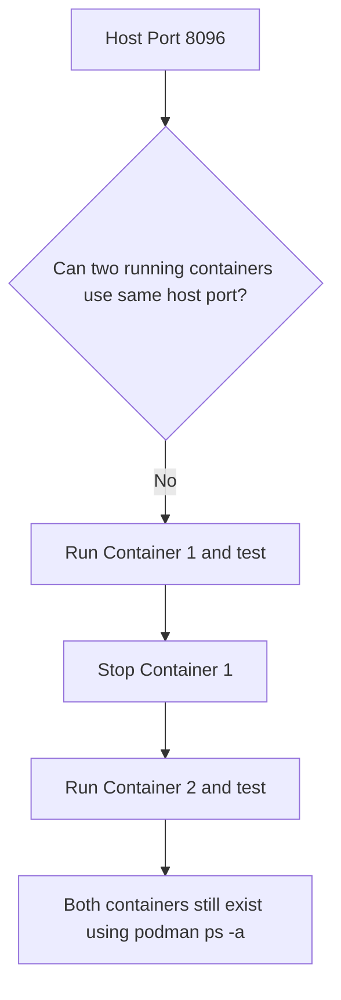

# 🚀  Task 3 Consume Environment variable

## 🎯 Prepare the lab for this question.
```
mkdir -p /home/student/task3-03
cat <<EOF > /home/student/task3-03/index.html1
Welcome to https://devops-wala.com Website for task3-03-nginx1.
EOF
cat <<EOF > /home/student/task3-03/index.html2
Welcome to https://devops-wala.com Website for task3-03-nginx2.
EOF
podman run --rm \
  registry.ocp4.example.com:8443/redhattraining/podman-nginx-helloworld \
  cat /etc/nginx/nginx.conf > /home/student/task3-03/nginx.conf
sed -i 's-/usr/share/nginx/html/public-/usr/share/nginx/html/-' /home/student/task3-03/nginx.conf
```
---


## 🎯 Requirement Summary

Create two containers from image:


- ➡️ Image: `registry.ocp4.example.com:8443/redhattraining/podman-nginx-helloworld`
- ➡️ Container name: **`devops-wala-task3-03-nginx1`** & **`devops-wala-task3-03-nginx2`**
- ➡️ Environment variables:

| Container | Variable Name | Variable Value |
|---|---|---|
| `devops-wala-task3-03-nginx1` | `DEVOPS_WALA1` | `MYCONTAINER1` |
| `devops-wala-task3-03-nginx2` | `DEVOPS_WALA2` | `MYCONTAINER2` |


- ➡️ Copy below files as follows:
- ➡️ File **`/home/student/task3-03/index.html1`** into the container **`devops-wala-task3-03-nginx1`** as **`/usr/share/nginx/html/index.html`**
- ➡️ File **`/home/student/task3-03/index.html2`** into the container **`devops-wala-task3-03-nginx2`** as **`/usr/share/nginx/html/index.html`**
- ➡️ File **`/home/student/task3-03/nginx.conf`** to both containers as **`/etc/nginx/nginx.conf`**
- ➡️ Execute **`nginx -s reload`** inside both the running container
- ➡️ Both containers must bind with host port 8096.
- ➡️ Both containers can still **persist** after the task
- ➡️ NGINX port is exposed on 8080


## 👨‍💻  Important Port Conflict Explanation

Both containers can't run on same port number, but if we stop first then we can bind port 8096 with 2nd container.

## Port Conflict Graphic




## 🚀 Deployment Steps

---

### ➡️ Step 1 — Pull Image

```bash
podman pull registry.ocp4.example.com:8443/redhattraining/podman-nginx-helloworld
```

---

### ➡️ Step 2 — Start First Container

```bash
podman run -d \
  --name devops-wala-task3-03-nginx1 \
  -e DEVOPS_WALA1=MYCONTAINER1 \
  -p 8096:8080 \
  registry.ocp4.example.com:8443/redhattraining/podman-nginx-helloworld
```

---

### ➡️ Step 3 — Copy Files into First Container

```bash
podman cp /home/student/task3-03/index.html1 \
  devops-wala-task3-03-nginx1:/usr/share/nginx/html/index.html

podman cp /home/student/task3-03/nginx.conf \
  devops-wala-task3-03-nginx1:/etc/nginx/nginx.conf

podman exec devops-wala-task3-03-nginx1 nginx -s reload
```

---

### ➡️ Step 4 — Test First Container

```bash
podman ps
podman exec devops-wala-task3-03-nginx1 env | grep -i devops
```

> **Expected output:**
> ```text
> DEVOPS_WALA1=MYCONTAINER1
> ```

```bash
curl http://workstation:8096
```
```bash
curl http://localhost:8096
```

> **Expected output:**
> ```text
> Welcome to https://devops-wala.com Website for task3-03-nginx1.
> ```

---

### ➡️ Step 5 — **Stop First Container** : Very important

```bash
podman stop devops-wala-task3-03-nginx1
```

---

### ➡️ Step 6 — Start Second Container

```bash
podman run -d \
  --name devops-wala-task3-03-nginx2 \
  -e DEVOPS_WALA2=MYCONTAINER2 \
  -p 8096:8080 \
  registry.ocp4.example.com:8443/redhattraining/podman-nginx-helloworld
```

---

### ➡️ Step 7 — Copy Files into Second Container

```bash
podman cp /home/student/task3-03/index.html2 \
  devops-wala-task3-03-nginx2:/usr/share/nginx/html/index.html

podman cp /home/student/task3-03/nginx.conf \
  devops-wala-task3-03-nginx2:/etc/nginx/nginx.conf

podman exec devops-wala-task3-03-nginx2 nginx -s reload
```

---

### ➡️ Step 8 — Test Second Container

```bash
podman ps
podman exec devops-wala-task3-03-nginx2 env | grep -i devops
```

> **Expected output:**
> ```text
> DEVOPS_WALA2=MYCONTAINER2
> ```

```bash
curl http://workstation:8096
```
```bash
curl http://localhost:8096
```

> **Expected output:**
> ```text
> Welcome to https://devops-wala.com Website for task3-03-nginx2.
> ```

---

### ➡️ Step 9 — Verify Both Containers Persist

```bash
podman ps -a | grep devops
```

> **Expected:** Both containers are listed. One stopped, one running.

| Container Name | Expected Status |
|---|---|
| `devops-wala-task3-03-nginx1` | ⏹️ Stopped |
| `devops-wala-task3-03-nginx2` | ✅ Running |

---

## Post Checks.
```bash
podman inspect devops-wala-task3-03-nginx1 |  if [[ $? -eq 0 ]]; then     echo "container created OK"; else     echo "Mentioned container is not created"; fi
```
```bash
podman inspect devops-wala-task3-03-nginx1 |  grep "8096:8080" |  if [[ $? -eq 0 ]]; then echo "Port is bind OK"; else echo "Port is not correctly bind"; fi
```
```bash
curl http://workstation:8096 2>/dev/null   | grep "Welcome to https://devops-wala.com Website for task3-03-nginx1."  |  if [[ $? -eq 0 ]]; then echo "Webpage is load the correct content OK"; else echo "Webpage is not load the correct content"; fi
```
```bash
podman inspect devops-wala-task3-03-nginx1 |  if [[ $? -eq 0 ]]; then     echo "container created OK"; else     echo "Mentioned container is not created"; fi
```
```bash
podman inspect devops-wala-task3-03-nginx2 |  grep "8096:8080" |  if [[ $? -eq 0 ]]; then echo "Port is bind OK"; else echo "Port is not correctly bind"; fi
```
```bash
curl http://workstation:8096 2>/dev/null | grep "Welcome to https://devops-wala.com Website for task3-03-nginx2." | if [[ $? -eq 0 ]]; then echo "Webpage is load the correct content OK"; else echo "Webpage is not load the correct content"; fi
```

## 📌 Quick Reference Summary

| Step | Action | Key Command |
|---|---|---|
| 1 | Pull Image | `podman pull <image>` |
| 2 | Start Container 1 | `podman run -d --name nginx1 -e ... -p 8096:8080 ...` |
| 3 | Copy Files to Container 1 | `podman cp ...` + `nginx -s reload` |
| 4 | Test Container 1 | `podman exec ... env` + `curl http://workstation:8096` |
| 5 | Stop Container 1 | `podman stop devops-wala-task3-03-nginx1` |
| 6 | Start Container 2 | `podman run -d --name nginx2 -e ... -p 8096:8080 ...` |
| 7 | Copy Files to Container 2 | `podman cp ...` + `nginx -s reload` |
| 8 | Test Container 2 | `podman exec ... env` + `curl http://workstation:8096` |
| 9 | Verify Persistence | `podman ps -a \| grep devops` |

---
