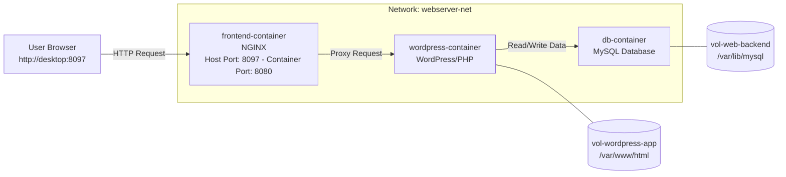

# 🐳 Task 5 — Multi-Container WordPress Application

## 🎯 Prepare the lab for this question.
```bash
mkdir -p /home/student/vol-net
cat <<EOF > /home/student/vol-net/index.html1
Welcome to https://devops-wala.com Website for vol-net-nginx1.
EOF

podman run --rm \
  registry.ocp4.example.com:8443/redhattraining/podman-nginx-helloworld \
  cat /etc/nginx/nginx.conf > /home/student/vol-net/nginx.conf
sed -i 's-/usr/share/nginx/html/public-/usr/share/nginx/html/-' /home/student/vol-net/nginx.conf
```
---
## 🎯 Requirement Summary: 
- Your task is to create network called **`webserver-net`**
- You need to create a **Volumes** for 2 applications
	- ➡️ Database volume: **`vol-web-backend`**
	- ➡️ WordPress app volume: **`vol-wordpress-app`**
- You need to create 3 containers. 
- Frontend container, which is exposing the web service and send the traffic to 2nd container i.e. `WordPress App`. WordPress App container will send the request to Database container to write the data.
- **For database container**:
	- ➡️ Container name **`db-container`** and it should mount the volume **`vol-web-backend`** to the container path **`/var/lib/mysql`** and use the network **`webserver-net`**.
	- ➡️ Make sure you should use environment **`MYSQL_USER="dbuser"`** , **`MYSQL_PASSWORD="devops-wala"`** and **`MYSQL_DATABASE="CDN_VIDEOS"`**
	- ➡️ User Registry **`registry.ocp4.example.com:8443/redhattraining/mysql-app:v1`**
- **`WordPress Container`**
  	- ➡️ Wordpress container named **`wordpress-container`** and it should mount the volume `vol-wordpress-app` to the container path `/var/www/html` and use the network `webserver-net`.
	- ➡️ Make sure you should use environment variables:
		- WORDPRESS_DB_HOST="db-container"
		- WORDPRESS_DB_USER="dbuser"
		-  WORDPRESS_DB_PASSWORD="devops-wala"
		-  WORDPRESS_DB_NAME="CDN_VIDEOS"
		-  WORDPRESS_URL="http://localhost:8097"
		-  WORDPRESS_TITLE="DevopsWala"
		-  WORDPRESS_USER="admin"
		- WORDPRESS_PASSWORD="devops-wala"
		- WORDPRESS_EMAIL="admin@devops-wala.com"
	- ➡️ User Registry **`registry.ocp4.example.com:8443/redhattraining/wordpress:5.7-php7.4-apache`**
- **`Frontend Web`** container:
	- ➡️ Container name **`frontend-container`** and use the network **`webserver-net`**.
	- ➡️ User Registry `registry.ocp4.example.com:8443/redhattraining/podman-nginx-helloworld`
	- ➡️ Copy below files as follows:
		- ➡️ File **`/home/student/vol-net/index.html1`** into the container **`frontend-container`** as **`/usr/share/nginx/html/index.html`**
		- ➡️ File **`/home/student/vol-net/nginx.conf`** to container as **`/etc/nginx/nginx.conf`**
	- ➡️ Execute **`nginx -s reload`** inside both the running container
	- ➡️ Container must bind with host port 8097.
	- ➡️ NGINX port is exposed on 8080
---

## 📋 Overview

| Item | Details |
|---|---|
| **Network** | `webserver-net` |
| **Volumes** | `vol-web-backend`, `vol-wordpress-app` |
| **Containers** | `db-container`, `wordpress-container`, `frontend-container` |
| **Exposed Port** | `8097:8080` |

---




---

## 💡 Explanation

A multi-container application separates each service into its own container:

- 🗄️ **Database container** — Stores MySQL/MariaDB data persistently.
- 🌐 **WordPress app container** — Stores and prepares application files.
- 🖥️ **Frontend web server** — Serves the WordPress files to the user.
- 🔗 **Shared network** — Allows containers to communicate using container names.
- 💾 **Named volumes** — Persist data even after containers are stopped or removed.
- Podman's built-in DNS allows containers to reach each other by container name on the same network.
---

## 🚀 Deployment Steps

### Step 1 — Create Network

```bash
podman network create webserver-net
```

> **Verify:**
```bash
podman network ls
podman network inspect webserver-net
```

---

### Step 2 — Create Volumes

```bash
podman volume create vol-web-backend
podman volume create vol-wordpress-app
```

> **Verify:**
```bash
podman volume ls
podman volume inspect vol-web-backend
podman volume inspect vol-wordpress-app
```

---

### Step 3 — Start Database Container

  
```bash
podman run -d --name db-container \
  -e MYSQL_USER="dbuser" \
  -e MYSQL_PASSWORD="devops-wala" \
  -e MYSQL_DATABASE="CDN_VIDEOS" \
  -v vol-web-backend:/var/lib/mysql \
  --network webserver-net \
  registry.ocp4.example.com:8443/redhattraining/mysql-app:v1
```

---

### Step 4 — Start WordPress App Container


```bash
podman run -d  \
--name wordpress-container   \
-v vol-wordpress-app:/var/www/html:Z   \
--network webserver-net  \
-e WORDPRESS_DB_HOST="db-container"   \
-e WORDPRESS_DB_USER="dbuser"   \
-e WORDPRESS_DB_PASSWORD="devops-wala"   \
-e WORDPRESS_DB_NAME="CDN_VIDEOS"   \
-e WORDPRESS_URL="http://localhost:8097"   \
-e WORDPRESS_TITLE="DevopsWala"   \
-e WORDPRESS_USER="admin"   \
-e WORDPRESS_PASSWORD="devops-wala"   \
-e WORDPRESS_EMAIL="admin@devops-wala.com"   \
registry.ocp4.example.com:8443/redhattraining/wordpress:5.7-php7.4-apache
```

---

### Step 5 — Start Frontend Container


```bash
podman run -d \
  --name frontend-container \
  --network webserver-net \
  -v vol-wordpress-app:/var/www/html \
  -p 8097:8080 \
  registry.ocp4.example.com:8443/redhattraining/podman-nginx-helloworld
```

> **Copy configuration files into the container:**
```bash
podman cp /home/student/vol-net/nginx.conf frontend-container:/etc/nginx/nginx.conf
podman cp /home/student/vol-net/index.html1 frontend-container:/usr/share/nginx/html/index.html
podman exec frontend-container  nginx -s reload
```

---

# 🐳 Task 5 — Post Check Guide: Multi-Container WordPress Application

---

## 📋 Overview

| Item | Details |
|---|---|
| **Network** | `webserver-net` |
| **Volumes** | `vol-web-backend`, `vol-wordpress-app` |
| **Containers** | `db-container`, `wordpress-container`, `frontend-container` |
| **Exposed Port** | `8097:8080` |

---

## Check 1 — Verify Network Exists

```bash
podman network ls | grep webserver-net
```

Expected:
```
webserver-net    bridge    enabled
```

---

## Check 2 — Verify Volumes Exist

```bash
podman volume ls | grep -E "vol-web-backend|vol-wordpress-app"
```

Expected:
```
local    vol-web-backend
local    vol-wordpress-app
```

---

## Check 3 — Verify All Containers Are Running

```bash
podman ps --format "table {{.Names}}\t{{.Ports}}\t{{.Status}}"
```

Expected:
```
NAMES                  PORTS                    STATUS
db-container                                    Up X minutes
wordpress-container                             Up X minutes
frontend-container     0.0.0.0:8097->8080/tcp   Up X minutes
```

---

## Check 4 — Verify All Containers Are on Same Network

```bash
podman network inspect webserver-net | grep -A 3 "name"
```

Expected — all 3 containers should appear:
```
db-container
wordpress-container
frontend-container
```

---

## Check 5 — Verify Volume Mounts Per Container

```bash
# DB container volume
podman inspect db-container \
  --format '{{range .Mounts}}{{.Source}} -> {{.Destination}}{{println}}{{end}}'

# WordPress container volume
podman inspect wordpress-container \
  --format '{{range .Mounts}}{{.Source}} -> {{.Destination}}{{println}}{{end}}'

# Frontend container volume
podman inspect frontend-container \
  --format '{{range .Mounts}}{{.Source}} -> {{.Destination}}{{println}}{{end}}'
```

Expected:
```
# db-container
/var/lib/containers/storage/volumes/vol-web-backend/_data -> /var/lib/mysql

# wordpress-container
/var/lib/containers/storage/volumes/vol-wordpress-app/_data -> /var/www/html

# frontend-container
/var/lib/containers/storage/volumes/vol-wordpress-app/_data -> /var/www/html
```

---

## Check 6 — Verify Database Container is Working

```bash
podman logs db-container | grep -i "ready\|error\|success"
```

Expected:
```
mysqld: ready for connections
```

---

## Check 7 — Verify WordPress Installed Successfully

```bash
podman logs wordpress-container | grep -i "success\|error"
```

Expected:
```
Success: WordPress installed successfully.
```

---

## Check 8 — Verify WordPress DB Connection

```bash
podman exec wordpress-container wp db check --allow-root --path=/var/www/html
```

Expected:
```
Success: Database checked.
```

---

## Check 9 — Verify nginx.conf Was Copied Correctly

```bash
podman exec frontend-container cat /etc/nginx/nginx.conf
```

---

## Check 10 — Verify index.html Was Copied Correctly

```bash
podman exec frontend-container cat /usr/share/nginx/html/index.html
```

---

## Check 11 — Verify Nginx is Running Inside Frontend Container

```bash
podman exec frontend-container nginx -t
```

Expected:
```
nginx: configuration file /etc/nginx/nginx.conf test is successful
```

---

## Check 12 — Verify Frontend Container Reaches WordPress Container

```bash
podman exec frontend-container curl -s -o /dev/null -w "%{http_code}" http://wordpress-container:80
```

Expected:
```
200 or 301
```

---

## Check 13 — Verify WordPress Container Reaches DB Container

```bash
podman exec wordpress-container wp db check --allow-root --path=/var/www/html
```

Expected:
```
Success: Database checked.
```

---

## Check 14 — Verify Frontend is Accessible From Host

```bash
curl -s -o /dev/null -w "%{http_code}" http://workstation:8097
```

Expected:
```
200
```

---

## Check 15 — Verify Correct Content is Served

```bash
curl -s http://workstation:8097 | head -20
```

---

## 🚀 One-Line Full Post Check Script

```bash
echo "====== 1. Network Check ======" && \
podman network ls | grep webserver-net && \
echo "====== 2. Volume Check ======" && \
podman volume ls | grep -E "vol-web-backend|vol-wordpress-app" && \
echo "====== 3. Container Status ======" && \
podman ps --format "table {{.Names}}\t{{.Ports}}\t{{.Status}}" && \
echo "====== 4. Frontend HTTP Check ======" && \
curl -s -o /dev/null -w "Frontend HTTP Code: %{http_code}\n" http://workstation:8097 && \
echo "====== 5. WordPress DB Check ======" && \
podman exec wordpress-container wp db check --allow-root --path=/var/www/html && \
echo "====== 6. Container-to-Container Check ======" && \
podman exec frontend-container curl -s -o /dev/null \
  -w "frontend->wordpress: %{http_code}\n" http://wordpress-container:80 && \
echo "====== 7. Nginx Config Check ======" && \
podman exec frontend-container nginx -t && \
echo "====== ALL CHECKS COMPLETE ======"
```

---

## ✅ Expected Final Summary

| Check | What is Verified                    | Expected Result  |
|-------|-------------------------------------|------------------|
| 1     | webserver-net network exists        | ✅ Listed        |
| 2     | Both volumes exist                  | ✅ Listed        |
| 3     | All 3 containers running            | ✅ Up            |
| 4     | All containers on webserver-net     | ✅ All listed    |
| 5     | Volume mounts correct               | ✅ Correct paths |
| 6     | DB container ready                  | ✅ Ready         |
| 7     | WordPress installed                 | ✅ Success       |
| 8     | WordPress DB connection             | ✅ DB checked    |
| 9     | nginx.conf copied                   | ✅ Content shown |
| 10    | index.html copied                   | ✅ Content shown |
| 11    | Nginx config valid                  | ✅ Test success  |
| 12    | frontend → wordpress connectivity   | ✅ 200 or 301    |
| 13    | wordpress → db connectivity         | ✅ DB checked    |
| 14    | Host → frontend port 8097           | ✅ 200           |
| 15    | Correct content served              | ✅ HTML returned |

---


curl http://localhost:8097
Check WordPress is Reachable from Frontend
# Go inside the frontend container
```bash
podman exec -it frontend-container /bin/bash

# Try to reach WordPress container
curl http://wordpress-container

# You should see WordPress HTML response
exit
```
## Check WordPress can Reach Database
```bash
# Go inside the WordPress container
podman exec -it wordpress-container /bin/bash

# Try to reach the database container
curl http://db-container

# OR check the WordPress config file
cat /var/www/html/wp-config.php | grep DB

# Expected Output:
# define( 'DB_NAME', 'CDN_VIDEOS' );
# define( 'DB_USER', 'dbuser' );
# define( 'DB_HOST', 'db-container' );
exit
```

## The Real Proof — Write Data and Verify in Database
#### Check the Database Volume BEFORE writing
```bash
# Go inside the database container
podman exec -it db-container /bin/bash

# Login to MySQL
mysql -u dbuser -pdevops-wala CDN_VIDEOS

# Check existing tables
SHOW TABLES;
exit
```
#### Write Something via WordPress (Browser)
```bash
1. Open your browser
2. Go to http://desktop:8097/wp-admin
3. Login with:
   - Username: admin
   - Password: devops-wala
4. Create a new Post or Page
5. Write something and Publish it

```

### Verify Data is Written in Database
```bash
# Go inside the database container
podman exec -it db-container /bin/bash

# Login to MySQL
mysql -u dbuser -pdevops-wala CDN_VIDEOS

# Check the WordPress posts table
SHOW TABLES;
SELECT ID, post_title, post_status FROM wp_posts WHERE post_status='publish';

# You should see your newly created post here!
exit
```
#### Verify Data is Physically Stored in Volume
```bash
# Check the volume mount on host machine
podman volume inspect vol-web-backend

# Go to the volume path and check MySQL files
ls -la /var/lib/containers/storage/volumes/vol-web-backend/_data/CDN_VIDEOS/

# You should see MySQL data files for your database
```

🧑‍💻 You open the browser and write a blog post on WordPress.
🌐 The request goes to frontend-container (NGINX).
🔀 NGINX proxies the request to wordpress-container.
🗄️ WordPress writes the post to db-container (MySQL).
💾 MySQL stores the data permanently in vol-web-backend volume.
✅ Even if containers restart, the data is still there in the volume!

