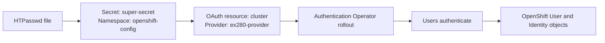

## 🎥 My YouTube Videos

### EX280 Playlist

[](https://www.youtube.com/watch?v=O4GC2S8Ad0s&list=PLu9E__aIIE2kV7l5vb7p3omYNvV6M5bag)

📌 Watch here: https://www.youtube.com/watch?v=O4GC2S8Ad0s&list=PLu9E__aIIE2kV7l5vb7p3omYNvV6M5bag


# Q1. Configure HTPasswd Authentication

## Objective

Configure the OpenShift OAuth server to use an HTPasswd identity provider with the following values:

- configure the Oauth to use HTPasswd as the identity provider.
- Identity Provider name is ex280-provider.
- Create four users: harry, leader , raja, qa-engineer and all should have review password.
- Configure user and apply password for them. Or Ensure that four users account exist.
- Secret name is super-secret

> **Lab note:** HTPasswd is suitable for training and development environments. It is not recommended as a production identity provider.

## Authentication flow



---

## Solution

### 1. Verify the administrative session

```bash
oc whoami
oc whoami --show-server
oc auth can-i patch oauth.config.openshift.io/cluster
```

The last command must return:

```text
yes
```

### 2. Verify that the `htpasswd` command is installed. It should be :-) 

```bash
command -v htpasswd
```

If the command is missing on a Red Hat-based workstation:

```bash
sudo dnf install -y httpd-tools
```

### 3. Create the HTPasswd file

> The `-c` option creates a new file and overwrites an existing file. Use it only for the first entry.

```bash
htpasswd -c -B -b /home/student/htpasswd harry review
htpasswd -B -b /home/student/htpasswd leader review
htpasswd -B -b /home/student/htpasswd raja review
htpasswd -B -b /home/student/htpasswd qa-engineer review
```

Options used:

| Option | Meaning |
|---|---|
| `-c` | Create a new password file. Use only for the first user. |
| `-B` | Store the password using bcrypt. |
| `-b` | Read the username and password from command arguments. |

Verify that all four entries exist:

```bash
cut -d: -f1 /home/student/htpasswd
```

Expected usernames:

```text
harry
leader
raja
qa-engineer
```

### 4. Create or update the OpenShift secret

The key inside the secret must be named `htpasswd`.

```bash
oc create secret generic super-secret \
  --from-file=htpasswd=/home/student/htpasswd \
  -n openshift-config \
  --dry-run=client -o yaml | oc apply -f -
```

Verify the correct secret:

```bash
oc get secret super-secret -n openshift-config
oc get secret super-secret -n openshift-config \
  -o jsonpath='{.data.htpasswd}' | base64 -d | cut -d: -f1
```

### 5. Configure the OAuth identity provider

Create `oauth-htpasswd.yaml`:

```bash
cat > oauth-htpasswd.yaml <<'EOF'
apiVersion: config.openshift.io/v1
kind: OAuth
metadata:
  name: cluster
spec:
  identityProviders:
    - name: ex280-provider
      mappingMethod: claim
      type: HTPasswd
      htpasswd:
        fileData:
          name: super-secret
EOF
```

Apply the configuration:

```bash
oc apply -f oauth-htpasswd.yaml
```

### 6. Wait for the authentication components to finish updating

```bash
oc get clusteroperator authentication
oc get pods -n openshift-authentication
```

For a live view:

```bash
watch oc get pods -n openshift-authentication
```

Press `Ctrl+C` after the pods are ready and the authentication ClusterOperator is no longer progressing.

### 7. Test every account without replacing the administrator kubeconfig

```bash
API_SERVER=$(oc whoami --show-server)

for user in harry leader raja qa-engineer; do
  oc login "${API_SERVER}" \
    -u "${user}" \
    -p review \
    --kubeconfig="/tmp/${user}.kubeconfig"

  KUBECONFIG="/tmp/${user}.kubeconfig" oc whoami
done
```

Expected identities:

```text
harry
leader
raja
qa-engineer
```

After the first successful login by every account, verify the OpenShift user objects from the administrator session:

```bash
oc get users
oc get identities
```

---

## Troubleshooting

### Error: `htpasswd: command not found`

**Cause:** The Apache `htpasswd` utility is not installed.

**Solution:**

```bash
sudo dnf install -y httpd-tools
```

### Error: secret already exists

```text
Error from server (AlreadyExists): secrets "super-secret" already exists
```

**Solution:** Use the idempotent create-or-update command:

```bash
oc create secret generic super-secret \
  --from-file=htpasswd=/home/student/htpasswd \
  -n openshift-config \
  --dry-run=client -o yaml | oc apply -f -
```


### Error: login returns `401 Unauthorized`

Possible causes:

1. The authentication rollout has not completed.
2. The OAuth resource references the wrong secret.
3. The secret does not contain a key named `htpasswd`.
4. The username or password is incorrect.
5. The HTPasswd file was changed locally but the secret was not updated.

Checks:

```bash
oc get oauth cluster -o yaml
oc get secret super-secret -n openshift-config -o yaml
oc get clusteroperator authentication
oc get pods -n openshift-authentication
```

Reapply the secret after changing the local file:

```bash
oc create secret generic super-secret \
  --from-file=htpasswd=/home/student/htpasswd \
  -n openshift-config \
  --dry-run=client -o yaml | oc apply -f -
```

### Warning from `oc apply`

```text
Warning: oc apply should be used on resources created by either oc create --save-config or oc apply
```

This warning can occur when the existing OAuth object was not originally created with `oc apply`. Verify the resulting OAuth configuration after the command. Do not blindly overwrite an existing `identityProviders` list.

---

## Final validation

```bash
oc get secret super-secret -n openshift-config
oc get oauth cluster -o yaml
oc get clusteroperator authentication
oc get users
oc get identities
```

## Reference

Validated against Red Hat OpenShift Container Platform 4.14 documentation:

- Configuring an HTPasswd identity provider
- Creating the HTPasswd secret
- Adding an identity provider to the cluster
