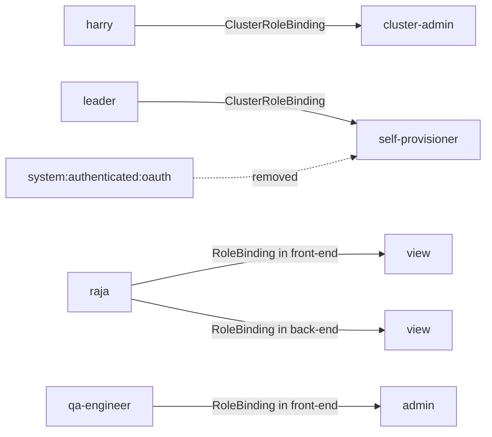

## If you are using REDHAT LAB then use below to create the lab for this question.
```
lab start appsec-scc
oc login -u admin -p redhatocp https://api.ocp4.example.com:6443
```


# Question 2. Manage Cluster Project and Permissions:
- Create 3 projects, `front-end`, `back-end`, and `app-db`
- `harry` user should have cluster administrator rights.
- `leader` user should be able create project but not administrator tasks.
- No other user should able to create project.
- `raja` user can only `view` the resources of `front-end` and `back-end` projects.
- `qa-engineer` user should have `admin` access to  `front-end` project.
- `kubaadmin` is  not present  (make sure your cluster-admin user is working fine before delete kubeadmin, otherwise ocp-cluster not recoverable)
---
## Solution:
## RBAC design



## Errors corrected from the original content

| Original problem | Typical error or risk | Correction |
|---|---|---|
| The heading says “Create 3 groups” although the task creates projects. | Documentation is misleading. | Use “Create three projects.” |
| `self-provisioners` is used as the role name for `leader`. | `clusterrole.rbac.authorization.k8s.io "self-provisioners" not found` | `self-provisioners` is the ClusterRoleBinding; the ClusterRole is singular: `self-provisioner`. |
| `add-cluster-role-to-user view ... -n <project>` is used for project-scoped access. | A cluster role binding is cluster-wide; `-n` is not used for cluster role bindings. | Use `oc adm policy add-role-to-user view ... -n <project>`. |
| The default self-provisioning group is removed without disabling automatic reconciliation. | The default subject can return later. | Set `rbac.authorization.kubernetes.io/autoupdate` to `"false"` on the `self-provisioners` ClusterRoleBinding. |
| The original login sequence ends with `qa-engineer`, then runs `oc new-project test`. | It tests only the last logged-in user, not every required identity. | Use `oc auth can-i --as=<user>` for explicit verification. |
| `kubaadmin` is misspelled. | The required account is `kubeadmin`. | Use the correct name and delete only the `kubeadmin` secret. |
| The document deletes `kubeadmin` without a strong, testable safety gate. | Removing it before verifying another cluster administrator can make the cluster unrecoverable without reinstalling. | Log in as `harry`, confirm cluster-admin access, and only then delete the secret. |

---

## Solution

### 1. Log in with the current administrator

Use the administrator credentials supplied by the lab environment:

```bash
oc whoami
oc auth can-i '*' '*' --all-namespaces
```

The second command must return:

```text
yes
```

> The environment-specific `lab start ...` command is not part of the OpenShift RBAC solution. Use the lab name supplied by your course environment rather than an unrelated hard-coded exercise name.

### 2. Create the three projects

The following loop safely skips projects that already exist:

```bash
for project in front-end back-end app-db; do
  oc get project "${project}" >/dev/null 2>&1 || oc new-project "${project}"
done
```

Verify:

```bash
oc get projects front-end back-end app-db
```

### 3. Grant cluster-administrator rights to `harry`

```bash
oc adm policy add-cluster-role-to-user cluster-admin harry
```

Verify:

```bash
oc auth can-i '*' '*' --all-namespaces --as=harry
```

Expected result:

```text
yes
```

### 4. Disable project self-provisioning for ordinary OAuth users

Inspect the default binding:

```bash
oc describe clusterrolebinding.rbac self-provisioners
```

The default relationship normally uses:

```text
ClusterRoleBinding: self-provisioners
ClusterRole:        self-provisioner
Group:              system:authenticated:oauth
```

Remove the default OAuth group while preserving any unrelated subjects:

```bash
oc adm policy remove-cluster-role-from-group \
  self-provisioner \
  system:authenticated:oauth
```

Disable automatic reconciliation for this binding:

```bash
oc patch clusterrolebinding.rbac self-provisioners \
  --type=merge \
  -p '{"metadata":{"annotations":{"rbac.authorization.kubernetes.io/autoupdate":"false"}}}'
```

Verify:

```bash
oc get clusterrolebinding.rbac self-provisioners -o yaml
```

Confirm that:

- `system:authenticated:oauth` is not listed under `subjects`.
- `rbac.authorization.kubernetes.io/autoupdate` is set to `"false"`.

### 5. Allow only `leader` to self-provision projects

Use the singular ClusterRole name:

```bash
oc adm policy add-cluster-role-to-user self-provisioner leader
```

Verify:

```bash
oc auth can-i create projectrequests \
  --api-group=project.openshift.io \
  --as=leader
```

Expected result:

```text
yes
```

Verify that ordinary users do not have the same permission:

```bash
oc auth can-i create projectrequests \
  --api-group=project.openshift.io \
  --as=raja

oc auth can-i create projectrequests \
  --api-group=project.openshift.io \
  --as=qa-engineer
```

Expected result for both:

```text
no
```

> This prevents default self-provisioning by ordinary OAuth users. A user with another explicitly granted role could still have project-creation rights, because RBAC permissions are additive.

### 6. Give `raja` project-scoped `view` access

```bash
oc adm policy add-role-to-user view raja -n front-end
oc adm policy add-role-to-user view raja -n back-end
```

Verify:

```bash
oc auth can-i get pods -n front-end --as=raja
oc auth can-i get pods -n back-end --as=raja
oc auth can-i create deployments.apps -n front-end --as=raja
```

Expected results:

```text
yes
yes
no
```

### 7. Give `qa-engineer` project-scoped `admin` access

```bash
oc adm policy add-role-to-user admin qa-engineer -n front-end
```

Verify:

```bash
oc auth can-i create deployments.apps -n front-end --as=qa-engineer
oc auth can-i create rolebindings.rbac.authorization.k8s.io \
  -n front-end \
  --as=qa-engineer
```

Expected result:

```text
yes
yes
```

### 8. Verify all RBAC assignments

```bash
oc get clusterrolebindings.rbac.authorization.k8s.io
oc get rolebindings.rbac.authorization.k8s.io -n front-end
oc get rolebindings.rbac.authorization.k8s.io -n back-end
oc get rolebindings.rbac.authorization.k8s.io -n app-db
```

Useful permission matrix:

```bash
printf '%-15s %-45s %s\n' USER TEST RESULT
printf '%-15s %-45s %s\n' harry 'cluster-wide all permissions' \
  "$(oc auth can-i '*' '*' --all-namespaces --as=harry)"
printf '%-15s %-45s %s\n' leader 'create projectrequests' \
  "$(oc auth can-i create projectrequests --api-group=project.openshift.io --as=leader)"
printf '%-15s %-45s %s\n' raja 'get pods in front-end' \
  "$(oc auth can-i get pods -n front-end --as=raja)"
printf '%-15s %-45s %s\n' qa-engineer 'create deployments in front-end' \
  "$(oc auth can-i create deployments.apps -n front-end --as=qa-engineer)"
```

### 9. Remove `kubeadmin` safely

> **Critical warning:** Do not perform this step until the HTPasswd identity provider works and `harry` has been proven to be a cluster administrator. Removing `kubeadmin` is not reversible through another command.

Store the API address from the current administrator session:

```bash
API_SERVER=$(oc whoami --show-server)
```

Log in as `harry` using a separate kubeconfig:

```bash
oc login "${API_SERVER}" \
  -u harry \
  -p review \
  --kubeconfig=/tmp/harry-admin.kubeconfig
```

Verify the identity and cluster-wide permission:

```bash
KUBECONFIG=/tmp/harry-admin.kubeconfig oc whoami
KUBECONFIG=/tmp/harry-admin.kubeconfig \
  oc auth can-i '*' '*' --all-namespaces
```

Required output:

```text
harry
yes
```

Only after both checks succeed, remove the secret:

```bash
KUBECONFIG=/tmp/harry-admin.kubeconfig \
  oc delete secret kubeadmin -n kube-system
```

Post-check:

```bash
KUBECONFIG=/tmp/harry-admin.kubeconfig \
  oc get secret kubeadmin -n kube-system
```

Expected post-removal message:

```text
Error from server (NotFound): secrets "kubeadmin" not found
```

Here, `NotFound` is the successful verification result.

---

## Troubleshooting

### Error: wrong ClusterRole name

```text
clusterrole.rbac.authorization.k8s.io "self-provisioners" not found
```

**Cause:** `self-provisioners` is a ClusterRoleBinding name, not a ClusterRole name.

**Solution:**

```bash
oc adm policy add-cluster-role-to-user self-provisioner leader
```

### Error: project permission was granted with a cluster-wide command

Incorrect pattern:

```bash
oc adm policy add-cluster-role-to-user view raja -n front-end
```

Correct project-scoped pattern:

```bash
oc adm policy add-role-to-user view raja -n front-end
```

### Error: self-provisioning returns after reconciliation

**Cause:** The `self-provisioners` ClusterRoleBinding still has automatic updates enabled.

**Solution:**

```bash
oc patch clusterrolebinding.rbac self-provisioners \
  --type=merge \
  -p '{"metadata":{"annotations":{"rbac.authorization.kubernetes.io/autoupdate":"false"}}}'
```

### Expected denial for an ordinary user

```text
Error from server (Forbidden): You may not request a new project via this API.
```

This is the expected result after default self-provisioning is disabled.

### Error: `Forbidden` while changing cluster roles or groups

**Cause:** The current identity is not a cluster administrator.

Checks:

```bash
oc whoami
oc auth can-i '*' '*' --all-namespaces
```

Switch to an approved cluster-administrator identity before continuing.

### Error: project already exists

```text
Error from server (AlreadyExists): project.project.openshift.io "<name>" already exists
```

Use the idempotent project-creation loop from this document, or verify the existing project and continue.

### `kubeadmin` deletion safety failure

If this returns `no`, stop:

```bash
KUBECONFIG=/tmp/harry-admin.kubeconfig \
  oc auth can-i '*' '*' --all-namespaces
```

Do not delete the `kubeadmin` secret until the result is `yes`.

---

## Final validation

```bash
oc get projects front-end back-end app-db
oc auth can-i '*' '*' --all-namespaces --as=harry
oc auth can-i create projectrequests --api-group=project.openshift.io --as=leader
oc auth can-i create projectrequests --api-group=project.openshift.io --as=raja
oc auth can-i get pods -n front-end --as=raja
oc auth can-i create deployments.apps -n front-end --as=qa-engineer
oc get clusterrolebinding.rbac self-provisioners -o yaml
```

## Reference

Validated against Red Hat OpenShift Container Platform 4.14 documentation:

- Default cluster roles and RBAC scope
- Local and cluster role binding commands
- Disabling project self-provisioning
- Creating a cluster administrator
- Removing the `kubeadmin` user

```
oc  -n kube-system  delete secret/kubeadmin
```


