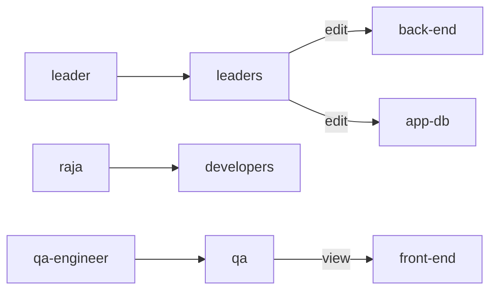

# Q3. Create Groups and Assign Project Roles

## Objective

- The `harry` user will create 3 groups, `leaders`, `developers` and `qa`. 
- Add `leader` user in `leaders` group. 
- Add `raja` user in `developers` group. 
- Add `qa-engineer` user in `qa` group.
- Give `edit` permission to `leaders` group members to the `back-end` and `app-db` projects.
- Give `view` permission to `qa` group members to the `front-end` project.
---

## Important state dependency

OpenShift RBAC is additive. A lower-privilege role does not cancel a higher-privilege role.

If Q2 was completed first, `qa-engineer` already has a direct `admin` RoleBinding in `front-end`. Adding `qa-engineer` to the `qa` group and binding `view` to that group does **not** reduce the user to view-only access. The user keeps both grants, and `admin` remains effective.

Only remove the earlier direct `admin` grant if this question is being evaluated independently and the intended final permission is strictly `view`.


## Solution

What we understand from questions is:

Configure the following OpenShift groups and role bindings:

| Group | User | Required project access |
|---|---|---|
| `leaders` | `leader` | `edit` in `back-end` and `app-db` |
| `developers` | `raja` | No additional role specified by this question |
| `qa` | `qa-engineer` | `view` in `front-end` |

## RBAC relationship



### 1. Log in as `harry`

```bash
oc login -u harry -p review
```

Verify:

```bash
oc whoami
oc auth can-i create groups.user.openshift.io
```

Expected output:

```text
harry
yes
```

If the second command returns `no`, verify that Q2 granted `harry` the cluster-admin ClusterRole.

### 2. Verify that the required projects exist:
#### In the previous question, we already created these projects, Just for your information.

```bash
oc get projects front-end back-end app-db
```

OR you can execute below commands.

```bash
oc get projects front-end
oc get projects back-end
oc get projects app-db
```


### 3. Create the groups safely

```bash
oc adm groups new leaders
oc adm groups new developers
oc adm groups new qa
```

Verify:

```bash
oc get groups
```

### 4. Add the users to their groups

```bash
oc adm groups add-users leaders leader
oc adm groups add-users developers raja
oc adm groups add-users qa qa-engineer
```

Verify memberships:

```bash
oc get group
```

Or execute below commands.

```bash
oc get group leaders \
  -o jsonpath='{.users}{"\n"}'

oc get group developers \
  -o jsonpath='{.users}{"\n"}'

oc get group qa \
  -o jsonpath='{.users}{"\n"}'
```

Expected values:

```text
[leader]
[raja]
[qa-engineer]
```

### 5. Grant `edit` to the `leaders` group

```bash
oc adm policy add-role-to-group edit leaders -n back-end
oc adm policy add-role-to-group edit leaders -n app-db
```

### 6. Grant `view` to the `qa` group

```bash
oc adm policy add-role-to-group view qa -n front-end
```

No role is assigned to the `developers` group because the question does not request one.

### 7. Verify the project role bindings

```bash
oc get rolebindings.rbac.authorization.k8s.io -n front-end
oc get rolebindings.rbac.authorization.k8s.io -n back-end
oc get rolebindings.rbac.authorization.k8s.io -n app-db
```

To inspect subjects and referenced roles:

```bash
oc describe rolebindings.rbac.authorization.k8s.io -n front-end
oc describe rolebindings.rbac.authorization.k8s.io -n back-end
oc describe rolebindings.rbac.authorization.k8s.io -n app-db
```

### 8. Test the group-level permissions in isolation

Use a temporary impersonated identity so that direct user bindings from earlier questions do not affect the result.

Test the `leaders` group:

```bash
oc auth can-i update deployments.apps \
  -n back-end \
  --as=rbac-test \
  --as-group=leaders

oc auth can-i update deployments.apps \
  -n app-db \
  --as=rbac-test \
  --as-group=leaders

oc auth can-i create rolebindings.rbac.authorization.k8s.io \
  -n back-end \
  --as=rbac-test \
  --as-group=leaders
```

Expected results:

```text
yes
yes
no
```

The default `edit` role can modify most application resources but cannot modify roles or role bindings.

Test the `qa` group:

```bash
oc auth can-i get pods \
  -n front-end \
  --as=rbac-test \
  --as-group=qa

oc auth can-i create deployments.apps \
  -n front-end \
  --as=rbac-test \
  --as-group=qa
```

Expected results:

```text
yes
no
```

### 9. Understand the `qa-engineer` result after Q2

If Q2 was completed, this command can still return `yes`:

```bash
oc auth can-i create deployments.apps \
  -n front-end \
  --as=qa-engineer
```

That is expected because Q2 directly granted `admin` to `qa-engineer`. The new `view` group binding does not downgrade the existing permission.

To inspect the direct bindings:

```bash
oc get rolebindings.rbac.authorization.k8s.io \
  -n front-end \
  -o yaml
```

### Optional: make `qa-engineer` view-only

Run this only when Q3 is being treated as an independent final-state requirement and Q2's direct `admin` grant is no longer required:

```bash
oc adm policy remove-role-from-user admin qa-engineer -n front-end
```

Then verify the actual user after reauthentication:

```bash
oc login -u qa-engineer -p review
oc auth can-i get pods -n front-end
oc auth can-i create deployments.apps -n front-end
```

Expected results in a strict view-only state:

```text
yes
no
```

---

## Troubleshooting

### Error: cannot create groups

```text
Error from server (Forbidden): groups.user.openshift.io is forbidden
```

**Cause:** The current user does not have cluster-level permission to manage OpenShift groups.

Checks:

```bash
oc whoami
oc auth can-i create groups.user.openshift.io
```

Log in as the verified cluster administrator, `harry`, before continuing.

### Error: group already exists

```text
Error from server (AlreadyExists): groups.user.openshift.io "leaders" already exists
```

Do not delete a valid group merely to rerun the exercise. Continue with:

```bash
oc adm groups add-users leaders leader
```

The idempotent group-creation loop in this document avoids this error.

### Error: project does not exist

```text
Error from server (NotFound): namespaces "back-end" not found
```

Verify and create the projects:

```bash
oc get projects front-end back-end app-db
oc new-project back-end
```

### Symptom: `qa-engineer` can still edit `front-end`

This is not an OpenShift failure. Permissions are additive. The direct `admin` grant from Q2 is still active.

Inspect:

```bash
oc get rolebindings.rbac.authorization.k8s.io -n front-end -o yaml
```

Remove the direct grant only when the required final state is view-only:

```bash
oc adm policy remove-role-from-user admin qa-engineer -n front-end
```

### Symptom: group permission test gives an unexpected result

When using impersonation, include the group explicitly:

```bash
oc auth can-i get pods \
  -n front-end \
  --as=rbac-test \
  --as-group=qa
```

Testing only with `--as=rbac-test` does not assert membership in `qa`.

---

## Final validation

```bash
oc get groups
oc get group leaders -o yaml
oc get group developers -o yaml
oc get group qa -o yaml

oc auth can-i update deployments.apps \
  -n back-end \
  --as=rbac-test \
  --as-group=leaders

oc auth can-i update deployments.apps \
  -n app-db \
  --as=rbac-test \
  --as-group=leaders

oc auth can-i get pods \
  -n front-end \
  --as=rbac-test \
  --as-group=qa
```

## Reference

Validated against Red Hat OpenShift Container Platform 4.14 documentation:

- `oc adm groups new`
- `oc adm groups add-users`
- Local role binding commands
- Default `admin`, `edit`, and `view` role behavior
