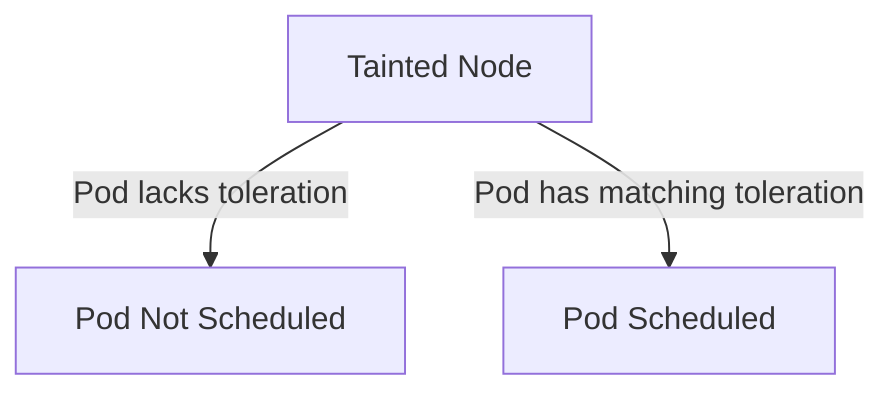

# 🟢 OpenShift Taint and Toleration – Complete Student Guide

> A comprehensive guide for students to understand Taints and Tolerations in OpenShift, practice step-by-step tasks, and prepare for advanced exercises.

---

## 🟡 Part A – Understanding Taints

- **Taints** are applied to **nodes** to prevent pods from scheduling unless they have a matching toleration.
- Components of a taint:
  1. **Key**
  2. **Value**
  3. **Effect**: `NoSchedule`, `PreferNoSchedule`, `NoExecute`

**Command Example:**
```
oc adm taint nodes <NODE_NAME> key=value:effect
```
**Mermaid Diagram – Taints Concept:**


---

## 🟡 Part B – Understanding Tolerations

- **Tolerations** are applied to **pods** to allow them to be scheduled on nodes with matching taints.
- Must match the **key, value, and effect** of the taint.

**Command Example:**
"oc set toleration pod <pod-name> key=value:effect"

---

## 🟢 Part C – Step-by-Step Tasks

### Task 1 – Create a Node Taint
**Goal:** Taint a node to repel pods without tolerations.

**Steps:**
1. **List nodes:**    
```oc get nodes```
2. **Apply taint:**   

```
oc adm taint nodes node1 dedicated=frontend:NoSchedule
```

3. **Verify:** 

```
oc describe node node1 | grep Taints
```

**Expected Outcome:**
- Node `node1` now has the taint and pods without the matching toleration cannot schedule on it.

---

### Task 2 – Apply Toleration to a Pod
**Goal:** Schedule a pod on a tainted node.

**Steps:**
1. Create a pod YAML with toleration:
```yaml
apiVersion: v1
kind: Pod
metadata:
  name: nginx-tolerated
spec:
  containers:
  - name: nginx
    image: nginx
  tolerations:
  - key: "dedicated"
    operator: "Equal"
    value: "frontend"
    effect: "NoSchedule"
```
2. Apply the pod: "oc apply -f nginx-tolerated.yaml"
3. Verify pod placement: "oc get pods -o wide"

**Expected Outcome:**
- Pod `nginx-tolerated` is scheduled on `node1` successfully.

---

### Task 3 – Remove a Taint
**Goal:** Remove a taint from a node to allow all pods.

**Steps:**
1. Remove taint: "
```
oc adm taint nodes node1 dedicated-
```
2. Verify: 
```
oc describe node node1 | grep Taints
```
**Expected Outcome:**
- Node `node1` has no taints and any pod can schedule on it.

---

### Task 4 – Multiple Taints and Corresponding Tolerations
**Goal:** Practice with multiple taints and pod tolerations.

**Steps:**
1. Apply taints to node2:

```
oc adm taint nodes node2 role=db:NoSchedule
```
```
oc adm taint nodes node2 environment=prod:NoExecute
```

2. Create a pod YAML with multiple tolerations:
```yaml
apiVersion: v1
kind: Pod
metadata:
  name: db-pod
spec:
  containers:
  - name: mysql
    image: mysql
  tolerations:
  - key: "role"
    operator: "Equal"
    value: "db"
    effect: "NoSchedule"
  - key: "environment"
    operator: "Equal"
    value: "prod"
    effect: "NoExecute"
```
3. Apply pod: 
```
oc apply -f db-pod.yaml
```
4. Verify: 
```
oc get pods -o wide
```

**Expected Outcome:**
- `db-pod` runs on `node2` respecting all taints.

---

### Task 5 – Advanced Scenario: Quota with Taints
**Goal:** Combine Taints with Resource Quotas for practice.

**Steps:**
1. Create a project "beta": 
```
oc new-project beta
```
2. Check quotas:
```
oc get quota
```
3. Apply a node taint: 
```
oc adm taint nodes node3 dedicated=critical:NoSchedule
```
4. Create a pod with toleration and resource requests:
```yaml
apiVersion: v1
kind: Pod
metadata:
  name: critical-pod
spec:
  containers:
  - name: app
    image: nginx
    resources:
      limits:
        memory: 1Gi
        cpu: 1
  tolerations:
  - key: "dedicated"
    operator: "Equal"
    value: "critical"
    effect: "NoSchedule"
```
5. Apply pod: 
```
oc apply -f critical-pod.yaml
```
6. Verify pod placement and resources: 
```
oc get pods -o wide" and "oc describe pod critical-pod
```
**Expected Outcome:**
- Pod schedules on tainted node and respects resource quota.

---

## 🔹 Part D – Tips and Best Practices
- Check node taints: "
```
oc describe node <node-name>
```
- Verify pod placement:
```
oc get pods -o wide
```
- Match toleration key, value, and effect exactly
- Understand effects: `NoSchedule`, `PreferNoSchedule`, `NoExecute`
- After mastering these tasks, students can attempt more exercises from [DO280 Taint and Toleration Lab](https://github.com/anishrana2001/Openshift/blob/main/DO280-v4.14/05.%20taint%20and%20toleration.md)

---

**✅ End of Complete Taint and Toleration Student Guide**

