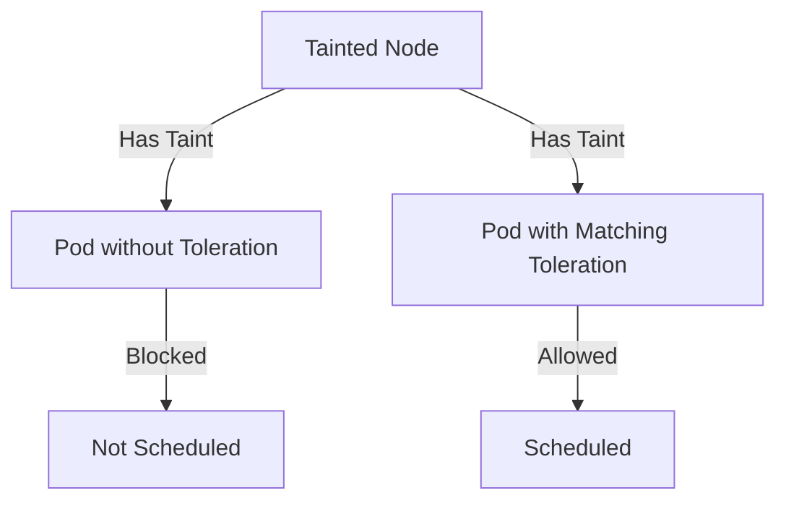

# 🟢 OpenShift Taint and Toleration – Complete Guide

> This file contains explanation, practical tasks, YAML examples, step-by-step solutions, and diagrams for Taints and Tolerations in OpenShift.

---

## 🟡 What are Taints and Tolerations?

### 🔹 Taints
- **Taints** are applied to **nodes** to repel pods from being scheduled unless the pod has a matching toleration.
- Taints have three components:
  1. **Key**
  2. **Value**
  3. **Effect**: `NoSchedule`, `PreferNoSchedule`, `NoExecute`

**Command example:**
"oc adm taint nodes <node-name> key=value:effect"

### 🔹 Tolerations
- **Tolerations** are applied to **pods** to allow them to be scheduled on nodes with matching taints.
- Tolerations specify **key, value, operator, and effect**.

**Command example:**
"oc set toleration pod <pod-name> key=value:effect"

**Mermaid Diagram – Taint & Toleration Concept:**



---

## 🟢 Task 1 – Create a Node Taint

**Objective:** Taint a node `node1` to repel pods without tolerations.

### Steps
1. Check current nodes:
"oc get nodes"
2. Apply a taint:
"oc adm taint nodes node1 dedicated=frontend:NoSchedule"
3. Verify the taint:
"oc describe node node1 | grep Taints"

### Expected Result
- Node `node1` now has a taint: `dedicated=frontend:NoSchedule`
- Pods without toleration for this taint cannot be scheduled on `node1`.

---

## 🟢 Task 2 – Apply Toleration to a Pod

**Objective:** Schedule a pod on a tainted node by adding toleration.

### Steps
1. Create a pod YAML with toleration:

```yaml
apiVersion: v1
kind: Pod
metadata:
  name: nginx-tolerated
spec:
  containers:
  - name: nginx
    image: nginx
  tolerations:
  - key: "dedicated"
    operator: "Equal"
    value: "frontend"
    effect: "NoSchedule"
```

2. Apply the pod:
"oc apply -f nginx-tolerated.yaml"
3. Verify pod placement:
"oc get pods -o wide"

### Expected Result
- Pod `nginx-tolerated` is scheduled on `node1` despite the taint.

---

## 🟢 Task 3 – Remove a Taint from Node

**Objective:** Remove a taint from a node to allow all pods.

### Steps
1. Remove taint:
"oc adm taint nodes node1 dedicated-"
2. Verify:
"oc describe node node1 | grep Taints"

### Expected Result
- Node `node1` has no taints.
- Any pod can be scheduled on it without needing a toleration.

---

## 🟢 Task 4 – Create Multiple Taints and Pods

**Objective:** Practice multiple taints and corresponding tolerations.

### Steps
1. Taint node:
"oc adm taint nodes node2 role=db:NoSchedule"
"oc adm taint nodes node2 environment=prod:NoExecute"

2. Create pod with multiple tolerations:

```yaml
apiVersion: v1
kind: Pod
metadata:
  name: db-pod
spec:
  containers:
  - name: mysql
    image: mysql
  tolerations:
  - key: "role"
    operator: "Equal"
    value: "db"
    effect: "NoSchedule"
  - key: "environment"
    operator: "Equal"
    value: "prod"
    effect: "NoExecute"
```

3. Apply the pod:
"oc apply -f db-pod.yaml"
4. Verify:
"oc get pods -o wide"

### Expected Result
- `db-pod` runs on `node2` successfully respecting all taints.

---

## 🔹 Quick Tips
- Use "oc describe node <node-name>" to check taints.
- Use "oc get pods -o wide" to verify pod placement.
- Tolerations must **match the taint key, value, and effect** to allow scheduling.
- `NoSchedule` prevents new pods, `NoExecute` evicts existing pods, `PreferNoSchedule` is soft.

---

### 🔹 GitHub Badges / Graphics

  
  


---

**✅ End of Taint and Toleration Exercises**
