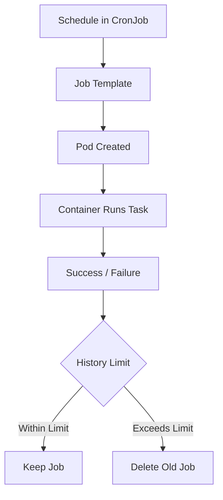

# 🟣 OpenShift CronJobs – Complete Guide

> Practical exercises for OpenShift DO280-style CronJobs  
> Includes explanations, YAML examples, solutions, badges, and diagrams.

---

## 🟡 What is Cron and CronJob?

### 🔹 Cron
- **Cron** is a time-based job scheduler in Unix/Linux systems.
- Allows users to automatically run scripts or commands at specified intervals.
- **Syntax:** `minute hour day month weekday`  
  Example: `30 2 * * 0` → Every Sunday at 02:30 AM

### 🔹 CronJob in OpenShift
- **CronJob** is the Kubernetes/OpenShift equivalent of Cron.
- It runs **Jobs in Pods automatically** based on a schedule.
- Supports:
  - Service accounts
  - Environment variables
  - History limits (`successfulJobsHistoryLimit`, `failedJobsHistoryLimit`)
  - Custom images

**Flow Diagram:**



---

## 🟢 Task 1 – Weekly Backup CronJob

**Objective:** Run a backup every Sunday at 02:30 AM.

| Field | Value |
|-------|-------|
| Name | `weekly-backup` |
| Project | `lion` |
| Schedule | `30 2 * * 0` |
| Image | `registry.io/backup-tool` |
| Service Account | `backup-sa` |
| Successful Job History Limit | `7` |

### YAML Example

```yaml
apiVersion: batch/v1
kind: CronJob
metadata:
  name: weekly-backup
  namespace: lion
spec:
  schedule: "30 2 * * 0"
  successfulJobsHistoryLimit: 7
  jobTemplate:
    spec:
      template:
        spec:
          serviceAccountName: backup-sa
          containers:
          - name: backup
            image: registry.io/backup-tool
            command: ["sh", "-c", "echo 'Running backup...' && /usr/local/bin/backup.sh"]
          restartPolicy: OnFailure
```

### Verification

```bash
oc get cronjobs -n lion
oc describe cronjob weekly-backup -n lion
oc get jobs -n lion
```

---

## 🟢 Task 2 – Monthly Report Generator

**Objective:** Generate reports on the 1st day of every month at 06:00 AM.

| Field | Value |
|-------|-------|
| Name | `monthly-report` |
| Project | `tiger` |
| Schedule | `0 6 1 * *` |
| Image | `registry.io/report-generator` |
| Service Account | `report-sa` |
| Successful Job History Limit | `12` |

### YAML Example

```yaml
apiVersion: batch/v1
kind: CronJob
metadata:
  name: monthly-report
  namespace: tiger
spec:
  schedule: "0 6 1 * *"
  successfulJobsHistoryLimit: 12
  jobTemplate:
    spec:
      template:
        spec:
          serviceAccountName: report-sa
          containers:
          - name: report
            image: registry.io/report-generator
            command: ["sh", "-c", "echo 'Generating monthly report...' && /usr/local/bin/generate-report.sh"]
          restartPolicy: OnFailure
```

---

## 🟢 Task 3 – Hourly Log Cleanup

**Objective:** Clean logs every hour at minute 45.

| Field | Value |
|-------|-------|
| Name | `log-cleanup` |
| Project | `panther` |
| Schedule | `45 * * * *` |
| Image | `registry.io/log-cleaner` |
| Service Account | `cleanup-sa` |
| Successful Job History Limit | `24` |

### YAML Example

```yaml
apiVersion: batch/v1
kind: CronJob
metadata:
  name: log-cleanup
  namespace: panther
spec:
  schedule: "45 * * * *"
  successfulJobsHistoryLimit: 24
  jobTemplate:
    spec:
      template:
        spec:
          serviceAccountName: cleanup-sa
          containers:
          - name: cleanup
            image: registry.io/log-cleaner
            command: ["sh", "-c", "echo 'Cleaning logs...' && /usr/local/bin/clean-logs.sh"]
          restartPolicy: OnFailure
```

### Verification

```bash
oc get cronjobs -n panther
oc describe cronjob log-cleanup -n panther
```

---

## 🟢 Task 4 – Daily Database Sync

**Objective:** Sync the database every day at 03:15 AM.

| Field | Value |
|-------|-------|
| Name | `db-sync` |
| Project | `tiger` |
| Schedule | `15 3 * * *` |
| Image | `registry.io/db-sync` |
| Service Account | `db-sa` |
| Successful Job History Limit | `14` |

### YAML Example

```yaml
apiVersion: batch/v1
kind: CronJob
metadata:
  name: db-sync
  namespace: tiger
spec:
  schedule: "15 3 * * *"
  successfulJobsHistoryLimit: 14
  jobTemplate:
    spec:
      template:
        spec:
          serviceAccountName: db-sa
          containers:
          - name: db-sync
            image: registry.io/db-sync
            command: ["sh", "-c", "echo 'Syncing database...' && /usr/local/bin/db-sync.sh"]
          restartPolicy: OnFailure
```

---

## 🟢 Task 5 – Test CronJob with Environment Variables

**Objective:** Test CronJob using environment variables every Monday at 09:00 AM.

| Field | Value |
|-------|-------|
| Name | `env-test-cron` |
| Project | `lion` |
| Schedule | `0 9 * * 1` |
| Image | `registry.io/env-test` |
| Service Account | `env-sa` |
| Successful Job History Limit | `5` |

### YAML Example

```yaml
apiVersion: batch/v1
kind: CronJob
metadata:
  name: env-test-cron
  namespace: lion
spec:
  schedule: "0 9 * * 1"
  successfulJobsHistoryLimit: 5
  jobTemplate:
    spec:
      template:
        spec:
          serviceAccountName: env-sa
          containers:
          - name: env-test
            image: registry.io/env-test
            env:
            - name: ENVIRONMENT
              value: "development"
            - name: LOG_LEVEL
              value: "debug"
            command: ["sh", "-c", "echo 'ENV=$ENVIRONMENT, LOG=$LOG_LEVEL'"]
          restartPolicy: OnFailure
```

---

## 🔹 Quick Tips
- `oc describe cronjob <name>` → Check schedule, pods, and logs
- `oc get jobs -n <project>` → Verify executions
- History limits prevent old jobs piling up
- Environment variables allow dynamic configuration without changing images

---

### 🔹 GitHub Badges / Graphics

  
  


---

**✅ End of CronJob Exercises**

