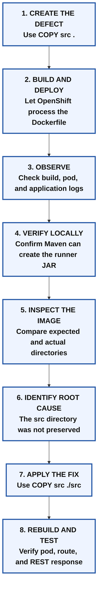
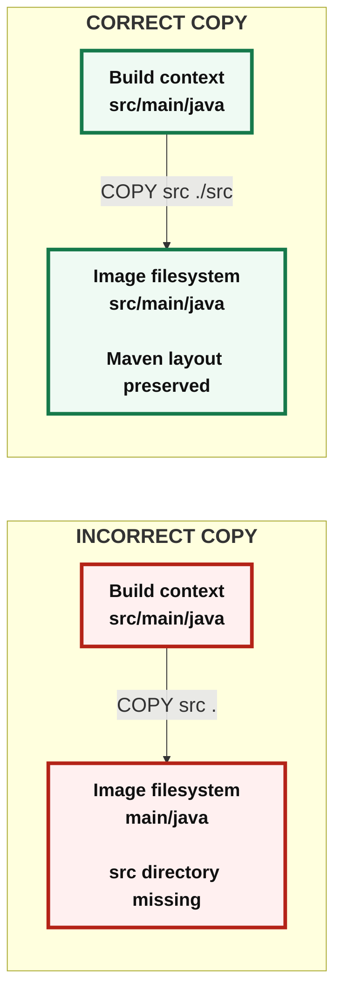
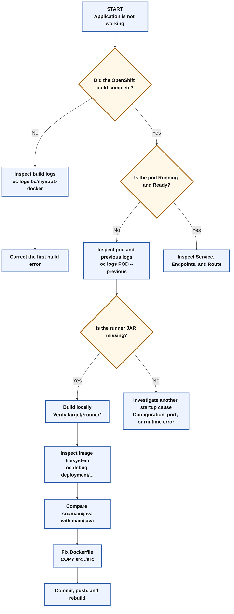

# 🧑‍🏫 OpenShift Docker Build Troubleshooting Lab

## Diagnosing an Incorrect Maven Source Copy in a Dockerfile

> [!IMPORTANT]
> This exercise contains an **intentional Dockerfile defect**.
>
> Students must first deploy the defective application, observe the failure, collect evidence, identify the root cause, and only then correct the Dockerfile.
>
> **Do not replace `COPY src .` with `COPY src ./src` at the beginning of the exercise.**  
> That incorrect instruction is the controlled fault used for the troubleshooting demonstration.

---

## 🎯 Learning objectives

After completing this lab, students should be able to:

- Log in to an OpenShift cluster and select a project.
- Explain how an OpenShift Docker build uses a Git repository and a build-context directory.
- Distinguish between a successful image build and a successful application startup.
- Read BuildConfig, build, pod, and deployment logs.
- Verify whether a Maven runner JAR is created locally.
- Inspect the filesystem of a container image with `oc debug`.
- Explain the difference between `COPY src .` and `COPY src ./src`.
- Correct a Dockerfile, push the change, and manually start a new build.
- Verify the repaired deployment through an OpenShift route.

---

# 🧩 Lab scenario

A Maven application is containerized by using an OpenShift Docker build.

The Dockerfile contains this instruction:

```dockerfile
COPY src .
```

At first glance, it appears to copy the application source code. However, it does not preserve the Maven `src` directory.

The objective is to let students discover this problem from the evidence rather than being given the correction immediately.

---

## 🧪 Controlled-fault design

To make the exercise useful, only the source-copy instruction should be intentionally wrong.

| Item | Required state |
|---|---|
| Git repository path | Correct |
| OpenShift `--context-dir` | Correct |
| Dockerfile location | Correct |
| Maven project | Valid |
| Expected runner JAR name | Known |
| Intentional defect | `COPY src .` |
| Final correction | `COPY src ./src` |

> [!WARNING]
> Avoid adding unrelated mistakes such as placing the Dockerfile outside the Git repository, appending duplicate Dockerfile content with `>>`, or adding a `-----` separator. Those errors would hide the intended lesson.

---

# 🗺️ Troubleshooting workflow



---

# Part 1: Prepare the OpenShift environment

## 1. 🔐 Log in to the cluster

```bash
oc login -u developer -p developer \
  https://api.ocp4.example.com:6443
```

Verify the authenticated user and cluster:

```bash
oc whoami
oc whoami --show-server
```

Expected user:

```text
developer
```

> [!NOTE]
> Supplying a password on the command line is acceptable in this isolated training environment. It is generally unsuitable for production automation because the value can remain in shell history.

---

## 2. 📁 Select the project

```bash
oc project docker-app
```

Verify the current project:

```bash
oc project -q
```

Expected output:

```text
docker-app
```

If the project does not exist and the account is permitted to create projects:

```bash
oc new-project docker-app
```

---

# Part 2: Prepare the Git repository correctly

## 3. 📥 Clone the repository

Create a working directory:

```bash
mkdir -p /home/student/docker-app
cd /home/student/docker-app
```

Clone the repository:

```bash
git clone https://git.ocp4.example.com/developer/DO288-apps
```

Enter the application directory:

```bash
cd /home/student/docker-app/DO288-apps/apps/docker-app/myapp1-docker
```

Verify the current path:

```bash
pwd
```

Expected path:

```text
/home/student/docker-app/DO288-apps/apps/docker-app/myapp1-docker
```

Inspect the Maven project:

```bash
ls -la
find src -maxdepth 3 -type d | sort
```

The directory should contain at least:

```text
pom.xml
src/
```

A typical Maven source structure is:

```text
myapp1-docker/
├── pom.xml
└── src/
    ├── main/
    │   ├── java/
    │   └── resources/
    └── test/
        └── java/
```

> [!IMPORTANT]
> The Dockerfile must be created in this directory because the OpenShift command later uses:
>
> ```text
> --context-dir=apps/docker-app/myapp1-docker
> ```
>
> OpenShift cannot use a Dockerfile stored outside that build-context directory.

---

# Part 3: Create the intentionally defective Dockerfile

## 4. 🧨 Write the Dockerfile with the controlled defect

Create the Dockerfile:

```bash
cat > Dockerfile <<'EOF'
FROM registry.ocp4.example.com:8443/redhattraining/ocpdev-ubi8-openjdk-17-base:1.16

COPY pom.xml .
RUN mvn dependency:go-offline

COPY src .
RUN mvn clean package

CMD ["java", "-jar", "target/myapp1-docker-1.0.0-SNAPSHOT-runner.jar"]
EOF
```

Display it:

```bash
cat Dockerfile
```

### What students should notice at this stage

Do not provide the correction yet. Ask students to predict what each instruction will do.

| Dockerfile instruction | Initial interpretation |
|---|---|
| `COPY pom.xml .` | Copies the Maven project descriptor into the image working directory. |
| `RUN mvn dependency:go-offline` | Downloads project dependencies. |
| `COPY src .` | Appears to copy source code, but its exact directory effect must be investigated. |
| `RUN mvn clean package` | Attempts to package the application. |
| `CMD [...]` | Attempts to start the expected runner JAR. |

> [!CAUTION]
> `COPY src .` is intentionally retained. Students should not change it before collecting evidence.

---

## 5. ⬆️ Commit and push the defective Dockerfile

Check the repository state:

```bash
git status
git diff -- Dockerfile
```

Stage the Dockerfile:

```bash
git add Dockerfile
```

Commit the controlled defect:

```bash
git commit -m "lab: add initial Docker build definition"
```

Push it to the remote repository:

```bash
git push
```

Verify that no local change remains:

```bash
git status
```

Expected result:

```text
nothing to commit, working tree clean
```

### Why must the file be pushed?

OpenShift performs a Git-based build by cloning the remote repository. It does not read uncommitted files from the student's workstation.

---

# Part 4: Create the OpenShift application

## 6. 🏗️ Create the application with Docker strategy

```bash
oc new-app \
  --name=myapp1-docker \
  --strategy=docker \
  --context-dir=apps/docker-app/myapp1-docker \
  https://git.ocp4.example.com/developer/DO288-apps
```

Inspect the generated resources:

```bash
oc get buildconfig,build,imagestream,deployment,service
```

The command normally creates resources such as:

- `BuildConfig`
- `Build`
- `ImageStream`
- `Deployment`
- `Service`

> [!NOTE]
> If these resources already exist from an earlier attempt, do not run `oc new-app` again. Use the rebuilding procedure in the recovery section later in this guide.

---

# Part 5: Observe the failure before changing anything

Troubleshooting begins with evidence. Editing the Dockerfile immediately would erase the lesson and replace reasoning with ritual, a cherished human tradition but a poor engineering method.

## 7. 📜 Follow the build logs

```bash
oc logs -f buildconfig/myapp1-docker
```

The shorter resource form is also valid:

```bash
oc logs -f bc/myapp1-docker
```

After the log stream finishes, inspect the build status:

```bash
oc get builds
```

For more detail:

```bash
oc get builds --sort-by=.metadata.creationTimestamp
```

Describe the latest build:

```bash
oc describe build/myapp1-docker-1
```

### Record the result

Students should answer:

1. Did the image build complete?
2. Did Maven report that no sources were compiled?
3. Was the expected runner JAR created?
4. Did the failure occur during the image build or after the container started?

> [!IMPORTANT]
> A completed container-image build does not prove that the application can start successfully.

---

## 8. 📦 Inspect the pod state

```bash
oc get pods
```

To watch pod changes:

```bash
oc get pods -w
```

Press `Ctrl+C` after observing the status.

Possible states include:

```text
Running
Error
CrashLoopBackOff
ImagePullBackOff
```

If the pod repeatedly restarts, inspect its restart count:

```bash
oc get pods
```

A growing restart count usually means the container starts and then exits.

---

## 9. 🧾 Read the application logs

```bash
oc logs deployment/myapp1-docker
```

If the container restarted, the most useful message may be in the previous container log:

```bash
POD_NAME="$(oc get pod \
  -l deployment=myapp1-docker \
  -o jsonpath='{.items[0].metadata.name}')"

oc logs "${POD_NAME}" --previous
```

If the label query does not return a pod, list labels first:

```bash
oc get pods --show-labels
```

Then read the selected pod directly:

```bash
oc logs <pod-name>
oc logs <pod-name> --previous
```

A likely runtime symptom is similar to:

```text
Error: Unable to access jarfile target/myapp1-docker-1.0.0-SNAPSHOT-runner.jar
```

The exact wording may vary.

### Interpretation

The `CMD` instruction tries to execute:

```text
target/myapp1-docker-1.0.0-SNAPSHOT-runner.jar
```

If that file does not exist in the image, Java exits immediately and OpenShift restarts the container.

---

# Part 6: Establish a local baseline

## 10. 🧪 Build the application locally

From the directory containing `pom.xml`, run:

```bash
mvn -Dmaven.compiler.release=11 clean package
```

### Why use `maven.compiler.release=11` here?

This option compiles the application to Java 11-compatible bytecode. A Java 17 runtime can run Java 11 bytecode, so using a Java 17 base image does not conflict with this local check.

The purpose of the local build is to answer a specific question:

> Can the unmodified Maven project produce the expected runner JAR when its normal directory structure is present?

---

## 11. 🔎 Verify the local runner JAR

```bash
ls -lh target/*runner*
```

For a precise check:

```bash
EXPECTED_JAR="target/myapp1-docker-1.0.0-SNAPSHOT-runner.jar"

if test -f "${EXPECTED_JAR}"; then
  echo "PASS: Expected runner JAR exists: ${EXPECTED_JAR}"
else
  echo "FAIL: Expected runner JAR does not exist."
  echo "Available JAR files:"
  find target -type f -name '*.jar' -print
fi
```

### Diagnostic conclusion

If the local build creates the JAR but the OpenShift container cannot find it:

- The Java source code is valid.
- The Maven project can be packaged.
- The expected JAR name is probably correct.
- The problem is likely in how the container image is assembled.

This narrows the investigation to the Dockerfile and the image filesystem.

---

# Part 7: Inspect the defective container image

## 12. 🔍 Start a debug shell

The application container may exit too quickly for `oc rsh`. Create a debug pod from the Deployment:

```bash
oc debug deployment/myapp1-docker -- /bin/sh
```

Inside the debug shell, run:

```bash
pwd
ls -la
```

Inspect the directory tree:

```bash
find . -maxdepth 3 -type d | sort
```

Check whether the Maven source root exists:

```bash
test -d src && echo "src directory exists" || echo "src directory is missing"
```

Inspect possible flattened directories:

```bash
ls -ld main test 2>/dev/null
```

Inspect Maven output:

```bash
ls -la target 2>/dev/null
find target -maxdepth 3 -type f -name '*.jar' -print 2>/dev/null
```

Exit the debug pod:

```bash
exit
```

---

## 13. 🧠 Compare expected and actual layouts

### Expected Maven layout

```text
working-directory/
├── pom.xml
└── src/
    ├── main/
    │   ├── java/
    │   └── resources/
    └── test/
        └── java/
```

### Likely layout created by `COPY src .`

```text
working-directory/
├── pom.xml
├── main/
│   ├── java/
│   └── resources/
└── test/
    └── java/
```

The contents of `src` were copied into the destination directory, but the `src` directory itself was not preserved.

Maven expects:

```text
src/main/java
```

The defective image contains:

```text
main/java
```

Therefore Maven does not find the source code in its standard location.

---

# Part 8: Explain the root cause

## 14. 📘 Understand Docker `COPY` behavior

The general syntax is:

```dockerfile
COPY <source> <destination>
```

### Defective instruction

```dockerfile
COPY src .
```

Meaning:

- Source: the local `src` directory in the build context.
- Destination: the current image working directory.
- Result: the **contents** of `src` are placed in the current directory.

### Correct instruction

```dockerfile
COPY src ./src
```

Meaning:

- Source: the local `src` directory.
- Destination: an image directory named `src`.
- Result: the Maven source hierarchy remains intact.

---

## 🗂️ Visual comparison



---

# Part 9: Correct the Dockerfile

## 15. 🛠️ Replace the incorrect copy instruction

Display the current file:

```bash
cat Dockerfile
```

Replace only the controlled defect:

```bash
sed -i 's|^COPY src \.$|COPY src ./src|' Dockerfile
```

Verify the change:

```bash
git diff -- Dockerfile
cat Dockerfile
```

The corrected Dockerfile should be:

```dockerfile
FROM registry.ocp4.example.com:8443/redhattraining/ocpdev-ubi8-openjdk-17-base:1.16

COPY pom.xml .
RUN mvn dependency:go-offline

COPY src ./src
RUN mvn clean package

CMD ["java", "-jar", "target/myapp1-docker-1.0.0-SNAPSHOT-runner.jar"]
```

### Why change only one line?

Changing one variable at a time proves that the source-copy instruction caused the failure. If several instructions are changed together, students cannot know which change solved the problem.

---

## 16. ⬆️ Commit and push the correction

```bash
git add Dockerfile
git commit -m "fix: preserve Maven source directory in container image"
git push
```

Confirm the latest commit:

```bash
git log -1 --oneline
```

---

# Part 10: Rebuild and redeploy

## 17. 🔄 Start a new OpenShift build

A Git push does not always start a build unless a working webhook is configured.

Start the build manually:

```bash
oc start-build myapp1-docker --follow
```

Check the final build status:

```bash
oc get builds
```

The latest build should reach:

```text
Complete
```

To inspect the latest build name dynamically:

```bash
LATEST_BUILD="$(oc get builds \
  -l buildconfig=myapp1-docker \
  --sort-by=.metadata.creationTimestamp \
  -o jsonpath='{.items[-1:].metadata.name}')"

echo "${LATEST_BUILD}"
oc describe build "${LATEST_BUILD}"
```

---

## 18. 🚀 Wait for the deployment rollout

```bash
oc rollout status deployment/myapp1-docker --timeout=180s
```

Check the pod:

```bash
oc get pods
```

A healthy pod should normally show:

```text
READY   STATUS    RESTARTS
1/1     Running   0
```

Read the application log:

```bash
oc logs deployment/myapp1-docker --tail=100
```

The previous `Unable to access jarfile` message should no longer appear.

---

## 19. 🔍 Verify the corrected image filesystem

Enter the running pod:

```bash
oc rsh deployment/myapp1-docker
```

Inside the container:

```bash
pwd
test -d src && echo "PASS: src directory exists"
find src -maxdepth 3 -type d | sort
find target -type f -name '*runner.jar' -print
exit
```

This verifies both parts of the correction:

1. The Maven source hierarchy exists.
2. The runner JAR was created.

---

# Part 11: Expose and test the application

## 20. 🌐 Create a route

Confirm that the service exists:

```bash
oc get service myapp1-docker
```

Create a route only when it does not already exist:

```bash
oc get route myapp1-docker >/dev/null 2>&1 || \
  oc expose service/myapp1-docker
```

Display it:

```bash
oc get route myapp1-docker
```

Read the generated hostname instead of hard-coding it:

```bash
ROUTE_HOST="$(oc get route myapp1-docker \
  -o jsonpath='{.spec.host}')"

echo "http://${ROUTE_HOST}"
```

---

## 21. ✅ Test the `/expenses` endpoint

```bash
curl -s "http://${ROUTE_HOST}/expenses" | jq .
```

To display headers and the HTTP status:

```bash
curl -i "http://${ROUTE_HOST}/expenses"
```

Successful verification should include:

- HTTP status `200`
- A JSON response
- A running and ready pod
- No missing-JAR error in the application logs

---

# 🩺 Diagnostic decision tree



---

# 📊 Evidence-to-conclusion worksheet

Students can complete this table during the exercise.

| Evidence | Observation | Conclusion |
|---|---|---|
| `mvn ... clean package` locally | Does the runner JAR exist? | Determines whether the Maven project itself is valid. |
| `oc get builds` | Is the build `Complete` or `Failed`? | Separates image-build failure from runtime failure. |
| `oc get pods` | Is the pod restarting? | Indicates whether the container process exits. |
| `oc logs deployment/myapp1-docker` | Is Java unable to access the runner JAR? | Identifies the immediate runtime failure. |
| `oc debug deployment/...` and `ls` | Are `main/` and `test/` present instead of `src/`? | Shows that the source hierarchy was flattened. |
| Corrected build | Is `src/main/...` preserved? | Confirms the Dockerfile correction. |
| Final `curl` | Does `/expenses` return JSON? | Confirms end-to-end success. |

---

# 🧑‍🏫 Instructor explanation

## What is the immediate failure?

The container cannot start the JAR specified in the `CMD` instruction because that runner JAR was not generated at the expected location.

## Why was the JAR not generated correctly?

The Dockerfile used:

```dockerfile
COPY src .
```

This copied the contents of `src` into the image working directory and removed the enclosing `src` level from the effective project structure.

## Why does Maven care?

Maven follows a standard directory convention:

```text
src/main/java
src/main/resources
src/test/java
```

When the container image contains `main/java` instead of `src/main/java`, Maven does not find the application source in its expected location.

## Why did the local build help?

The local build preserved the original project layout. Its success proved that the application and POM could generate the runner JAR, shifting attention to the Dockerfile.

## Why use `oc debug`?

The normal container exits too quickly because its `CMD` fails. A debug pod overrides the normal startup behavior and provides a shell for inspecting the image filesystem.

## Why manually run `oc start-build`?

Pushing to Git does not guarantee an automatic OpenShift rebuild. A BuildConfig requires a working webhook or another trigger. Manually starting the build makes the lab deterministic.

---

# ⚠️ Common student mistakes

## Mistake 1: Correcting the Dockerfile before observing the error

This removes the troubleshooting portion of the exercise.

**Correct approach:** capture the build status, pod state, logs, local JAR, and debug filesystem first.

---

## Mistake 2: Creating the Dockerfile outside the repository context

Incorrect location:

```text
/home/student/docker-app/myapp1-docker/Dockerfile
```

Required repository location:

```text
/home/student/docker-app/DO288-apps/apps/docker-app/myapp1-docker/Dockerfile
```

The Dockerfile must be inside the directory selected by `--context-dir`.

---

## Mistake 3: Using `>>` when creating the Dockerfile

```bash
cat <<EOF >> Dockerfile
```

The `>>` operator appends content. Repeating the command can create duplicate Dockerfile instructions.

Use:

```bash
cat > Dockerfile <<'EOF'
```

---

## Mistake 4: Adding decorative separator text to the Dockerfile

This is invalid:

```dockerfile
-----
FROM ...
```

A Dockerfile accepts recognized instructions and comments. A separator such as `-----` is interpreted as an unknown instruction.

---

## Mistake 5: Using `git commit -am` for a new Dockerfile

A newly created file is untracked. `git commit -am` does not reliably add untracked files.

Use:

```bash
git add Dockerfile
git commit -m "message"
```

---

## Mistake 6: Assuming `git push` automatically rebuilds the image

Use:

```bash
oc start-build myapp1-docker --follow
```

unless the lab has explicitly configured and verified a webhook.

---

## Mistake 7: Using `oc rsh` against a crashing container

A rapidly failing container may not remain alive long enough for a remote shell.

Use:

```bash
oc debug deployment/myapp1-docker -- /bin/sh
```

After the repair, use `oc rsh` against the stable running deployment.

---

# 🧹 Optional lab reset

Use the following only when the instructor wants to repeat the complete exercise from the beginning.

Review resources first:

```bash
oc get all,route -l app=myapp1-docker
```

Delete the generated application resources:

```bash
oc delete all,route -l app=myapp1-docker
```

If the route does not carry the expected label, remove it by name:

```bash
oc delete route myapp1-docker --ignore-not-found
```

Then restore the intentionally defective Dockerfile and repeat the lab.

> [!CAUTION]
> Confirm the project and resource names before deleting anything. Computers are remarkably obedient when instructed to destroy the wrong object.

---

# ✅ Final validation checklist

## Before the fix

- [ ] The Dockerfile is inside the correct repository subdirectory.
- [ ] The Dockerfile intentionally contains `COPY src .`.
- [ ] The defective Dockerfile is committed and pushed.
- [ ] The OpenShift build is observed.
- [ ] The pod status is recorded.
- [ ] Application or previous-container logs are collected.
- [ ] A local Maven build confirms the expected runner JAR can be created.
- [ ] `oc debug` is used to inspect the image filesystem.
- [ ] Students identify `main/` instead of `src/main/`.

## After the fix

- [ ] The Dockerfile contains `COPY src ./src`.
- [ ] Only the intended line is changed.
- [ ] The correction is committed and pushed.
- [ ] A new OpenShift build is started.
- [ ] The latest build completes successfully.
- [ ] The deployment rollout completes.
- [ ] The pod is `Running` and `Ready`.
- [ ] The runner JAR exists inside the image.
- [ ] The route is available.
- [ ] `/expenses` returns valid JSON.

---

# 📝 Student review questions

1. Why can a container-image build complete even when the application cannot start?
2. What filesystem difference is produced by `COPY src .` and `COPY src ./src`?
3. Why did the local Maven build help isolate the problem?
4. Why is `oc logs --previous` useful for a restarting container?
5. Why might `oc debug` work when `oc rsh` does not?
6. Why should only one Dockerfile line be changed during the repair?
7. Why is `oc start-build` used after `git push`?
8. Why should the route hostname be read from OpenShift instead of typed manually?

---

# 🧾 Command summary

## Phase A: Create and diagnose the intentional defect

```bash
oc login -u developer -p developer \
  https://api.ocp4.example.com:6443

oc project docker-app

mkdir -p /home/student/docker-app
cd /home/student/docker-app

git clone https://git.ocp4.example.com/developer/DO288-apps

cd /home/student/docker-app/DO288-apps/apps/docker-app/myapp1-docker

cat > Dockerfile <<'EOF'
FROM registry.ocp4.example.com:8443/redhattraining/ocpdev-ubi8-openjdk-17-base:1.16

COPY pom.xml .
RUN mvn dependency:go-offline

COPY src .
RUN mvn clean package

CMD ["java", "-jar", "target/myapp1-docker-1.0.0-SNAPSHOT-runner.jar"]
EOF

git add Dockerfile
git commit -m "lab: add initial Docker build definition"
git push

oc new-app \
  --name=myapp1-docker \
  --strategy=docker \
  --context-dir=apps/docker-app/myapp1-docker \
  https://git.ocp4.example.com/developer/DO288-apps

oc logs -f bc/myapp1-docker
oc get builds
oc get pods
oc logs deployment/myapp1-docker
```

## Phase B: Verify and inspect

```bash
mvn -Dmaven.compiler.release=11 clean package
ls -lh target/*runner*

oc debug deployment/myapp1-docker -- /bin/sh
```

Inside the debug pod:

```bash
pwd
ls -la
find . -maxdepth 3 -type d | sort
ls -la target 2>/dev/null
find target -type f -name '*.jar' -print 2>/dev/null
exit
```

## Phase C: Correct and rebuild

```bash
sed -i 's|^COPY src \.$|COPY src ./src|' Dockerfile

git diff -- Dockerfile
git add Dockerfile
git commit -m "fix: preserve Maven source directory in container image"
git push

oc start-build myapp1-docker --follow
oc rollout status deployment/myapp1-docker --timeout=180s
oc get pods
oc logs deployment/myapp1-docker --tail=100
```

## Phase D: Expose and test

```bash
oc get route myapp1-docker >/dev/null 2>&1 || \
  oc expose service/myapp1-docker

ROUTE_HOST="$(oc get route myapp1-docker \
  -o jsonpath='{.spec.host}')"

curl -s "http://${ROUTE_HOST}/expenses" | jq .
```

---

# 🎓 Expected learning outcome

Students should not merely memorize that `COPY src ./src` is correct.

They should be able to explain the complete reasoning chain:

```text
The pod fails to start
        ↓
Java cannot access the expected runner JAR
        ↓
The application builds correctly on the workstation
        ↓
The container image has main/ instead of src/main/
        ↓
COPY src . flattened the Maven source hierarchy
        ↓
COPY src ./src preserves the required Maven layout
        ↓
The rebuilt image starts and the endpoint responds
```
