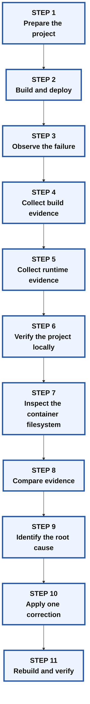
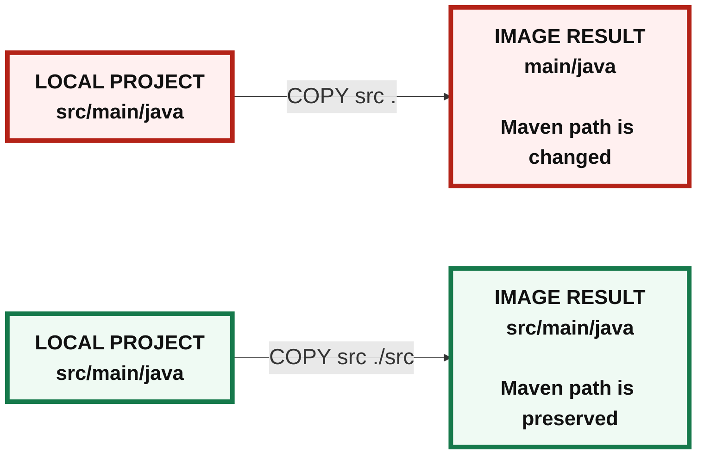
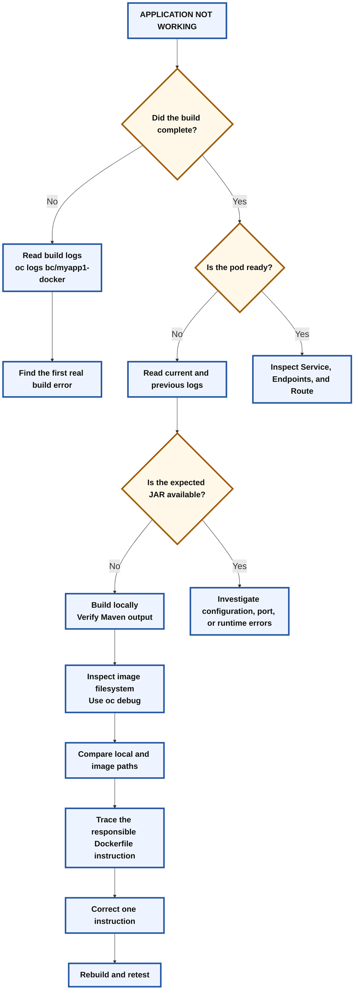

# 🧑‍🏫 OpenShift Docker Build Troubleshooting Lab

## Diagnosing and Repairing a Maven Application Deployment

## 🎯 Learning objectives

After completing this lab, students should be able to:

- Log in to an OpenShift cluster and select a project.
- Create an application by using the OpenShift Docker build strategy.
- Monitor a BuildConfig and interpret build logs.
- Distinguish between build-time and runtime failures.
- Read pod and deployment logs.
- Verify Maven build output on the workstation.
- Inspect a container filesystem with `oc debug`.
- Compare a local project structure with the structure inside an image.
- Identify the root cause of a failed application deployment.
- Correct the Dockerfile, rebuild the image, and verify the application.

---

# 📘 Scenario

You are given a Maven application stored in a Git repository.

Your task is to:

1. Build the application with an OpenShift Docker build.
2. Deploy it.
3. Test the `/expenses` endpoint.
4. Investigate and repair any problem that prevents the application from working.

Do not assume the first visible error is the root cause. Collect evidence at every stage before modifying the application.

---

# 🗺️ Troubleshooting process



---

# Part 1: Connect to OpenShift

## 1. 🔐 Log in to the cluster

```bash
oc login -u developer -p developer \
  https://api.ocp4.example.com:6443
```

Verify the authenticated user:

```bash
oc whoami
```

Verify the connected API server:

```bash
oc whoami --show-server
```

Expected user:

```text
developer
```

> [!NOTE]
> Passing a password directly on the command line is acceptable in this isolated training environment. In a production environment, avoid storing credentials in shell history.

---

## 2. 📁 Select the project

```bash
oc project docker-app
```

Confirm the active project:

```bash
oc project -q
```

Expected output:

```text
docker-app
```

If the project does not exist and the user has permission to create one:

```bash
oc new-project docker-app
```

---

# Part 2: Prepare the application source

## 3. 📥 Clone the Git repository

Create a workspace:

```bash
mkdir -p /home/student/docker-app
cd /home/student/docker-app
```

Clone the repository:

```bash
git clone https://git.ocp4.example.com/developer/DO288-apps
```

Enter the application directory:

```bash
cd /home/student/docker-app/DO288-apps/apps/docker-app/myapp1-docker
```

Verify the current directory:

```bash
pwd
```

Expected path:

```text
/home/student/docker-app/DO288-apps/apps/docker-app/myapp1-docker
```

Inspect the available files:

```bash
ls -la
```

Inspect the application directories:

```bash
find src -maxdepth 4 -type d | sort
```

A standard Maven project normally resembles:

```text
myapp1-docker/
├── pom.xml
└── src/
    ├── main/
    │   ├── java/
    │   └── resources/
    └── test/
        └── java/
```

---

## 4. 📝 Create the Dockerfile

Create the Dockerfile in the application directory:

```bash
cat > Dockerfile <<'EOF'
FROM registry.ocp4.example.com:8443/redhattraining/ocpdev-ubi8-openjdk-17-base:1.16

COPY pom.xml .
RUN mvn dependency:go-offline

COPY src .
RUN mvn clean package

CMD ["java", "-jar", "target/myapp1-docker-1.0.0-SNAPSHOT-runner.jar"]
EOF
```

Display the file:

```bash
cat Dockerfile
```

### Dockerfile instruction summary

| Instruction | Purpose |
|---|---|
| `FROM` | Selects the Java 17 base image. |
| `COPY pom.xml .` | Copies the Maven project descriptor. |
| `RUN mvn dependency:go-offline` | Downloads Maven dependencies. |
| `COPY src .` | Copies application source content into the image. |
| `RUN mvn clean package` | Builds the application. |
| `CMD` | Starts the expected runner JAR. |

At this point, do not change the Dockerfile. First test the complete build and deployment flow.

---

## 5. ⬆️ Commit and push the Dockerfile

Review the repository state:

```bash
git status
git diff -- Dockerfile
```

Stage the new file:

```bash
git add Dockerfile
```

Commit it:

```bash
git commit -m "feat: add Docker build definition"
```

Push it:

```bash
git push
```

Confirm that the local working tree is clean:

```bash
git status
```

Expected result:

```text
nothing to commit, working tree clean
```

### Why is `git push` required?

OpenShift performs the build from the remote Git repository. Files that exist only on the workstation are not included in the cluster build.

---

# Part 3: Create the OpenShift application

## 6. 🏗️ Create the application with Docker strategy

```bash
oc new-app \
  --name=myapp1-docker \
  --strategy=docker \
  --context-dir=apps/docker-app/myapp1-docker \
  https://git.ocp4.example.com/developer/DO288-apps
```

### What the command normally creates

Depending on the OpenShift version and cluster configuration, the command creates resources such as:

- A `BuildConfig`
- A build
- An `ImageStream`
- A `Deployment`
- A `Service`

Inspect the generated resources:

```bash
oc get buildconfig,build,imagestream,deployment,service
```

> [!IMPORTANT]
> The `--context-dir` value tells OpenShift to use this repository subdirectory:
>
> ```text
> apps/docker-app/myapp1-docker
> ```
>
> The Dockerfile, `pom.xml`, and source files must all be available within that directory.

---

# Part 4: Observe before troubleshooting

## 7. 📜 Monitor the build

Follow the BuildConfig logs:

```bash
oc logs -f buildconfig/myapp1-docker
```

The abbreviated resource name can also be used:

```bash
oc logs -f bc/myapp1-docker
```

After the log stream finishes, check the builds:

```bash
oc get builds
```

Sort builds by creation time:

```bash
oc get builds --sort-by=.metadata.creationTimestamp
```

Describe the first build:

```bash
oc describe build/myapp1-docker-1
```

### Record the evidence

Students should write down:

- Did the build finish with `Complete` or `Failed`?
- Did Maven compile application classes?
- Did Maven report that no sources were available?
- Was a runner JAR mentioned in the output?
- Did the error appear during image creation or after deployment?

> [!IMPORTANT]
> A successful image build does not automatically mean the application inside the image is valid.

---

## 8. 📦 Check pod status

```bash
oc get pods
```

Watch pod changes:

```bash
oc get pods -w
```

Press `Ctrl+C` after observing the state.

Possible pod states include:

```text
Running
Error
CrashLoopBackOff
ImagePullBackOff
```

Check the restart count. A pod that repeatedly restarts usually means the container process starts and then exits.

---

## 9. 🧾 Read application logs

Read deployment logs:

```bash
oc logs deployment/myapp1-docker
```

If the container restarted, inspect the previous container instance:

```bash
oc get pods
```

Then run:

```bash
oc logs <pod-name> --previous
```

Possible messages may include:

```text
Unable to access jarfile
```

or another startup-related error.

Do not correct anything yet. The log message describes the immediate failure, but not necessarily the underlying cause.

---

# Part 5: Form a troubleshooting hypothesis

## 10. 🧠 Separate symptoms from causes

Use the following distinction:

| Type | Example |
|---|---|
| Symptom | The pod is restarting. |
| Immediate failure | Java cannot start the configured JAR. |
| Possible cause | The JAR was not created or was created somewhere else. |
| Root cause | The condition that prevented the expected build output from being produced. |

A reliable troubleshooting sequence is:

```text
Observe
  ↓
Collect evidence
  ↓
Reproduce
  ↓
Compare
  ↓
Identify root cause
  ↓
Change one thing
  ↓
Retest
```

---

## 11. 🔎 Inspect the configured startup command

Display the Dockerfile:

```bash
cat Dockerfile
```

The container attempts to run:

```text
target/myapp1-docker-1.0.0-SNAPSHOT-runner.jar
```

This leads to the next diagnostic question:

> Does the Maven project normally create this file?

---

# Part 6: Verify the Maven project locally

## 12. 🧪 Build the application on the workstation

From the directory containing `pom.xml`, run:

```bash
mvn -Dmaven.compiler.release=11 clean package
```

Check the Maven result carefully.

The local build provides a baseline because the workstation still contains the original project directory structure.

---

## 13. 🔍 Verify the runner JAR

List matching runner files:

```bash
ls -lh target/*runner*
```

Use a precise test:

```bash
EXPECTED_JAR="target/myapp1-docker-1.0.0-SNAPSHOT-runner.jar"

if test -f "${EXPECTED_JAR}"; then
  echo "PASS: ${EXPECTED_JAR} exists"
else
  echo "FAIL: Expected runner JAR was not found"
  echo "Available JAR files:"
  find target -type f -name '*.jar' -print
fi
```

### Interpret the result

If the local build creates the expected runner JAR, then:

- The source code can be compiled.
- The POM can package the application.
- The expected filename is valid.
- The problem is probably specific to the container build environment.

This reduces the search area. The next step is to inspect the image filesystem.

---

# Part 7: Inspect the container image

## 14. 🔬 Use `oc debug`

A crashing container may not remain available long enough for `oc rsh`.

Create a debug pod from the Deployment:

```bash
oc debug deployment/myapp1-docker -- /bin/sh
```

Inside the debug shell, run:

```bash
pwd
ls -la
```

Inspect the directories near the working directory:

```bash
find . -maxdepth 3 -type d | sort
```

Check for a `src` directory:

```bash
ls -ld src 2>/dev/null
```

Check for `main` and `test` directories:

```bash
ls -ld main test 2>/dev/null
```

Inspect the target directory:

```bash
ls -la target 2>/dev/null
```

Search for JAR files:

```bash
find target -type f -name '*.jar' -print 2>/dev/null
```

Exit:

```bash
exit
```

---

## 15. 📋 Record the filesystem evidence

Complete this table:

| Item | Workstation | Container image |
|---|---|---|
| `pom.xml` | Present or absent | Present or absent |
| `src/` | Present or absent | Present or absent |
| `src/main/java` | Present or absent | Present or absent |
| `main/java` | Present or absent | Present or absent |
| Expected runner JAR | Present or absent | Present or absent |

Do not edit the Dockerfile until the two structures have been compared.

---

# Part 8: Compare the two environments

## 16. 🗂️ Compare the project layouts

### Workstation layout

The local project should resemble:

```text
working-directory/
├── pom.xml
└── src/
    ├── main/
    │   ├── java/
    │   └── resources/
    └── test/
        └── java/
```

### Container layout

The image may resemble:

```text
working-directory/
├── pom.xml
├── main/
│   ├── java/
│   └── resources/
└── test/
    └── java/
```

Now ask:

1. Where is the `src` directory inside the image?
2. Where does Maven expect Java source files?
3. Which Dockerfile instruction created this difference?

---

## 17. 🔍 Trace each Dockerfile instruction

Display only the copy instructions:

```bash
grep -n '^COPY' Dockerfile
```

Expected output:

```text
COPY pom.xml .
COPY src .
```

Compare the second instruction with the filesystem evidence.

Docker `COPY` uses this form:

```dockerfile
COPY <source> <destination>
```

For the current instruction:

```dockerfile
COPY src .
```

- Source: the contents of the local `src` directory
- Destination: the current image working directory

The result is that `main/` and `test/` are placed directly in the image working directory.

Maven expects:

```text
src/main/java
```

The image contains:

```text
main/java
```

---

# Part 9: Identify the root cause

## 18. ✅ Root-cause conclusion

The application does not build correctly inside the container because the Maven source hierarchy is not preserved.

The Dockerfile instruction:

```dockerfile
COPY src .
```

places the contents of `src` in the working directory.

It should create an image directory named `src` so that Maven can continue to find:

```text
src/main/java
src/main/resources
src/test/java
```

The correction is:

```dockerfile
COPY src ./src
```

---

## 19. 🖼️ Visual comparison



---

# Part 10: Apply the correction

## 20. 🛠️ Modify only the identified line

Display the existing Dockerfile:

```bash
cat Dockerfile
```

Replace the source-copy instruction:

```bash
sed -i 's|^COPY src \.$|COPY src ./src|' Dockerfile
```

Review the change:

```bash
git diff -- Dockerfile
```

The corrected Dockerfile should now be:

```dockerfile
FROM registry.ocp4.example.com:8443/redhattraining/ocpdev-ubi8-openjdk-17-base:1.16

COPY pom.xml .
RUN mvn dependency:go-offline

COPY src ./src
RUN mvn clean package

CMD ["java", "-jar", "target/myapp1-docker-1.0.0-SNAPSHOT-runner.jar"]
```

### Why change only one line?

Changing one variable allows the student to prove that the identified instruction caused the problem. Changing several commands at once would make the conclusion uncertain.

---

## 21. ⬆️ Commit and push the correction

```bash
git add Dockerfile
git commit -m "fix: preserve Maven source directory"
git push
```

Verify the latest commit:

```bash
git log -1 --oneline
```

---

# Part 11: Rebuild the application

## 22. 🔄 Start a new build

A Git push may not automatically trigger a build unless a webhook is configured.

Start a new build manually:

```bash
oc start-build myapp1-docker --follow
```

Check the build status:

```bash
oc get builds
```

The latest build should reach:

```text
Complete
```

Describe the latest build if necessary:

```bash
oc get builds --sort-by=.metadata.creationTimestamp
```

```bash
oc describe build/<latest-build-name>
```

---

## 23. 🚀 Verify the rollout

Wait for the Deployment:

```bash
oc rollout status deployment/myapp1-docker --timeout=180s
```

Check the pods:

```bash
oc get pods
```

A healthy application pod should show:

```text
READY   STATUS    RESTARTS
1/1     Running   0
```

Read the application logs:

```bash
oc logs deployment/myapp1-docker --tail=100
```

---

## 24. 🔍 Verify the repaired container

Enter the running container:

```bash
oc rsh deployment/myapp1-docker
```

Inside the container:

```bash
pwd
ls -ld src
find src -maxdepth 3 -type d | sort
find target -type f -name '*runner.jar' -print
exit
```

Expected findings:

- `src/` exists.
- `src/main/...` exists.
- The runner JAR exists under `target/`.

---

# Part 12: Expose and test the application

## 25. 🌐 Create the route

Confirm the service:

```bash
oc get service myapp1-docker
```

Expose it only if a route does not already exist:

```bash
oc get route myapp1-docker >/dev/null 2>&1 || \
  oc expose service/myapp1-docker
```

Display the route:

```bash
oc get route myapp1-docker
```

Read the actual hostname:

```bash
ROUTE_HOST="$(oc get route myapp1-docker \
  -o jsonpath='{.spec.host}')"

echo "${ROUTE_HOST}"
```

---

## 26. ✅ Test the endpoint

```bash
curl -s "http://${ROUTE_HOST}/expenses" | jq .
```

To inspect the HTTP response:

```bash
curl -i "http://${ROUTE_HOST}/expenses"
```

A successful result should include:

- HTTP status `200`
- Valid JSON
- A running and ready pod
- No missing-JAR error
- A preserved Maven source directory inside the image

---

# 🩺 Troubleshooting decision tree



---

# 📊 Evidence worksheet

| Command | Observation | What it proves |
|---|---|---|
| `oc get builds` | Build phase | Whether image creation completed |
| `oc logs bc/myapp1-docker` | Maven output | Whether source code was compiled |
| `oc get pods` | Pod state and restart count | Whether the container remains running |
| `oc logs <pod> --previous` | Previous startup failure | Why the last container exited |
| `mvn ... clean package` | Local build result | Whether the project itself is valid |
| `ls target/*runner*` | Local runner JAR | Whether the expected artifact can be produced |
| `oc debug deployment/...` | Image filesystem | Whether the source hierarchy is preserved |
| `grep -n '^COPY' Dockerfile` | Copy instructions | Which instruction changed the directory structure |
| Final `curl` | HTTP response | Whether the repair succeeded end to end |

---

# ⚠️ Common troubleshooting mistakes

## 1. Editing before collecting evidence

Changing the Dockerfile immediately prevents students from learning how the failure was isolated.

Use this sequence:

```text
Observe → Record → Compare → Conclude → Correct
```

---

## 2. Treating the first log message as the root cause

For example:

```text
Unable to access jarfile
```

This explains why the container exited. It does not explain why the JAR is absent.

---

## 3. Checking only the OpenShift build

A build may complete even when the resulting image cannot run correctly.

Always check:

```bash
oc get builds
oc get pods
oc logs deployment/myapp1-docker
```

---

## 4. Skipping the local build

Without the local baseline, it is harder to determine whether the problem is in the application or in the image assembly.

---

## 5. Using `oc rsh` against a crashing pod

A crashing container may exit before a shell can be opened.

Use:

```bash
oc debug deployment/myapp1-docker -- /bin/sh
```

---

## 6. Changing multiple Dockerfile instructions

Change only the instruction supported by the evidence. Otherwise, the actual fix cannot be proven.

---

## 7. Assuming `git push` always starts a build

Use:

```bash
oc start-build myapp1-docker --follow
```

unless a working webhook has been verified.

---

# ✅ Final validation checklist

## Investigation

- [ ] Logged in as `developer`.
- [ ] Selected the `docker-app` project.
- [ ] Cloned the correct repository.
- [ ] Entered the correct application subdirectory.
- [ ] Created and pushed the Dockerfile.
- [ ] Created the OpenShift application.
- [ ] Recorded the build status.
- [ ] Recorded the pod state.
- [ ] Read current or previous container logs.
- [ ] Built the application locally.
- [ ] Verified the local runner JAR.
- [ ] Inspected the image with `oc debug`.
- [ ] Compared local and image directory structures.
- [ ] Traced the difference to a Dockerfile instruction.

## Repair

- [ ] Changed `COPY src .` to `COPY src ./src`.
- [ ] Changed no unrelated instruction.
- [ ] Committed and pushed the correction.
- [ ] Started a new OpenShift build.
- [ ] Verified the build completed.
- [ ] Verified the pod became ready.
- [ ] Verified the runner JAR inside the container.
- [ ] Exposed the service.
- [ ] Tested `/expenses`.
- [ ] Received valid JSON.

---

# 📝 Review questions

1. Why is a completed image build not proof that the application will run?
2. What information does `oc logs <pod> --previous` provide?
3. Why should the Maven project be built locally during troubleshooting?
4. Why is the image filesystem inspected with `oc debug`?
5. What was different between the workstation and container directory structures?
6. Which Dockerfile instruction created that difference?
7. Why does Maven require `src/main/java`?
8. Why should only one instruction be changed during the repair?
9. Why is `oc start-build` used after pushing the correction?
10. What evidence proves that the repair succeeded?

---

# 🧾 Complete command sequence

## Initial build and deployment

```bash
oc login -u developer -p developer \
  https://api.ocp4.example.com:6443

oc project docker-app

mkdir -p /home/student/docker-app
cd /home/student/docker-app

git clone https://git.ocp4.example.com/developer/DO288-apps

cd /home/student/docker-app/DO288-apps/apps/docker-app/myapp1-docker

cat > Dockerfile <<'EOF'
FROM registry.ocp4.example.com:8443/redhattraining/ocpdev-ubi8-openjdk-17-base:1.16

COPY pom.xml .
RUN mvn dependency:go-offline

COPY src .
RUN mvn clean package

CMD ["java", "-jar", "target/myapp1-docker-1.0.0-SNAPSHOT-runner.jar"]
EOF

git add Dockerfile
git commit -m "feat: add Docker build definition"
git push

oc new-app \
  --name=myapp1-docker \
  --strategy=docker \
  --context-dir=apps/docker-app/myapp1-docker \
  https://git.ocp4.example.com/developer/DO288-apps

oc logs -f bc/myapp1-docker
oc get builds
oc get pods
oc logs deployment/myapp1-docker
```

## Investigation

```bash
mvn -Dmaven.compiler.release=11 clean package
ls -lh target/*runner*

oc debug deployment/myapp1-docker -- /bin/sh
```

Inside the debug pod:

```bash
pwd
ls -la
find . -maxdepth 3 -type d | sort
ls -ld src main test 2>/dev/null
find target -type f -name '*.jar' -print 2>/dev/null
exit
```

## Correction and rebuild

```bash
sed -i 's|^COPY src \.$|COPY src ./src|' Dockerfile

git diff -- Dockerfile
git add Dockerfile
git commit -m "fix: preserve Maven source directory"
git push

oc start-build myapp1-docker --follow
oc rollout status deployment/myapp1-docker --timeout=180s
oc get pods
oc logs deployment/myapp1-docker --tail=100
```

## Route and verification

```bash
oc get route myapp1-docker >/dev/null 2>&1 || \
  oc expose service/myapp1-docker

ROUTE_HOST="$(oc get route myapp1-docker \
  -o jsonpath='{.spec.host}')"

curl -s "http://${ROUTE_HOST}/expenses" | jq .
```

---

# 🎓 Final troubleshooting conclusion

The repair is not presented at the beginning of the exercise.

Students reach it by following the evidence:

```text
The application does not work
        ↓
The pod or endpoint shows a runtime problem
        ↓
The local Maven project creates the expected artifact
        ↓
The container filesystem differs from the local project
        ↓
The expected Maven source path is missing
        ↓
A Dockerfile COPY instruction changed the hierarchy
        ↓
The source directory is preserved
        ↓
The image is rebuilt
        ↓
The application starts and the endpoint responds
```
