# 🧑‍🏫 Building and Troubleshooting a Docker-Strategy Application on OpenShift

## 🎯 Learning objectives

By the end of this exercise, a student should be able to:

- Log in to an OpenShift cluster and select a project.
- Understand the relationship between a Git repository, an OpenShift build context, and a Dockerfile.
- Build a Maven application locally before building it on OpenShift.
- Correct a Dockerfile that breaks the standard Maven directory structure.
- Create an OpenShift application by using the Docker build strategy.
- Read build and application logs.
- Rebuild an existing application after pushing a correction.
- Expose the application with a route and test its REST endpoint.

---

## ⚠️ Errors in the original procedure

| No. | Original instruction | Problem | Correct approach |
|---:|---|---|---|
| 1 | `git clone ...` followed by creating `Dockerfile` in the parent directory | `git clone` creates a `DO288-apps` directory, but OpenShift uses `apps/docker-app/myapp1-docker` inside that repository as its build context. A Dockerfile created in the parent directory is invisible to the OpenShift build. | Change into `DO288-apps/apps/docker-app/myapp1-docker` before creating or editing the Dockerfile. |
| 2 | `cat <<EOF >> Dockerfile` | `>>` appends content. Re-running the command can produce duplicate Dockerfile instructions. | Use `>` to create or replace the file deliberately. |
| 3 | A line containing `-----` inside the Dockerfile | `-----` is not a valid Dockerfile instruction and causes a parsing error such as `unknown instruction`. | Remove the line. |
| 4 | `COPY src .` | Docker copies the **contents** of `src` into the current image directory. This changes `src/main/java` into `main/java`, so Maven no longer sees the standard source tree. | Use `COPY src ./src` or `COPY src src`. |
| 5 | Running `oc new-app` before committing and pushing the Dockerfile | A Git-based OpenShift build reads the remote repository, not uncommitted workstation files. | Commit and push the corrected Dockerfile before creating or restarting the build. |
| 6 | `git commit -am "..."` | The `-a` option stages modified tracked files, but it does not reliably include a newly created, untracked Dockerfile. | Run `git add Dockerfile` before `git commit`. |
| 7 | `mvn -Dmaven.compiler.release=11 clean package` while the container image uses Java 17 | This does not reproduce the same build configuration as the container unless the project explicitly requires Java 11. It can hide or introduce version-related differences. | Use the Java version defined by the project POM. For this exercise, run `mvn clean package` unless the POM explicitly specifies another release. |
| 8 | “Open the file” followed by `cat Dockerfile` | `cat` only displays a file. It does not edit it. | Use an editor or replace the file with a here-document. |
| 9 | `git push` without starting another OpenShift build | A Git push does not guarantee that the BuildConfig will automatically rebuild unless a working webhook is configured. | Run `oc start-build myapp1-docker --follow` after pushing the fix. |
| 10 | Immediately running pod logs after the build command | The image build or deployment rollout might still be running. | Verify the build first, then wait for the deployment rollout before reading application logs. |
| 11 | Using `oc debug` as though it enters the original application pod | `oc debug` creates a separate debug pod from the workload definition. | Use `oc rsh` to inspect a running application pod. Use `oc debug` when the original container cannot remain running. |
| 12 | Hard-coding the generated route hostname | Route hostnames depend on the route name, project, and cluster application domain. | Read the actual hostname with `oc get route ... -o jsonpath=...`. |
| 13 | `--strategy Docker` | CLI option values are conventionally supplied in lowercase, and lowercase avoids version-dependent parsing surprises. | Use `--strategy=docker`. |

---

## 🧠 Why `COPY src .` breaks the Maven project

A standard Maven application normally has this structure:

```text
myapp1-docker/
├── pom.xml
└── src/
    ├── main/
    │   ├── java/
    │   └── resources/
    └── test/
        └── java/
```

With the following instruction:

```dockerfile
COPY src .
```

Docker copies the **contents** of `src` into the current working directory. The image can therefore end up with this incorrect layout:

```text
working-directory/
├── pom.xml
├── main/
│   ├── java/
│   └── resources/
└── test/
    └── java/
```

Maven expects source code under `src/main/java`, not `main/java`.

The corrected instruction preserves the directory itself:

```dockerfile
COPY src ./src
```

The resulting image layout remains:

```text
working-directory/
├── pom.xml
└── src/
    ├── main/
    │   ├── java/
    │   └── resources/
    └── test/
        └── java/
```

---

## 🗺️ Build and deployment flow

```mermaid
flowchart LR
    A["🔐 Log in"] --> B["📁 Select project"]
    B --> C["📥 Clone Git repository"]
    C --> D["📂 Enter the application context directory"]
    D --> E["📝 Create the corrected Dockerfile"]
    E --> F["🧪 Build locally with Maven"]
    F --> G["⬆️ Commit and push"]
    G --> H["🏗️ Create or restart OpenShift build"]
    H --> I["📦 Build container image"]
    I --> J["🚀 Roll out Deployment"]
    J --> K["🔌 Service"]
    K --> L["🌐 Route"]
    L --> M["✅ Test /expenses endpoint"]
```



> [!IMPORTANT]
> OpenShift uses the directory supplied through `--context-dir` as the Docker build context. The Dockerfile, `pom.xml`, and `src` directory must all be present in that remote Git subdirectory.

---

# ✅ Corrected procedure

## 1. 🔐 Log in to OpenShift

```bash
oc login -u developer -p developer \
  https://api.ocp4.example.com:6443
```

Verify the active user and API server:

```bash
oc whoami
oc whoami --show-server
```

> [!NOTE]
> The username and password are acceptable for this training environment. In a real environment, avoid placing passwords directly in shell history.

---

## 2. 📁 Select the project

```bash
oc project docker-app
```

Confirm the active project:

```bash
oc project -q
```

Expected output:

```text
docker-app
```

If the project does not already exist and the account is allowed to create projects, use:

```bash
oc new-project docker-app
```

---

## 3. 📥 Clone the repository

Create a workspace and clone the repository:

```bash
mkdir -p /home/student/docker-app
cd /home/student/docker-app

git clone https://git.ocp4.example.com/developer/DO288-apps
```

Now enter the exact subdirectory that will be used as the OpenShift build context:

```bash
cd /home/student/docker-app/DO288-apps/apps/docker-app/myapp1-docker
```

Verify the location and files:

```bash
pwd
ls -la
```

The directory should contain at least:

```text
pom.xml
src/
```

> [!WARNING]
> Do not create the Dockerfile in `/home/student/docker-app` or in another parent directory. OpenShift cannot read files outside the configured build context.

---

## 4. 📝 Create the corrected Dockerfile

Create or replace the Dockerfile:

```bash
cat > Dockerfile <<'EOF'
FROM registry.ocp4.example.com:8443/redhattraining/ocpdev-ubi8-openjdk-17-base:1.16

COPY pom.xml .
RUN mvn -B dependency:go-offline

COPY src ./src
RUN mvn -B clean package

CMD ["java", "-jar", "target/myapp1-docker-1.0.0-SNAPSHOT-runner.jar"]
EOF
```

Display the file for verification:

```bash
cat Dockerfile
```

### Explanation of each instruction

| Instruction | Purpose |
|---|---|
| `FROM ...openjdk-17-base:1.16` | Uses the training image that supplies Java 17 and the build environment. |
| `COPY pom.xml .` | Copies the Maven project descriptor before the source code. |
| `RUN mvn -B dependency:go-offline` | Downloads dependencies in a separate image layer. `-B` enables non-interactive batch mode. |
| `COPY src ./src` | Preserves the Maven `src/main/...` and `src/test/...` directory structure. |
| `RUN mvn -B clean package` | Compiles, tests, and packages the application. |
| `CMD [...]` | Starts the packaged runner JAR when the container launches. |

### Why copy `pom.xml` first?

Dependencies usually change less frequently than source code. Separating dependency download from source compilation allows a container builder to reuse the dependency layer when only application source files change.

---

## 5. 🧪 Build the application locally

Check the local Java and Maven versions:

```bash
java -version
mvn -version
```

Build the project from the directory containing `pom.xml`:

```bash
mvn clean package
```

Verify the expected runner JAR:

```bash
JAR_FILE="target/myapp1-docker-1.0.0-SNAPSHOT-runner.jar"

if test -f "${JAR_FILE}"; then
  echo "✅ Runner JAR found: ${JAR_FILE}"
else
  echo "❌ Expected runner JAR was not found."
  echo "Available JAR files:"
  find target -maxdepth 2 -type f -name '*.jar' -print
  exit 1
fi
```

> [!IMPORTANT]
> Do not force `maven.compiler.release=11` unless the project POM explicitly requires Java 11. The local verification should match the project configuration used by the container build.

---

## 6. ⬆️ Commit and push the corrected Dockerfile

Review the change:

```bash
git status
git diff -- Dockerfile
```

Stage and commit it:

```bash
git add Dockerfile
git commit -m "fix: preserve Maven source directory in Docker build"
git push
```

Confirm that the working tree is clean:

```bash
git status
```

Expected result:

```text
nothing to commit, working tree clean
```

> [!NOTE]
> OpenShift clones the remote repository during a Git-based build. A local file that has not been pushed is invisible to the cluster.

---

# 🚀 Fresh deployment path

Use this section when the OpenShift application has **not** already been created.

## 7. 🏗️ Create the application with Docker strategy

```bash
oc new-app \
  --name=myapp1-docker \
  --strategy=docker \
  --context-dir=apps/docker-app/myapp1-docker \
  https://git.ocp4.example.com/developer/DO288-apps
```

### What this command creates

Depending on the OpenShift version and cluster configuration, the command normally creates resources such as:

- A `BuildConfig` for building the image.
- An `ImageStream` for storing the resulting image reference.
- A `Deployment` for running the application.
- A `Service` for providing stable internal network access.

Inspect the created resources:

```bash
oc status
oc get buildconfig,build,imagestream,deployment,service
```

---

## 8. 📜 Monitor the initial build

Stream the latest build logs:

```bash
oc logs -f bc/myapp1-docker
```

Check the final build status:

```bash
oc get builds
```

For detailed diagnostics, identify the latest build and describe it:

```bash
oc get builds --sort-by=.metadata.creationTimestamp
oc describe build/myapp1-docker-1
```

A successful build should show a phase similar to:

```text
Complete
```

> [!WARNING]
> If the build phase is `Failed`, do not continue to route testing. Read the build logs and correct the first actual error.

---

# 🔧 Recovery path for an application that already exists

Use this section when `oc new-app` was already run before the Dockerfile was corrected.

After committing and pushing the corrected file, manually start a new build:

```bash
oc start-build myapp1-docker --follow
```

Then verify its status:

```bash
oc get builds
```

This step matters because a normal `git push` does not guarantee that OpenShift will rebuild unless a repository webhook is configured and functioning.

If the BuildConfig does not use the expected source directory, inspect it:

```bash
oc get bc/myapp1-docker -o jsonpath='{.spec.source.git.uri}{"\n"}'
oc get bc/myapp1-docker -o jsonpath='{.spec.source.contextDir}{"\n"}'
oc get bc/myapp1-docker -o jsonpath='{.spec.strategy.type}{"\n"}'
```

Expected values should resemble:

```text
https://git.ocp4.example.com/developer/DO288-apps
apps/docker-app/myapp1-docker
Docker
```

---

## 9. 🚦 Wait for the application rollout

Wait for the Deployment to become available:

```bash
oc rollout status deployment/myapp1-docker --timeout=180s
```

Inspect the pods:

```bash
oc get pods
```

A healthy application pod should normally show:

```text
STATUS: Running
READY:  1/1
```

Read the application logs:

```bash
oc logs deployment/myapp1-docker --tail=100
```

Follow logs continuously when needed:

```bash
oc logs -f deployment/myapp1-docker
```

Press `Ctrl+C` to stop following the logs.

---

## 10. 🔍 Inspect the packaged files inside the container

### Method A: Inspect a running pod with `oc rsh`

List the pods:

```bash
oc get pods
```

Open a shell in the running application pod:

```bash
oc rsh <running-pod-name>
```

Inside the pod, run:

```bash
pwd
find . -maxdepth 4 -type f -name '*runner.jar' -print
ls -la
exit
```

### Method B: Use `oc debug` when the application container will not stay running

```bash
oc debug deployment/myapp1-docker -- /bin/sh
```

Inside the debug pod:

```bash
pwd
find . -maxdepth 4 -type f -name '*runner.jar' -print
exit
```

If the working directory is unknown and the JAR is not found, use the broader diagnostic command:

```bash
find / -type f -name '*runner.jar' 2>/dev/null
```

> [!NOTE]
> `oc debug` creates a separate debug pod based on the Deployment. It does not attach to the original running pod.

---

## 11. 🌐 Expose the service

First confirm that the service exists:

```bash
oc get service myapp1-docker
```

Create a route only if one does not already exist:

```bash
oc get route myapp1-docker >/dev/null 2>&1 || \
  oc expose service/myapp1-docker
```

Display the route:

```bash
oc get route myapp1-docker
```

Read the actual route hostname:

```bash
ROUTE_HOST="$(oc get route myapp1-docker -o jsonpath='{.spec.host}')"
echo "Application URL: http://${ROUTE_HOST}"
```

---

## 12. ✅ Test the REST endpoint

Test the `/expenses` endpoint:

```bash
curl -s "http://${ROUTE_HOST}/expenses" | jq .
```

Without `jq`, use:

```bash
curl -s "http://${ROUTE_HOST}/expenses"
```

For HTTP status and connection details:

```bash
curl -i "http://${ROUTE_HOST}/expenses"
```

A successful request should return an HTTP `200` response and valid JSON data.

---

# 🩺 Troubleshooting guide

## Problem 1: Dockerfile parsing fails

Example symptom:

```text
unknown instruction: -----
```

Cause:

- The `-----` separator was accidentally written into the Dockerfile.

Fix:

```bash
sed -i '/^-----$/d' Dockerfile
git add Dockerfile
git commit -m "fix: remove invalid Dockerfile separator"
git push
oc start-build myapp1-docker --follow
```

---

## Problem 2: Maven does not find application sources

Possible symptoms:

- The build produces no expected runner JAR.
- Maven reports missing application classes.
- The packaged application is incomplete.

Check the Dockerfile:

```bash
grep -n '^COPY' Dockerfile
```

Incorrect:

```dockerfile
COPY src .
```

Correct:

```dockerfile
COPY src ./src
```

---

## Problem 3: OpenShift still uses the old Dockerfile

Check the latest pushed commit:

```bash
git log -1 --oneline
git status
```

Check the source revision used by an OpenShift build:

```bash
oc describe build <build-name>
```

Start a new build after confirming the push:

```bash
oc start-build myapp1-docker --follow
```

---

## Problem 4: `oc new-app` says resources already exist

Do not repeatedly create the same application. Rebuild the existing BuildConfig:

```bash
oc start-build myapp1-docker --follow
```

Then wait for rollout:

```bash
oc rollout status deployment/myapp1-docker --timeout=180s
```

---

## Problem 5: Build succeeds, but the pod crashes

Inspect the pod status and events:

```bash
oc get pods
oc describe pod <pod-name>
```

Read current logs:

```bash
oc logs <pod-name>
```

Read logs from the previous failed container instance:

```bash
oc logs <pod-name> --previous
```

Common causes include:

- Incorrect JAR filename in `CMD`.
- The JAR was not generated.
- The application exits during startup.
- Required configuration is missing.
- The application listens on an unexpected port.

---

## Problem 6: Route exists, but `curl` fails

Inspect all related resources:

```bash
oc get route,service,endpoints,pods
```

Check whether the service has endpoints:

```bash
oc get endpoints myapp1-docker
```

If no endpoint addresses are displayed, the service selector does not currently match a ready pod.

Inspect service selectors and pod labels:

```bash
oc describe service myapp1-docker
oc get pods --show-labels
```

---

# 📋 Final validation checklist

- [ ] `oc whoami` returns `developer`.
- [ ] `oc project -q` returns `docker-app`.
- [ ] The Dockerfile is inside `DO288-apps/apps/docker-app/myapp1-docker`.
- [ ] The Dockerfile does not contain `-----`.
- [ ] The Dockerfile uses `COPY src ./src`.
- [ ] `mvn clean package` succeeds locally.
- [ ] The expected runner JAR exists.
- [ ] `git status` shows a clean working tree after the push.
- [ ] The latest OpenShift build phase is `Complete`.
- [ ] The application pod is `Running` and `Ready`.
- [ ] Application logs do not show startup errors.
- [ ] The service has one or more endpoints.
- [ ] The route hostname is read dynamically.
- [ ] `/expenses` returns an HTTP `200` response and valid JSON.

---

# 🧾 Compact corrected command sequence

The following block shows the complete fresh-deployment workflow without the detailed explanations:

```bash
# Log in and select the project
oc login -u developer -p developer \
  https://api.ocp4.example.com:6443

oc project docker-app

# Clone the repository
mkdir -p /home/student/docker-app
cd /home/student/docker-app
git clone https://git.ocp4.example.com/developer/DO288-apps

# Enter the OpenShift build-context directory
cd /home/student/docker-app/DO288-apps/apps/docker-app/myapp1-docker

# Create the corrected Dockerfile
cat > Dockerfile <<'EOF'
FROM registry.ocp4.example.com:8443/redhattraining/ocpdev-ubi8-openjdk-17-base:1.16

COPY pom.xml .
RUN mvn -B dependency:go-offline

COPY src ./src
RUN mvn -B clean package

CMD ["java", "-jar", "target/myapp1-docker-1.0.0-SNAPSHOT-runner.jar"]
EOF

# Verify locally
mvn clean package
test -f target/myapp1-docker-1.0.0-SNAPSHOT-runner.jar

# Commit and push
git add Dockerfile
git commit -m "fix: preserve Maven source directory in Docker build"
git push

# Create the OpenShift application
oc new-app \
  --name=myapp1-docker \
  --strategy=docker \
  --context-dir=apps/docker-app/myapp1-docker \
  https://git.ocp4.example.com/developer/DO288-apps

# Monitor build and deployment
oc logs -f bc/myapp1-docker
oc rollout status deployment/myapp1-docker --timeout=180s
oc get pods
oc logs deployment/myapp1-docker --tail=100

# Expose and test
oc get route myapp1-docker >/dev/null 2>&1 || \
  oc expose service/myapp1-docker

ROUTE_HOST="$(oc get route myapp1-docker -o jsonpath='{.spec.host}')"
curl -s "http://${ROUTE_HOST}/expenses" | jq .
```

For an application that already exists, replace the `oc new-app` section with:

```bash
oc start-build myapp1-docker --follow
oc rollout status deployment/myapp1-docker --timeout=180s
```
