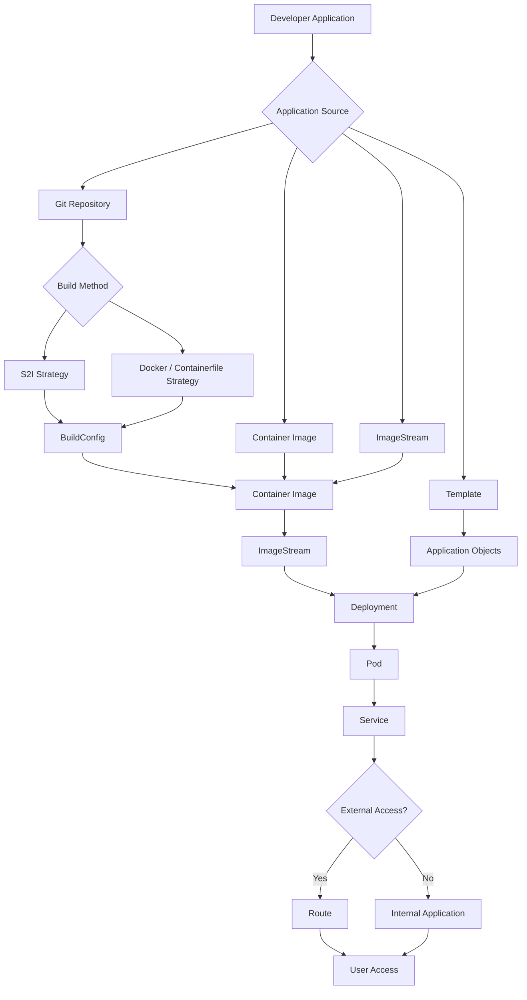

I have reorganized the entire `oc new-app` explanation into a **logical application lifecycle order**:

**Source → Build Method → Image → Deployment → Configuration → Networking → Advanced Options**

This order is much easier for DO288 preparation because it follows how OpenShift actually creates an application.

---

# `oc new-app` Complete Options (Synchronized Learning Flow)

In OpenShift Container Platform, the command:

```bash
oc new-app
```

creates an application from different sources:

* Git source code
* Container images
* Containerfile/Dockerfile
* S2I builder images
* Templates
* Existing image streams

It automatically creates required OpenShift objects:

```
BuildConfig
ImageStream
Deployment
Service
Route (optional)
```

---

# Application Creation Lifecycle



---

# 1. Application Source Options

First decide: **Where is my application coming from?**

---

# A. Git Repository Source

Used when you have application source code.

Syntax:

```bash
oc new-app <git-url>
```

Example:

```bash
oc new-app https://github.com/user/myapp.git
```

OpenShift:

```
Git Repository
      |
      ↓
Detect Application
      |
      ↓
Build Application
      |
      ↓
Create Image
      |
      ↓
Deploy
```

---

## Git Branch Selection

Option:

```bash
--branch
```

Example:

```bash
oc new-app \
https://github.com/user/app \
--branch=develop
```

Repository:

```
app
 |
 ├── main
 |
 ├── develop  ← selected
 |
 └── test
```

---

## Git Context Directory

Option:

```bash
--context-dir
```

Used when the application is inside a subfolder.

Example:

Repository:

```
project
 |
 ├── frontend
 |
 └── backend
```

Command:

```bash
oc new-app \
https://github.com/user/project \
--context-dir=backend
```

Builds:

```
backend/
```

only.

---

# 2. Build Strategy Options

After selecting Git source:

**How should OpenShift build the application?**

---

# A. Source-to-Image (S2I) Strategy

S2I means:

```
Source Code
     +
Builder Image
     |
     ↓
Application Image
```

Example:

```bash
oc new-app \
nodejs~https://github.com/user/app
```

The `nodejs~` means:

"Use Node.js S2I builder."

OpenShift automatically:

```
Download Source
       |
Install Dependencies
       |
Build Application
       |
Create Image
       |
Deploy
```

Common S2I builders:

```
Node.js
Python
Java
PHP
Ruby
```

---

# B. Docker / Containerfile Strategy

Used when you provide your own build instructions.

Example:

Repository:

```
myapp

├── Containerfile
└── app.py
```

Command:

```bash
oc new-app \
https://github.com/user/myapp \
--strategy=docker
```

Flow:

```
Source Code
     |
Containerfile/Dockerfile
     |
Container Build
     |
Image
```

---

## Specify Strategy

Option:

```bash
--strategy
```

Example:

S2I:

```bash
--strategy=source
```

Docker:

```bash
--strategy=docker
```

---

# 3. Container Image Source

If an image already exists, no build is needed.

---

## Image Name

Example:

```bash
oc new-app nginx
```

Creates:

```
nginx Image
     |
     ↓
Deployment
     |
     ↓
Pod
```

---

## Full Registry Image

Example:

```bash
oc new-app \
docker.io/library/nginx
```

---

## Private Registry Image

Example:

```bash
oc new-app \
registry.example.com/myapp:v1
```

Create registry secret:

```bash
oc create secret docker-registry mysecret \
--docker-server=registry.example.com
```

---

# 4. ImageStream Source

OpenShift can use internal ImageStreams.

Example:

```bash
oc new-app \
--image-stream=nodejs:18
```

Flow:

```
ImageStream
     |
     ↓
Deployment
     |
     ↓
Pod
```

---

# 5. Template-Based Application

Used when application definition already exists.

Option:

```bash
-f
```

Example:

```bash
oc new-app \
-f mysql-template.yaml
```

Template creates:

```
Deployment
Service
Secrets
ConfigMaps
```

---

# 6. Application Naming and Organization

---

## Application Name

Option:

```bash
--name
```

Example:

```bash
oc new-app nginx \
--name=frontend
```

Creates:

```
frontend
```

instead of:

```
nginx
```

---

## Labels

Option:

```bash
--labels
```

Example:

```bash
oc new-app nginx \
--labels=env=production
```

Creates:

```yaml
labels:
  env: production
```

Multiple:

```bash
--labels="app=web,tier=frontend"
```

---

# 7. Build-Time Configuration

Variables required during image creation.

---

## Build Environment Variables

Option:

```bash
--build-env
```

Example:

```bash
oc new-app \
https://github.com/user/app \
--build-env NODE_ENV=production
```

Used during:

```
Build Stage
```

---

## Build Arguments

Option:

```bash
--build-arg
```

Example:

```bash
oc new-app \
https://github.com/user/app \
--build-arg VERSION=1.0
```

Passed to:

```
Docker/Containerfile build
```

---

# 8. Runtime Configuration

Variables required after deployment.

---

## Environment Variables

Option:

```bash
-e
```

Example:

```bash
oc new-app mysql \
-e MYSQL_USER=admin \
-e MYSQL_PASSWORD=password
```

Used inside running container.

---

Difference:

| Option        | Stage               |
| ------------- | ------------------- |
| `--build-env` | Image creation      |
| `--build-arg` | Container build     |
| `-e`          | Running application |

---

## Environment File

Option:

```bash
--env-file
```

Example:

File:

```
database.env
```

Content:

```
USER=admin
PASSWORD=password
```

Command:

```bash
oc new-app mysql \
--env-file=database.env
```

---

# 9. Deployment Options

---

## Deployment Type

Option:

```bash
--as-deployment-config=false
```

Old OpenShift default:

```
DeploymentConfig
```

Modern Kubernetes style:

```bash
oc new-app nginx \
--as-deployment-config=false
```

Creates:

```
Deployment
```

---

# 10. Networking Options

---

## Expose Application Ports

Option:

```bash
--ports
```

Example:

```bash
oc new-app nginx \
--ports=8080
```

Creates:

```
Service
 |
8080/TCP
```

Multiple:

```bash
--ports=8080,8443
```

---

## Create Route Automatically

Option:

```bash
--route
```

Example:

```bash
oc new-app nginx \
--route
```

Creates:

```
User
 |
Route
 |
Service
 |
Pod
```

---

# 11. Multiple Components

Example:

Frontend + Database:

```bash
oc new-app \
nodejs~https://github.com/user/frontend \
mysql
```

Creates:

```
Frontend Application
        |
        |
        ↓
MySQL Database
```

Architecture:

```
User
 |
Route
 |
Node.js Frontend
 |
MySQL Service
 |
MySQL Pod
```

---

# 12. Preview Before Creating

## Dry Run

Option:

```bash
--dry-run
```

Example:

```bash
oc new-app nginx \
--dry-run=client -o yaml
```

Shows YAML:

```yaml
kind: Deployment
kind: Service
```

without creating resources.

---

# 13. Namespace / Project Selection

Example:

```bash
oc new-app nginx \
-n development
```

Creates application in:

```
development project
```

---

# 14. Complete Real Examples

---

## Node.js Application using S2I

```bash
oc new-app \
nodejs~https://github.com/company/node-app \
--name=node-api \
--strategy=source \
-e NODE_ENV=production \
--route
```

Flow:

```
Git
 |
S2I
 |
BuildConfig
 |
ImageStream
 |
Deployment
 |
Service
 |
Route
```

---

## Application using Containerfile

```bash
oc new-app \
https://github.com/company/app \
--strategy=docker \
--name=custom-app
```

Flow:

```
Git
 |
Containerfile
 |
Image
 |
Deployment
 |
Pod
```

---

## Deploy Nginx

```bash
oc new-app nginx \
--name=frontend \
--ports=80 \
--route
```

---

## Deploy MySQL

```bash
oc new-app mysql \
-e MYSQL_DATABASE=testdb \
-e MYSQL_USER=user \
-e MYSQL_PASSWORD=password
```

---

# Most Important DO288 Interview Options

| Option           | Purpose                    |
| ---------------- | -------------------------- |
| Git URL          | Create from source         |
| `--branch`       | Select Git branch          |
| `--context-dir`  | Select folder              |
| `--strategy`     | Choose S2I/Docker build    |
| `nodejs~giturl`  | Use S2I builder            |
| `--image`        | Use container image        |
| `--image-stream` | Use OpenShift image stream |
| `-f`             | Create from template       |
| `--name`         | Application name           |
| `-e`             | Runtime variables          |
| `--build-env`    | Build variables            |
| `--build-arg`    | Build arguments            |
| `--ports`        | Expose ports               |
| `--route`        | Create external URL        |
| `--labels`       | Add metadata               |
| `--dry-run`      | Preview resources          |

---

## Final Mental Model

```
SOURCE
 |
 |-- Git
 |     |
 |     |-- S2I
 |     |
 |     |-- Containerfile/Dockerfile
 |
 |-- Container Image
 |
 |-- ImageStream
 |
 |-- Template

        ↓

BUILD

        ↓

IMAGE

        ↓

DEPLOYMENT

        ↓

POD

        ↓

SERVICE

        ↓

ROUTE

        ↓

USER
```

This sequence is the one to remember for DO288: **where code comes from → how image is built → where image comes from → how application runs → how users access it.**
