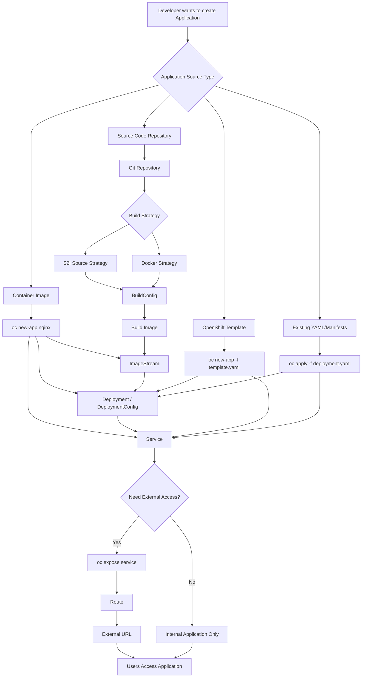
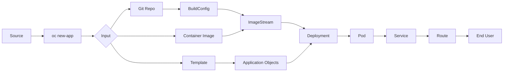

In OpenShift Container Platform, the command you mean is most likely:

```bash
oc new-app
```

(`oc new-a` is just an incomplete command. Humans invented autocomplete, then still managed to type half a command. A timeless achievement.)

`oc new-app` creates a new application by detecting source code, images, templates, or other inputs and creating the required Kubernetes/OpenShift objects.

## Basic Syntax

```bash
oc new-app [options] <source>
```

Examples:

```bash
oc new-app nginx
```

Creates an application from an image named `nginx`.

```bash
oc new-app https://github.com/user/myapp.git
```

Creates an application from source code.

---

I assume you mean a **Mermaid diagram** (the diagram syntax), not a magical "mirmade" creature that draws OpenShift apps for us. Sadly, Kubernetes has not reached that level of convenience yet.

Here is a **Mermaid flow diagram showing different ways to create an application in OpenShift using `oc new-app`:**



## Simplified OpenShift Application Creation Flow



### In interview terms:

```
Git Code
   |
   | oc new-app
   ↓
BuildConfig
   |
   ↓
Build
   |
   ↓
ImageStream
   |
   ↓
Deployment
   |
   ↓
Pod
   |
   ↓
Service
   |
   ↓
Route
   |
   ↓
User
```

This is the mental model you need for DO288: **everything starts from the application source, but the final goal is always a running Pod exposed through a Service (and optionally a Route).**

---

# 1. Create Application from Container Image

### Option: Image name

```bash
oc new-app nginx
```

Explanation:

* Pulls the `nginx` image
* Creates:

  * Deployment
  * Service
  * ImageStream (usually)

Example:

```bash
oc new-app docker.io/library/nginx
```

---

# 2. Create Application from Git Repository

### Source Code Deployment

```bash
oc new-app https://github.com/sclorg/nodejs-ex
```

OpenShift detects:

* Language
* Build strategy
* Required builder image

Creates:

```
BuildConfig
Deployment
Service
ImageStream
```

---

# 3. Specify Builder Image

### `--strategy`

Choose build strategy.

Syntax:

```bash
oc new-app <source> --strategy=<strategy>
```

Options:

### Source-to-Image (S2I)

```bash
oc new-app https://github.com/example/app \
--strategy=source
```

Used for:

* Java
* Python
* Node.js
* PHP applications

---

### Docker Strategy

```bash
oc new-app https://github.com/example/app \
--strategy=docker
```

Uses:

```
Dockerfile
```

Example:

Repository:

```
myapp/
 ├── Dockerfile
 └── index.html
```

Command:

```bash
oc new-app https://github.com/user/myapp \
--strategy=docker
```

---

# 4. Give Application Name

### `--name`

```bash
oc new-app nginx --name=my-web
```

Creates:

```
app name = my-web
```

Instead of default:

```
nginx
```

---

# 5. Create from Template

### `-f`

```bash
oc new-app -f template.yaml
```

Example:

```bash
oc new-app -f mysql-persistent-template.json
```

Uses OpenShift template.

---

# 6. Environment Variables

### `-e`

Add environment variables.

Example:

```bash
oc new-app mysql \
-e MYSQL_USER=admin \
-e MYSQL_PASSWORD=password
```

Creates container with:

```
MYSQL_USER=admin
MYSQL_PASSWORD=password
```

Multiple variables:

```bash
oc new-app myimage \
-e DB_HOST=mysql \
-e DB_PORT=3306
```

---

# 7. Create Application Without Deployment

### `--as-deployment-config=false`

Default older OpenShift behavior creates:

```
DeploymentConfig
```

To create Kubernetes Deployment:

```bash
oc new-app nginx \
--as-deployment-config=false
```

Creates:

```
Deployment
```

---

# 8. Create Only Build Configuration

### `--build-env`

Example:

```bash
oc new-app \
https://github.com/user/app \
--build-env NODE_ENV=production
```

Sets variables only during build.

Difference:

| Option        | Used for          |
| ------------- | ----------------- |
| `-e`          | Runtime container |
| `--build-env` | Build process     |

---

# 9. Expose Ports

### `--ports`

Example:

```bash
oc new-app nginx \
--ports=8080
```

Creates service exposing:

```
8080/TCP
```

Multiple ports:

```bash
oc new-app app \
--ports=8080,8443
```

---

# 10. Create Route Automatically

### `--route`

Example:

```bash
oc new-app nginx --route
```

Creates:

```
Pod
 |
Service
 |
Route
 |
External URL
```

Without it:

```
Only internal service
```

---

# 11. Labels

### `--labels`

Example:

```bash
oc new-app nginx \
--labels=env=production
```

Adds:

```yaml
labels:
  env: production
```

Multiple:

```bash
--labels="app=web,tier=frontend"
```

---

# 12. Deployment Environment Variables from File

### `--env-file`

Example:

File:

```
environment.txt
```

Content:

```
USER=admin
PASSWORD=test123
```

Command:

```bash
oc new-app mysql \
--env-file=environment.txt
```

---

# 13. Create App in Specific Namespace

Usually switch project:

```bash
oc project dev
```

Then:

```bash
oc new-app nginx
```

or:

```bash
oc new-app nginx \
-n dev
```

---

# 14. Dry Run (See YAML Before Creating)

Very useful.

```bash
oc new-app nginx \
--dry-run=client -o yaml
```

Output:

```yaml
apiVersion: apps/v1
kind: Deployment
...
```

Nothing is created.

---

# 15. Import Image from Private Registry

Example:

```bash
oc new-app \
registry.example.com/myimage:v1
```

Private registry:

```bash
oc create secret docker-registry mysecret \
--docker-server=registry.example.com
```

Then:

```bash
oc new-app registry.example.com/myimage:v1
```

---

# 16. Multiple Components Together

Example:

Frontend + Database:

```bash
oc new-app \
nodejs~https://github.com/user/frontend \
mysql
```

Creates:

```
frontend
   |
mysql database
```

---

# 17. Build Arguments

Example:

```bash
oc new-app \
https://github.com/user/app \
--build-arg VERSION=1.0
```

Passes arguments during Docker build.

---

# 18. Git Branch Selection

### `--branch`

Example:

```bash
oc new-app \
https://github.com/user/app \
--branch=develop
```

Uses:

```
develop branch
```

instead of:

```
main/master
```

---

# 19. Git Context Directory

### `--context-dir`

Example:

Repository:

```
repo/
 ├── backend/
 └── frontend/
```

Command:

```bash
oc new-app \
https://github.com/user/repo \
--context-dir=backend
```

Builds only:

```
backend/
```

---

# 20. Specify Image Stream

Example:

```bash
oc new-app \
--image-stream=nodejs:18
```

Uses OpenShift internal image stream.

---

# 21. List Available Options

The complete built-in help:

```bash
oc new-app --help
```

Short version:

```bash
oc new-app -h
```

---

# Common Real Production Examples

## Node.js Application

```bash
oc new-app \
https://github.com/company/node-app \
--name=node-api \
--strategy=source \
--env=NODE_ENV=production \
--route
```

Creates:

```
Git
 |
S2I Build
 |
ImageStream
 |
Deployment
 |
Service
 |
Route
```

---

## Deploy Nginx

```bash
oc new-app nginx \
--name=frontend \
--ports=80 \
--route
```

---

## Deploy Java Spring Boot

```bash
oc new-app \
https://github.com/company/spring-app \
--strategy=source \
--name=payment-service \
--route
```

---

## Database Example

```bash
oc new-app mysql \
-e MYSQL_DATABASE=testdb \
-e MYSQL_USER=user \
-e MYSQL_PASSWORD=password \
-e MYSQL_ROOT_PASSWORD=root123
```

---

## Most Important Options for Interviews

| Option          | Purpose                       |
| --------------- | ----------------------------- |
| `--name`        | Application name              |
| `-e`            | Runtime environment variables |
| `--strategy`    | Build method                  |
| `--image`       | Use container image           |
| `--route`       | Create external URL           |
| `--ports`       | Expose ports                  |
| `--labels`      | Add metadata                  |
| `--branch`      | Git branch                    |
| `--context-dir` | Build subdirectory            |
| `--dry-run`     | Preview YAML                  |
| `-f`            | Create from template          |

For OpenShift administrator interviews, `oc new-app`, `oc expose`, `oc create`, `oc apply`, `oc rollout`, and `oc adm` commands are the core survival kit. The cluster will not care that we memorized 300 commands, naturally, because computers have the emotional range of a brick.
