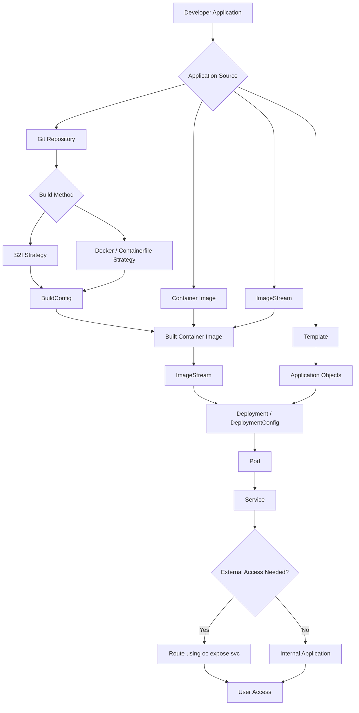

**Source → Build Method → Build Configuration → Image → Deployment → Runtime Configuration → Networking → Advanced Options**


---

# `oc new-app` Complete Options

## Synchronized Learning Flow for DO288

In OpenShift Container Platform, the command:

```bash
oc new-app
```

creates an application from different sources such as:

* Git source code
* Container images
* Containerfile/Dockerfile-based source repositories
* S2I builder images
* Templates
* Existing ImageStreams

Depending on the source type, OpenShift can automatically create objects such as:

```text
BuildConfig
ImageStream
Deployment or DeploymentConfig
Service
```

A Route is usually created separately using:

```bash
oc expose svc/<service-name>
```

---

# Application Creation Lifecycle



---

# 1. Application Source Options

First decide:

```text
Where is my application coming from?
```

OpenShift can create an application from:

```text
Git Repository
Container Image
ImageStream
Template
```

---

# 2. Git Repository Source

Use this when you have application source code in Git.

## Basic Syntax

```bash
oc new-app <git-url>
```

Example:

```bash
oc new-app https://github.com/user/myapp.git
```

OpenShift performs this flow:

```text
Git Repository
      |
      ↓
Detect Application Language
      |
      ↓
Select Builder Image if possible
      |
      ↓
Create BuildConfig
      |
      ↓
Build Application Image
      |
      ↓
Create ImageStream
      |
      ↓
Create Deployment
      |
      ↓
Create Service
```

---

## Git Branch Selection

Use this when the required application code is in a specific branch.

Option:

```bash
--branch
```

Example:

```bash
oc new-app \
https://github.com/user/app \
--branch=develop
```

Repository example:

```text
app
 |
 ├── main
 |
 ├── develop  ← selected
 |
 └── test
```

Only the `develop` branch is used for the build.

---

## Git Context Directory

Use this when the application is inside a subfolder of the repository.

Option:

```bash
--context-dir
```

Repository example:

```text
project
 |
 ├── frontend
 |
 └── backend
```

Command:

```bash
oc new-app \
https://github.com/user/project \
--context-dir=backend
```

OpenShift builds only:

```text
backend/
```

This is important when one Git repository contains multiple applications.

---

# 3. Git Build Method Options

After selecting Git source, decide:

```text
How should OpenShift build the application?
```

There are two major build strategies:

```text
S2I Strategy
Docker / Containerfile Strategy
```

---

# 3A. Source-to-Image Strategy

S2I means:

```text
Source Code
     +
Builder Image
     |
     ↓
Application Image
```

Example:

```bash
oc new-app \
nodejs~https://github.com/user/app
```

Here:

```text
nodejs~git-url
```

means:

```text
Use the Node.js S2I builder image to build the Git source code.
```

OpenShift automatically performs:

```text
Download Source
       |
Install Dependencies
       |
Run S2I Assemble Script
       |
Create Application Image
       |
Push Image to ImageStream
       |
Deploy Application
```

Common S2I builders:

```text
Node.js
Python
Java
PHP
Ruby
```

---

## S2I with Build-Time Environment Variables

Build-time variables belong here because they affect the build stage.

Option:

```bash
--build-env
```

Example:

```bash
oc new-app \
nodejs~https://github.com/user/app \
--build-env=NODE_ENV=production
```

Used during:

```text
Build Stage
```

Typical use cases:

```text
Proxy settings
Dependency installation mode
Maven/NPM build settings
Compile-time configuration
S2I assemble-script behavior
```

Example with proxy:

```bash
oc new-app \
nodejs~https://github.com/user/app \
--build-env=HTTP_PROXY=http://proxy.example.com:8080 \
--build-env=HTTPS_PROXY=http://proxy.example.com:8080
```

Important:

```text
--build-env is used while building the image.
-e or --env is used after the application is running.
```

Humans confusing these two is basically a required certification objective at this point.

---

## Build Environment File

Option:

```bash
--build-env-file
```

File:

```text
build.env
```

Content:

```text
HTTP_PROXY=http://proxy.example.com:8080
NODE_ENV=production
```

Command:

```bash
oc new-app \
nodejs~https://github.com/user/app \
--build-env-file=build.env
```

---

# 3B. Docker / Containerfile Strategy

Use this when your repository has a `Dockerfile` or `Containerfile`.

Repository example:

```text
myapp
 |
 ├── Containerfile
 └── app.py
```

Command:

```bash
oc new-app \
https://github.com/user/myapp \
--strategy=docker
```

Flow:

```text
Git Source
     |
Containerfile / Dockerfile
     |
Docker Strategy Build
     |
Container Image
     |
ImageStream
     |
Deployment
```

---

## Specify Build Strategy

Option:

```bash
--strategy
```

Examples:

For S2I/source strategy:

```bash
oc new-app \
https://github.com/user/app \
--strategy=source
```

For Docker/Containerfile strategy:

```bash
oc new-app \
https://github.com/user/app \
--strategy=docker
```

---

## Important Note About Build Arguments

Dockerfile `ARG` values are Docker build arguments.

In OpenShift BuildConfig, Docker build arguments are stored under:

```text
dockerStrategy.buildArgs
```

For DO288 basic `oc new-app` learning, do not treat `--build-arg` as a main `oc new-app` option unless your exact OpenShift CLI version confirms it in:

```bash
oc new-app --help
```

Safer DO288 mental model:

```text
--build-env       → build-time environment variable for new-app builds
docker buildArgs → Docker strategy BuildConfig setting
-e / --env        → runtime environment variable
```

If you need Docker build arguments, inspect or edit the BuildConfig:

```bash
oc get bc
oc edit bc/<buildconfig-name>
```

Example BuildConfig structure:

```yaml
strategy:
  dockerStrategy:
    buildArgs:
      - name: VERSION
        value: "1.0"
```

---

# 4. Container Image Source

Use this when an image already exists and no build is required.

## Simple Image Name

Example:

```bash
oc new-app nginx
```

Flow:

```text
Existing nginx Image
        |
        ↓
Deployment
        |
        ↓
Pod
        |
        ↓
Service
```

No BuildConfig is created because OpenShift is not building source code.

---

## Full Registry Image

Example:

```bash
oc new-app \
docker.io/library/nginx:latest
```

---

## Force External Container Image

Option:

```bash
--docker-image
```

Example:

```bash
oc new-app \
--docker-image=docker.io/library/nginx:latest \
--name=frontend
```

Use this when you want to clearly tell OpenShift:

```text
This is an external container image, not an ImageStream.
```

---

## Private Registry Image

Example:

```bash
oc new-app \
registry.example.com/myapp:v1
```

Create a registry pull secret:

```bash
oc create secret docker-registry mysecret \
--docker-server=registry.example.com \
--docker-username=myuser \
--docker-password=mypassword \
--docker-email=user@example.com
```

Link the secret to the default service account:

```bash
oc secrets link default mysecret --for=pull
```

Then create the application:

```bash
oc new-app \
registry.example.com/myapp:v1 \
--name=myapp
```

---

# 5. ImageStream Source

Use this when the image is already available as an OpenShift ImageStream.

Option:

```bash
-i
```

or:

```bash
--image-stream
```

Example:

```bash
oc new-app \
--image-stream=nodejs:18
```

Flow:

```text
ImageStream
     |
     ↓
Deployment
     |
     ↓
Pod
     |
     ↓
Service
```

You can also specify a project/namespace if needed:

```bash
oc new-app \
--image-stream=openshift/nodejs:18
```

---

# 6. Template-Based Application

Use this when an application definition already exists as a template.

Option:

```bash
-f
```

Example:

```bash
oc new-app \
-f mysql-template.yaml
```

A template can create multiple objects:

```text
Deployment
Service
Secrets
ConfigMaps
PersistentVolumeClaims
ImageStreams
BuildConfigs
```

---

## Template Parameters

If the template has parameters, pass them using:

```bash
-p
```

Example:

```bash
oc new-app \
-f mysql-template.yaml \
-p MYSQL_USER=admin \
-p MYSQL_PASSWORD=password
```

Mental model:

```text
Template
   |
Parameters
   |
Generated OpenShift Objects
```

---

# 7. Application Naming and Organization

---

## Application Name

Option:

```bash
--name
```

Example:

```bash
oc new-app nginx \
--name=frontend
```

Creates objects using:

```text
frontend
```

instead of:

```text
nginx
```

---

## Labels

Option:

```bash
-l
```

or:

```bash
--labels
```

Example:

```bash
oc new-app nginx \
--labels=env=production
```

Creates labels such as:

```yaml
labels:
  env: production
```

Multiple labels:

```bash
oc new-app nginx \
--labels="app=web,tier=frontend"
```

Labels are useful for:

```text
Searching objects
Grouping application components
Deleting related resources
Selecting pods and services
```

Example:

```bash
oc get all -l app=web
```

---

# 8. Runtime Configuration

Runtime variables are required after the application starts.

They are used inside the running container.

---

## Environment Variables

Option:

```bash
-e
```

or:

```bash
--env
```

Example:

```bash
oc new-app mysql \
-e MYSQL_USER=admin \
-e MYSQL_PASSWORD=password
```

Used inside:

```text
Running Application Container
```

Example flow:

```text
Deployment
     |
Pod
     |
Container
     |
Runtime Environment Variables
```

---

## Environment File

Option:

```bash
--env-file
```

File:

```text
database.env
```

Content:

```text
MYSQL_USER=admin
MYSQL_PASSWORD=password
MYSQL_DATABASE=testdb
```

Command:

```bash
oc new-app mysql \
--env-file=database.env
```

---

## Build-Time vs Runtime Variables

| Option                     | Stage                 | Used For                                          |
| -------------------------- | --------------------- | ------------------------------------------------- |
| `--build-env`              | Image build stage     | Dependency install, proxy, compile/build settings |
| `--build-env-file`         | Image build stage     | Multiple build variables from file                |
| `-e` / `--env`             | Runtime stage         | Application/container configuration               |
| `--env-file`               | Runtime stage         | Multiple runtime variables from file              |
| `dockerStrategy.buildArgs` | Docker strategy build | Dockerfile `ARG` values                           |

Simple memory rule:

```text
Build needs it?     Use --build-env.
Running app needs it? Use -e or --env-file.
Dockerfile ARG?     Use Docker strategy buildArgs.
```

---

# 9. Deployment Options

---

## Deployment or DeploymentConfig

Modern OpenShift commonly creates Kubernetes `Deployment` objects.

In some labs or older OpenShift workflows, you may need a `DeploymentConfig`.

Option:

```bash
--as-deployment-config
```

or:

```bash
--as-deployment-config=true
```

Example:

```bash
oc new-app nginx \
--name=frontend \
--as-deployment-config=true
```

Creates:

```text
DeploymentConfig
```

instead of:

```text
Deployment
```

For DO288, understand both:

```text
Deployment       → Kubernetes-native object
DeploymentConfig → OpenShift-specific older object
```

---

# 10. Networking Options

---

## Service Creation

`oc new-app` usually creates a Service automatically when the image exposes ports or when OpenShift can detect the application port.

Flow:

```text
Pod
 |
Service
```

A Service gives stable internal access to the application.

---

## Expose Application Ports

Option:

```bash
--ports
```

Example:

```bash
oc new-app nginx \
--ports=8080
```

Creates a Service port:

```text
8080/TCP
```

Multiple ports:

```bash
oc new-app nginx \
--ports=8080,8443
```

---

## Create External Route

Do not rely on `oc new-app --route`.

Correct DO288-friendly method:

```bash
oc expose svc/<service-name>
```

Example:

```bash
oc new-app nginx \
--name=frontend
```

Then expose the Service:

```bash
oc expose svc/frontend
```

Flow:

```text
User
 |
Route
 |
Service
 |
Pod
```

Check the route:

```bash
oc get route
```

---

# 11. Multiple Components

You can create multiple components in one command.

Example:

```bash
oc new-app \
nodejs~https://github.com/user/frontend \
mysql
```

Creates:

```text
Frontend Application
Database Application
```

Architecture:

```text
User
 |
Route
 |
Node.js Frontend
 |
MySQL Service
 |
MySQL Pod
```

Important:

```text
Environment variables apply to components created from source or images.
Labels apply to all objects created by the command.
```

For cleaner real-world work, create components separately unless the exam task clearly asks for one command.

---

# 12. Grouping Components in One Pod

OpenShift can group multiple images in one pod using `+`.

Example:

```bash
oc new-app nginx+sidecar
```

Mental model:

```text
One Pod
 |
 |-- nginx container
 |
 |-- sidecar container
```

This is less common for beginner DO288 tasks but useful to recognize.

---

# 13. Preview Before Creating

Use preview mode before creating objects.

Option:

```bash
-o yaml
```

Example:

```bash
oc new-app nginx \
-o yaml
```

This prints generated YAML instead of immediately applying it.

You can save it:

```bash
oc new-app nginx \
-o yaml > app.yaml
```

Then create manually:

```bash
oc create -f app.yaml
```

This is useful when you want to inspect or modify generated resources first.

---

## Dry Run Style Preview

Depending on CLI version, you may also see:

```bash
oc new-app nginx \
--dry-run=client -o yaml
```

For exam safety, always confirm with:

```bash
oc new-app --help
```

because CLI flags can vary slightly by OpenShift version. Naturally, the one thing a command-line exam needed was version-sensitive behavior.

---

# 14. Namespace / Project Selection

Use `-n` when creating the application in a specific project.

Example:

```bash
oc new-app nginx \
-n development
```

Creates the application in:

```text
development
```

Before that, you can also switch project:

```bash
oc project development
```

Then run:

```bash
oc new-app nginx
```

---

# 15. Complete Real Examples

---

## Example 1: Node.js Application Using S2I

```bash
oc new-app \
nodejs~https://github.com/company/node-app \
--name=node-api \
--strategy=source \
--build-env=NODE_ENV=production \
-e NODE_ENV=production
```

Then expose it:

```bash
oc expose svc/node-api
```

Flow:

```text
Git
 |
S2I Builder
 |
BuildConfig
 |
ImageStream
 |
Deployment
 |
Pod
 |
Service
 |
Route
```

---

## Example 2: Application Using Containerfile

```bash
oc new-app \
https://github.com/company/app \
--strategy=docker \
--name=custom-app
```

Then expose it:

```bash
oc expose svc/custom-app
```

Flow:

```text
Git
 |
Containerfile / Dockerfile
 |
BuildConfig
 |
Image
 |
ImageStream
 |
Deployment
 |
Pod
```

---

## Example 3: Deploy Nginx from Existing Image

```bash
oc new-app nginx \
--name=frontend \
--ports=80
```

Expose externally:

```bash
oc expose svc/frontend
```

Flow:

```text
Existing Image
 |
Deployment
 |
Pod
 |
Service
 |
Route
```

---

## Example 4: Deploy MySQL

```bash
oc new-app mysql \
-e MYSQL_DATABASE=testdb \
-e MYSQL_USER=user \
-e MYSQL_PASSWORD=password
```

Flow:

```text
MySQL Image
 |
Deployment
 |
Pod
 |
Service
 |
Runtime Environment Variables
```

No Route is normally needed for a database because it should usually remain internal.

---

## Example 5: Git Repository with Context Directory and Branch

```bash
oc new-app \
python~https://github.com/company/project \
--branch=develop \
--context-dir=backend \
--name=backend-api \
--build-env=PIP_INDEX_URL=https://pypi.org/simple
```

Flow:

```text
Git Repository
 |
develop branch
 |
backend directory
 |
Python S2I Build
 |
Application Image
 |
Deployment
```

---

# Most Important DO288 `oc new-app` Options

| Option                   | Purpose                                       |
| ------------------------ | --------------------------------------------- |
| Git URL                  | Create application from source                |
| `builder~giturl`         | Use specific S2I builder                      |
| `--branch`               | Select Git branch                             |
| `--context-dir`          | Select subfolder inside Git repository        |
| `--strategy=source`      | Use S2I/source strategy                       |
| `--strategy=docker`      | Use Docker/Containerfile strategy             |
| Image name               | Deploy existing image                         |
| `--docker-image`         | Force external container image                |
| `-i` / `--image-stream`  | Use OpenShift ImageStream                     |
| `-f`                     | Create from template file                     |
| `-p`                     | Pass template parameters                      |
| `--name`                 | Set application/object name                   |
| `-l` / `--labels`        | Add labels                                    |
| `-e` / `--env`           | Runtime environment variables                 |
| `--env-file`             | Runtime environment variables from file       |
| `--build-env`            | Build-time environment variables              |
| `--build-env-file`       | Build-time environment variables from file    |
| `--ports`                | Specify application ports                     |
| `--as-deployment-config` | Create DeploymentConfig instead of Deployment |
| `-n` / `--namespace`     | Create in another project                     |
| `-o yaml`                | Preview generated YAML                        |

---

# Important Commands Used After `oc new-app`

| Command                        | Purpose                              |
| ------------------------------ | ------------------------------------ |
| `oc get all`                   | View created objects                 |
| `oc status`                    | View application status              |
| `oc logs bc/<name>`            | View build logs                      |
| `oc logs pod/<pod-name>`       | View pod logs                        |
| `oc expose svc/<name>`         | Create Route                         |
| `oc get route`                 | View external URL                    |
| `oc delete all -l app=<name>`  | Delete application objects by label  |
| `oc edit bc/<name>`            | Edit BuildConfig                     |
| `oc set env deployment/<name>` | Modify runtime environment variables |

---

# Final Mental Model

```text
SOURCE
 |
 |-- Git
 |     |
 |     |-- S2I Builder
 |     |
 |     |-- Docker / Containerfile Strategy
 |
 |-- Existing Container Image
 |
 |-- ImageStream
 |
 |-- Template

        ↓

BUILD
Only for Git/source-based applications

        ↓

IMAGE
Built image or existing image

        ↓

IMAGESTREAM
OpenShift image tracking

        ↓

DEPLOYMENT / DEPLOYMENTCONFIG

        ↓

POD

        ↓

SERVICE

        ↓

ROUTE
Created separately using oc expose svc

        ↓

USER
```

---

# DO288 Exam Memory Line

Remember this sequence:

```text
Where does the application come from?
How is the image built?
What image is deployed?
What configuration is needed at build time?
What configuration is needed at runtime?
How is the application exposed?
```

Simple final version:

```text
Source → Build → Image → Deploy → Configure → Service → Route
```

For Git/S2I:

```text
Git → S2I → BuildConfig → ImageStream → Deployment → Service → Route
```

For existing images:

```text
Image → Deployment → Service → Route
```

For databases:

```text
Image → Deployment → Service
```

No Route is usually needed for databases.

The revised structure now keeps `--build-env` where it belongs, removes the misleading `--route` usage, and separates runtime configuration from build configuration like a civilized document instead of a YAML crime scene.

[1]: https://docs.redhat.com/en/documentation/openshift_container_platform/4.16/html/building_applications/creating-applications "Chapter 3. Creating applications | Building applications | OpenShift Container Platform | 4.16 | Red Hat Documentation"
