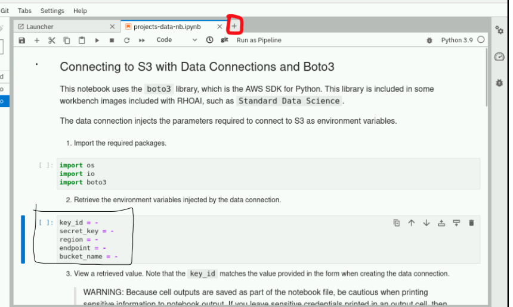

## Guided Exercise: Saving Trained Machine Learning Models
### How to prepare the lab?

```bash
lab start -t AI262 notebooks-collaboration
lab start -t AI265 serving-saving

# Create S3 configuration file
cat <<EOF>> /tmp/.s3cfg
[AWS]
AWS_ACCESS_KEY_ID = minio
AWS_SECRET_ACCESS_KEY = minio123
AWS_DEFAULT_REGION = any
host_base = minio-api-minio.apps.ocp4.example.com
EOF
```

# 🧩 Task: Save the data in the S3 bucket.
A **workbench** is already running `serving-saving-wb` under `serving-saving` project. 
- Your tasks are to modify the **workbench** with content mentioned in the `/tmp/.s3cfg` file and make sure all values are shown under bucket `saved-models`.
- You cloned already in the previous task, but if this is not the case then Clone the **Git repo** `https://github.com/RedHatTraining/AI26X-apps`
- Modify the file `AI26X-apps/intro/projects-data/projects-data-nb.ipynb` under the branch **`origin/RHOAI2.13`**
- Perform all the tasks whatever written on this notebook.
- In the cloned Jupyter notebook, the cell starting with comment **"saving THE JOBLIB Model file"** is updaed to use joblib to save the model to the root of the cloned repo as a file named: `carido-model.joblib`.
- Create a new branch called `experiment2` and save all the changes on this branch.
- Merge the `experiment2` feature branch into the `RHOAI2.13 branch`
---


### Solution

## Given Environment:

#### - A workbench named **`serving-saving-wb`** is already running under the **`serving-saving project`**

#### - The S3 bucket to be used is: **`saved-models`**

#### - The Git repository is: **`https://github.com/RedHatTraining/AI26X-apps`**

#### - The notebook to modify is: **`AI26X-apps/intro/projects-data/projects-data-nb.ipynb`**

#### - The required branch is: **`origin/RHOAI2.13`**

#### - The feature branch to create is: **`experiment2`**

#### - The required model output file name is: **`carido-model.joblib`**


### Important: The task requires the filename **`carido-model.joblib`**
Do not rename it to cardio-model.joblib unless the exam or lab instructions explicitly say so.


## Lets start the solution:

### Solution

✅ **Complete Step-by-Step Solution**

## **1. Add Data Connection to the Workbench**

  1. Go to **OpenShift AI Dashboard → `Data Science Projects` → serving-saving**.
  2. Navigate to the **`Workbenches`** tab.
  3. Click **`serving-saving-wb`**
  4. Click on **`DataConnection`**
  5. Create a new **`DataConnection`** if not there with name **`my-s3-connection`**. 
  6. Add all the information mentioned in the **`/tmp/.s3cfg`** and use bucket name information from the task **`saved-models`**
  7. Click the ⋮ menu next to **`serving-saving-wb`** → **`Edit workbench`**
  8. Scroll to **`Connections section`**.
  9. Click Use a `connection` → **`Use existing connection`**.
  10. Select **`my-s3-connection`** from the list.
  11. Click **`Save`** and **`wait for the workbench to restart`**.


## **2. Clone & Checkout Repository**

  1. Open JupyterLab in **`serving-saving-wb`**
  2. Click the **`Git icon`** in the left sidebar.
  3. Clone the repository containing **`AI26X-apps`**
  4. Open a Terminal (File → New → Terminal).
  5. Run the following commands:
  
```
cd AI26X-apps
git checkout origin/RHOAI2.13
git pull
```


## **3. Open and Complete the Notebook**
- Open the notebook: **`AI26X-apps/intro/projects-data/projects-data-nb.ipynb`**
- Run all cells sequentially as instructed in the notebook.





```python
key_id = os.getenv("AWS_ACCESS_KEY_ID")
secret_key = os.getenv("AWS_SECRET_ACCESS_KEY")
endpoint = os.getenv("AWS_ENDPOINT")
bucket_name = os.getenv("AWS_S3_BUCKET")
```

## **4. Update the Joblib Save Cell**
- Replace the cell with comment "saving THE JOBLIB Model file" with the following code:
```python
import joblib
import os

# Save the trained model (adjust variable name if different)
#model_path = "carido-model.joblib"
#joblib.dump(model, model_path)   # 'model' should be your trained model object

joblib.dump(ml_model, "carido-model.joblib")   # 'model' should be your trained model object
```


## Final validation checklist

Use this checklist before submission:

- [✅] The `serving-saving` project is selected.
- [✅] The workbench `serving-saving-wb` exists and is running.
- [✅ ] The data connection secret `my-s3-connection` exists.
- [ ✅] The data connection contains:
  - [✅] `AWS_ACCESS_KEY_ID=minio`
  - [✅] `AWS_SECRET_ACCESS_KEY=minio123`
  - [✅] `AWS_DEFAULT_REGION=any`
  - [✅] `host_base=minio-api-minio.apps.ocp4.example.com/saved-models`
- [✅] The workbench has been restarted after adding the data connection.
- [✅] The repository is checked out to `RHOAI2.13` from `origin/RHOAI2.13`.
- [✅] The notebook `intro/projects-data/projects-data-nb.ipynb` has been opened and completed.
- [✅] The cell beginning with `# saving THE JOBLIB Model file` uses `joblib.dump(...)`.
- [✅] The model is saved at the root of the cloned repo as `carido-model.joblib`.

 ---
 ---
 ---


 # Manage Resources Workbench Solution

## Task

A workbench named `serving-saving-wb` is already running in the `serving-saving` project.

Complete the following:

1. Modify the workbench and add the data connection named `my-s3-connection`.
2. Modify the file:

   ```text
   AI26X-apps/intro/projects-data/projects-data-nb.ipynb
   ```

   from branch:

   ```text
   origin/RHOAI2.13
   ```

3. Perform all tasks written in that notebook.
4. In the cloned Jupyter notebook, update the cell starting with:

   ```python
   # saving THE JOBLIB Model file
   ```

   so that it uses `joblib` to save the model to the root of the cloned repository as:

   ```text
   carido-model.joblib
   ```

## Data connection details

Use the following values:

```json
{
  "AWS_ACCESS_KEY_ID": "minio",
  "AWS_DEFAULT_REGION": "any",
  "host_base": "minio-api-minio.apps.ocp4.example.com/saved-models",
  "AWS_SECRET_ACCESS_KEY": "minio123"
}
```

---

## Solution

### 1. Log in to OpenShift

Log in to the cluster from a terminal where the `oc` CLI is available.

```bash
oc login --server=<OPENSHIFT_API_URL> -u <USERNAME> -p <PASSWORD>
```

Switch to the required project:

```bash
oc project serving-saving
```

Verify that the workbench exists:

```bash
oc get notebook serving-saving-wb -n serving-saving
```

---

### 2. Create the data connection secret

Create a secret named `my-s3-connection` in the `serving-saving` project.

```bash
oc create secret generic my-s3-connection \
  -n serving-saving \
  --from-literal=AWS_ACCESS_KEY_ID=minio \
  --from-literal=AWS_SECRET_ACCESS_KEY=minio123 \
  --from-literal=AWS_DEFAULT_REGION=any \
  --from-literal=host_base=minio-api-minio.apps.ocp4.example.com/saved-models
```

Add the labels used by the RHOAI dashboard for data connections:

```bash
oc label secret my-s3-connection \
  -n serving-saving \
  opendatahub.io/dashboard=true \
  opendatahub.io/managed=true \
  --overwrite
```

Verify the secret:

```bash
oc get secret my-s3-connection -n serving-saving --show-labels
```

---

### 3. Attach the data connection to the workbench

Patch the `serving-saving-wb` workbench so the notebook pod receives the data connection values as environment variables.

```bash
oc patch notebook serving-saving-wb \
  -n serving-saving \
  --type='json' \
  -p='[
    {
      "op": "add",
      "path": "/spec/template/spec/containers/0/envFrom/-",
      "value": {
        "secretRef": {
          "name": "my-s3-connection"
        }
      }
    }
  ]'
```

If the command fails because `envFrom` does not exist yet, initialize it first:

```bash
oc patch notebook serving-saving-wb \
  -n serving-saving \
  --type='json' \
  -p='[
    {
      "op": "add",
      "path": "/spec/template/spec/containers/0/envFrom",
      "value": []
    }
  ]'
```

Then run the previous patch command again.

Restart the workbench pod so the environment variables are loaded:

```bash
oc delete pod -n serving-saving -l notebook-name=serving-saving-wb
```

Wait for the workbench pod to return to `Running`:

```bash
oc get pods -n serving-saving
```

Confirm that the data connection values are available inside the notebook pod:

```bash
POD=$(oc get pod -n serving-saving -l notebook-name=serving-saving-wb -o jsonpath='{.items[0].metadata.name}')

oc exec -n serving-saving "$POD" -- env | grep -E 'AWS_ACCESS_KEY_ID|AWS_DEFAULT_REGION|host_base'
```

---

### 4. Open the Jupyter workbench

Open the RHOAI dashboard, go to the `serving-saving` project, and open the running workbench named:

```text
serving-saving-wb
```

Open a terminal inside JupyterLab.

---

### 5. Clone the repository and switch to the required branch

In the JupyterLab terminal, clone the repository if it is not already cloned.

```bash
git clone <REPOSITORY_URL> AI26X-apps
```

Move into the repository:

```bash
cd AI26X-apps
```

Fetch all remote branches:

```bash
git fetch --all
```

Checkout the required branch:

```bash
git checkout -B RHOAI2.13 origin/RHOAI2.13
```

Verify the branch:

```bash
git branch --show-current
```

Expected output:

```text
RHOAI2.13
```

---

### 6. Open the notebook

Open this notebook in JupyterLab:

```text
AI26X-apps/intro/projects-data/projects-data-nb.ipynb
```

From the repository root, the path is:

```text
intro/projects-data/projects-data-nb.ipynb
```

Run the notebook cells and complete all instructions written inside the notebook.

---

### 7. Update the joblib model-saving cell

Find the cell that starts with:

```python
# saving THE JOBLIB Model file
```

Update it so the model is saved to the root of the cloned repository as:

```text
carido-model.joblib
```

Use this code pattern:

```python
# saving THE JOBLIB Model file

import joblib
from pathlib import Path

# Save the model to the root of the cloned AI26X-apps repository.
# If the notebook is running from AI26X-apps/intro/projects-data,
# parents[2] points to the AI26X-apps repo root.
repo_root = Path.cwd()

# Walk upward until the AI26X-apps repository root is found.
while repo_root.name != "AI26X-apps" and repo_root.parent != repo_root:
    repo_root = repo_root.parent

model_path = repo_root / "carido-model.joblib"

joblib.dump(model, model_path)

print(f"Model saved to: {model_path}")
```

If the trained model variable in the notebook is not named `model`, replace `model` with the actual trained model variable name used in the notebook, for example:

```python
joblib.dump(clf, model_path)
```

or:

```python
joblib.dump(rf_model, model_path)
```

---

### 8. Run the notebook

In JupyterLab, run all notebook cells from top to bottom:

```text
Kernel -> Restart Kernel and Run All Cells
```

Confirm that the model file was created at the root of the cloned repository:

```bash
cd ~/AI26X-apps 2>/dev/null || cd /opt/app-root/src/AI26X-apps
ls -l carido-model.joblib
```

Expected result:

```text
carido-model.joblib
```

---

### 9. Optional: verify with Python

Run:

```bash
python - <<'PY'
from pathlib import Path

model_file = Path("carido-model.joblib")
print(model_file.resolve())
print("Exists:", model_file.exists())
print("Size:", model_file.stat().st_size if model_file.exists() else "missing")
PY
```

Expected output should show:

```text
Exists: True
```

---

## Final validation checklist

Use this checklist before submission:

- [ ] The `serving-saving` project is selected.
- [ ] The workbench `serving-saving-wb` exists and is running.
- [ ] The data connection secret `my-s3-connection` exists.
- [ ] The data connection contains:
  - [ ] `AWS_ACCESS_KEY_ID=minio`
  - [ ] `AWS_SECRET_ACCESS_KEY=minio123`
  - [ ] `AWS_DEFAULT_REGION=any`
  - [ ] `host_base=minio-api-minio.apps.ocp4.example.com/saved-models`
- [ ] The workbench has been restarted after adding the data connection.
- [ ] The repository is checked out to `RHOAI2.13` from `origin/RHOAI2.13`.
- [ ] The notebook `intro/projects-data/projects-data-nb.ipynb` has been opened and completed.
- [ ] The cell beginning with `# saving THE JOBLIB Model file` uses `joblib.dump(...)`.
- [ ] The model is saved at the root of the cloned repo as `carido-model.joblib`.

---

## Notes

The required filename is written exactly as requested:

```text
carido-model.joblib
```

Do not rename it to `cardio-model.joblib` unless the grading instructions explicitly require that spelling.

