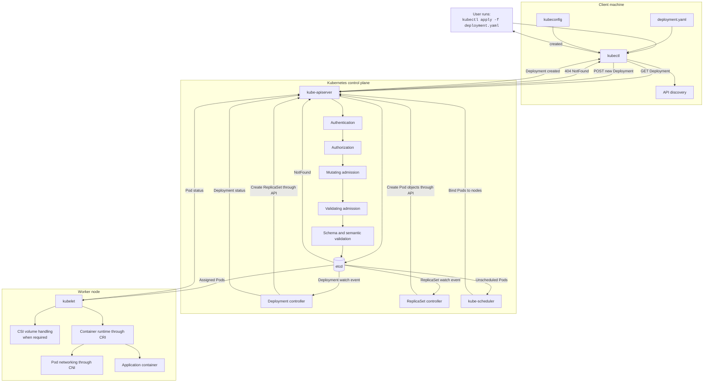
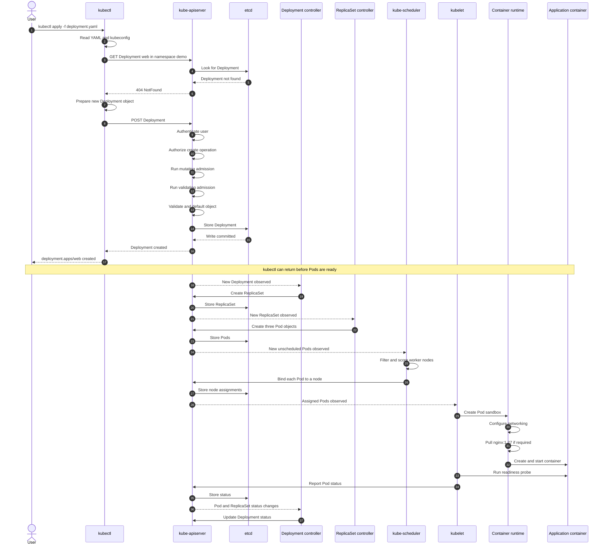
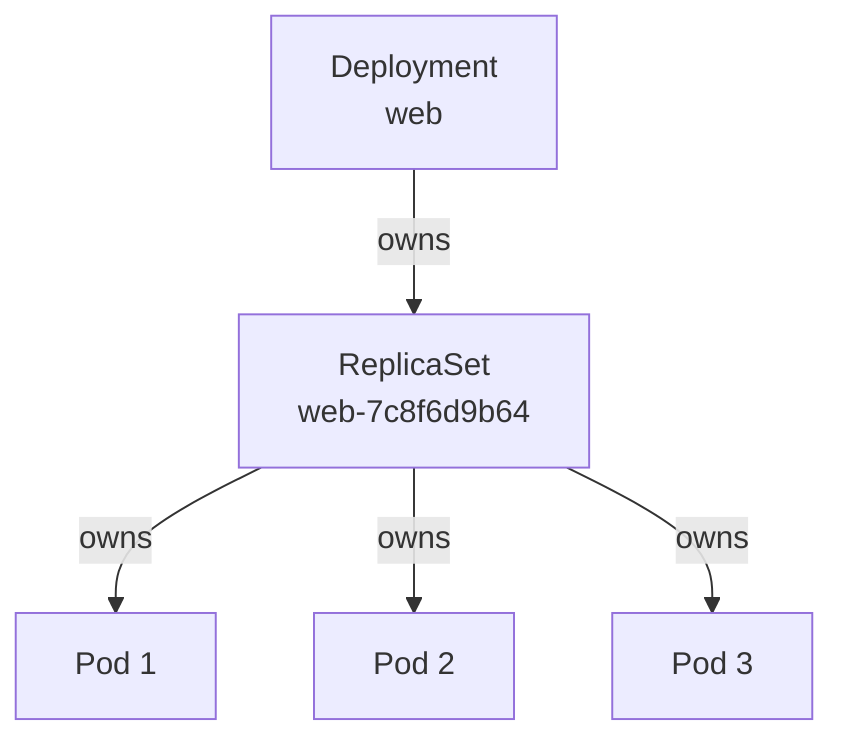

# What Happens When `kubectl apply` Creates a New Deployment?

This guide explains only the following case:

- The Deployment does **not** already exist.
- You run `kubectl apply -f deployment.yaml`.
- Kubernetes creates the Deployment for the first time.

It does not cover updating, patching, scaling, or rolling out changes to an existing Deployment.

---

## Example Deployment

Assume `deployment.yaml` contains:

```yaml
apiVersion: apps/v1
kind: Deployment
metadata:
  name: web
  namespace: demo
spec:
  replicas: 3
  selector:
    matchLabels:
      app: web
  template:
    metadata:
      labels:
        app: web
    spec:
      containers:
        - name: web
          image: nginx:1.27
          ports:
            - containerPort: 80
          readinessProbe:
            httpGet:
              path: /
              port: 80
            initialDelaySeconds: 2
            periodSeconds: 5
```

The command is:

```bash
kubectl apply -f deployment.yaml
```

Because the Deployment does not exist, the expected output is:

```text
deployment.apps/web created
```

This output means that the Deployment object was accepted and stored by the Kubernetes API server.

It does not necessarily mean that all Pods are already running and ready.

---

# Complete Creation Flow



---

# Detailed Sequence Diagram



---

# Step 1: `kubectl` Reads the Manifest

When you run:

```bash
kubectl apply -f deployment.yaml
```

`kubectl` reads the YAML file and converts it into a Kubernetes object.

The most important fields are:

```yaml
apiVersion: apps/v1
kind: Deployment
metadata:
  name: web
  namespace: demo
```

These fields identify:

- API group: `apps`
- API version: `v1`
- Resource type: `Deployment`
- Deployment name: `web`
- Namespace: `demo`

The corresponding API location is conceptually:

```text
/apis/apps/v1/namespaces/demo/deployments
```

---

# Step 2: `kubectl` Reads the Kubeconfig

`kubectl` reads the kubeconfig to determine:

- Which cluster to contact
- The Kubernetes API server address
- Which user credentials to use
- The certificate authority
- The active context
- The default namespace

The default kubeconfig file is usually:

```text
$HOME/.kube/config
```

A context connects three pieces of information:

```text
Context
├── Cluster
├── User
└── Namespace
```

For example:

```bash
kubectl config current-context
```

You can inspect the active connection details with:

```bash
kubectl config view --minify
```

---

# Step 3: `kubectl` Discovers the Kubernetes API

`kubectl` uses API discovery information to determine:

- Whether `apps/v1` is supported
- Whether a Deployment is namespaced
- The REST resource name
- Supported operations
- Available schema information

For this object:

```text
Kind: Deployment
Resource: deployments
API group: apps
Version: v1
Namespaced: yes
```

---

# Step 4: `kubectl` Checks Whether the Deployment Exists

Before creating the object, `kubectl apply` checks the live state.

Conceptually, it sends:

```http
GET /apis/apps/v1/namespaces/demo/deployments/web
```

Because the Deployment does not exist, the API server returns:

```text
404 NotFound
```

This tells `kubectl` to use the creation path.

There is no existing Deployment to patch or merge.

---

# Step 5: `kubectl` Prepares a New Deployment Object

Because this is the first client-side apply, `kubectl` prepares the complete Deployment for creation.

It also normally stores the applied configuration in an annotation:

```yaml
metadata:
  annotations:
    kubectl.kubernetes.io/last-applied-configuration: |
      {...}
```

This annotation can be used by later client-side apply operations.

In this guide, however, only the initial creation is being considered.

---

# Step 6: `kubectl` Sends a Create Request

`kubectl` sends an HTTPS `POST` request to the API server.

Conceptually:

```http
POST /apis/apps/v1/namespaces/demo/deployments
Content-Type: application/json
```

The request body contains the Deployment object.

The important point is:

```text
The request is sent to the API server.
It is not sent directly to a worker node.
```

---

# Step 7: The API Server Authenticates the User

Authentication answers:

```text
Who is making this request?
```

The API server may authenticate the request using:

- Client certificate
- Bearer token
- OpenID Connect token
- Cloud authentication plugin
- Executable credential plugin
- Service account token

If authentication fails, the request stops.

Example error:

```text
Unauthorized
```

No Deployment is created.

---

# Step 8: The API Server Authorizes the Request

Authorization answers:

```text
Is this user allowed to create Deployments in namespace demo?
```

The permission is conceptually:

```text
verb: create
apiGroup: apps
resource: deployments
namespace: demo
```

In most clusters, RBAC handles this decision.

You can test the permission with:

```bash
kubectl auth can-i create deployments -n demo
```

A denied request produces an error similar to:

```text
Error from server (Forbidden): deployments.apps is forbidden
```

If authorization fails:

- The Deployment is not stored.
- No ReplicaSet is created.
- No Pods are created.

---

# Step 9: Mutating Admission Runs

Mutating admission can modify the object before it is stored.

Examples include:

- Adding labels
- Adding annotations
- Injecting a sidecar
- Adding environment variables
- Setting security fields
- Adding resource requests
- Applying cluster-specific defaults

Therefore, the final stored Deployment may not be byte-for-byte identical to the YAML file.

Conceptually:

```text
Original object
      ↓
Mutating admission
      ↓
Modified object
```

---

# Step 10: Validating Admission Runs

Validating admission checks whether the object complies with cluster policy.

It may reject the Deployment when:

- Images come from an unapproved registry
- Resource requests are missing
- Required labels are absent
- Security rules are violated
- Replica limits are exceeded
- Organizational policies are not satisfied

If validating admission rejects the request, the Deployment is not stored.

---

# Step 11: Kubernetes Validates the Deployment

The API server validates the Deployment schema and semantic rules.

For example, it checks that:

- Required fields are present
- Field types are correct
- The Deployment name is valid
- `spec.replicas` is valid
- The selector is valid
- The selector matches the Pod template labels
- Container definitions are valid

For this example:

```yaml
selector:
  matchLabels:
    app: web
```

must match:

```yaml
template:
  metadata:
    labels:
      app: web
```

If they do not match, the Deployment is rejected.

---

# Step 12: Default Values Are Added

Kubernetes may add default values to fields that were omitted.

Examples can include:

- Deployment update strategy
- Revision history limit
- Progress deadline
- Pod restart policy
- DNS policy
- Scheduler name
- Image pull policy
- Termination grace period

The exact defaults depend on the Kubernetes API and version.

The object stored in Kubernetes can therefore contain more fields than the original YAML.

---

# Step 13: The Deployment Is Stored in etcd

After authentication, authorization, admission, and validation succeed, the API server stores the Deployment in etcd.

etcd is the persistent data store for Kubernetes cluster state.

The stored Deployment receives server-generated metadata such as:

```yaml
metadata:
  uid: 2af2...
  resourceVersion: "481923"
  generation: 1
  creationTimestamp: "2026-07-16T..."
```

Important fields:

| Field | Meaning |
|---|---|
| `uid` | Unique identity of this Deployment instance |
| `resourceVersion` | Version used for watches and concurrency |
| `generation` | Version of the desired specification |
| `creationTimestamp` | Time recorded by the API server |
| `managedFields` | Field-management information |

At this point, the Deployment exists in Kubernetes.

However:

- A ReplicaSet may not exist yet.
- Pods may not exist yet.
- No node may have been selected.
- No image may have been pulled.
- The application may not be ready.

---

# Step 14: The API Server Returns Success

After the Deployment is stored, the API server returns the created object to `kubectl`.

`kubectl` prints:

```text
deployment.apps/web created
```

This means:

```text
The Deployment resource was successfully created in the Kubernetes API.
```

It does not mean:

```text
All three Pods are already running and ready.
```

Kubernetes reconciliation continues asynchronously after the command returns.

---

# Step 15: The Deployment Controller Notices the New Deployment

The Deployment controller watches Deployment resources through the API server.

It sees:

```yaml
spec:
  replicas: 3
```

and the Pod template:

```yaml
spec:
  template:
    metadata:
      labels:
        app: web
    spec:
      containers:
        - name: web
          image: nginx:1.27
```

The controller determines that a ReplicaSet must be created.

The Deployment controller does not create containers directly.

Its responsibility is to create and manage ReplicaSets.

---

# Step 16: A ReplicaSet Is Created

The Deployment controller creates a ReplicaSet through the API server.

The ReplicaSet name contains a hash derived from the Pod template.

Example:

```text
web-7c8f6d9b64
```

The ownership relationship becomes:

```text
Deployment/web
└── ReplicaSet/web-7c8f6d9b64
```

The ReplicaSet contains:

- A reference to the Deployment
- The desired replica count
- The Pod template
- A selector
- A Pod-template hash

A simplified owner reference looks like:

```yaml
metadata:
  ownerReferences:
    - kind: Deployment
      name: web
```

The ReplicaSet is then stored through the API server in etcd.

---

# Step 17: The ReplicaSet Controller Creates Pods

The ReplicaSet controller watches ReplicaSets and Pods.

It compares:

```text
Desired Pods: 3
Existing Pods: 0
Missing Pods: 3
```

It therefore creates three Pod objects through the API server.

The object hierarchy becomes:

```text
Deployment/web
└── ReplicaSet/web-7c8f6d9b64
    ├── Pod/web-7c8f6d9b64-a1b2c
    ├── Pod/web-7c8f6d9b64-d3e4f
    └── Pod/web-7c8f6d9b64-g5h6i
```

At first, these Pods are normally unscheduled:

```yaml
status:
  phase: Pending
```

and:

```yaml
spec:
  nodeName: ""
```

The ReplicaSet controller creates Pod API objects.

It does not choose nodes and does not start containers.

---

# Step 18: The Scheduler Finds the Unscheduled Pods

The kube-scheduler watches for Pods without an assigned node.

For each Pod, it performs:

```text
Filtering
   ↓
Scoring
   ↓
Binding
```

---

## Filtering Nodes

The scheduler removes nodes that cannot run the Pod.

Reasons can include:

- Insufficient CPU
- Insufficient memory
- Node selector mismatch
- Node affinity mismatch
- Untolerated taints
- Volume restrictions
- Host port conflicts
- Unschedulable node
- Pod anti-affinity rules

Example:

```text
Worker 1: rejected because of insufficient memory
Worker 2: accepted
Worker 3: rejected because of an untolerated taint
```

---

## Scoring Nodes

The remaining nodes are scored.

Factors may include:

- Resource balance
- Requested CPU and memory
- Affinity preferences
- Topology spread
- Image locality
- Scheduler plugin configuration

The highest-scoring suitable node is selected.

---

## Binding the Pod

The scheduler records the chosen node through the API server.

Conceptually:

```yaml
spec:
  nodeName: worker-2
```

The assignment is persisted in etcd.

The scheduler does not contact the container runtime directly.

---

# Step 19: Kubelet Notices the Assigned Pod

Every worker node runs a kubelet.

The kubelet watches for Pods assigned to its node.

When `worker-2` sees:

```yaml
spec:
  nodeName: worker-2
```

it begins creating the Pod locally.

The kubelet is responsible for making the Pod specification real on that node.

---

# Step 20: Volumes and Configuration Are Prepared

Before starting the container, the kubelet may prepare:

- ConfigMaps
- Secrets
- Service account credentials
- Persistent volumes
- Projected volumes
- Empty directories
- Container filesystem mounts

When persistent storage is used, Kubernetes may involve CSI components.

If a required Secret, ConfigMap, or volume is unavailable, the Pod can remain pending or fail during startup.

---

# Step 21: The Pod Sandbox Is Created

The kubelet asks the container runtime through the Container Runtime Interface, or CRI, to create a Pod sandbox.

The Pod sandbox normally provides:

- Network namespace
- Shared Pod environment
- Pod IP context
- Linux namespace setup
- Infrastructure needed by containers in the Pod

Common runtimes include containerd and CRI-O.

The kubelet does not directly execute the container image itself.

---

# Step 22: Pod Networking Is Configured

The container runtime invokes the configured CNI networking plugin.

The network setup may include:

- Allocating a Pod IP
- Creating virtual network interfaces
- Connecting the Pod to the node network
- Installing routes
- Configuring an overlay network
- Applying network-policy rules
- Configuring the networking dataplane

The result is that the Pod receives network connectivity according to the cluster's CNI implementation.

---

# Step 23: The Container Image Is Pulled

The runtime checks whether the image is already available locally:

```text
nginx:1.27
```

If required, it pulls the image from a registry.

Possible failures include:

```text
ErrImagePull
ImagePullBackOff
```

Common causes are:

- Wrong image name
- Wrong tag
- Private registry authentication failure
- Registry unavailable
- Network failure
- Unsupported image architecture

---

# Step 24: The Container Is Created

The runtime creates the container with settings from the Pod specification.

These can include:

- Container command
- Arguments
- Environment variables
- CPU requests and limits
- Memory requests and limits
- Volume mounts
- Security context
- User and group
- Linux capabilities
- Container ports

The runtime then starts the container process.

---

# Step 25: Probes Are Executed

The kubelet runs the configured health probes.

For the example, a readiness probe is configured:

```yaml
readinessProbe:
  httpGet:
    path: /
    port: 80
```

The readiness probe answers:

```text
Should this Pod receive normal application traffic?
```

A container can be running while the Pod is still not ready.

Possible Pod state:

```text
STATUS: Running
READY: 0/1
```

After readiness succeeds:

```text
STATUS: Running
READY: 1/1
```

---

# Step 26: Kubelet Reports Pod Status

The kubelet sends Pod status updates to the API server.

Example:

```yaml
status:
  phase: Running
  podIP: 10.244.2.18
  conditions:
    - type: PodScheduled
      status: "True"
    - type: Initialized
      status: "True"
    - type: ContainersReady
      status: "True"
    - type: Ready
      status: "True"
```

The API server stores the status in etcd.

---

# Step 27: ReplicaSet and Deployment Status Are Updated

The ReplicaSet controller observes that the Pods now exist and become ready.

The Deployment controller updates the Deployment status.

Example:

```yaml
status:
  observedGeneration: 1
  replicas: 3
  updatedReplicas: 3
  readyReplicas: 3
  availableReplicas: 3
```

The status flows upward:

```text
Container status
      ↓
Pod status
      ↓
ReplicaSet status
      ↓
Deployment status
```

The cluster has now converged toward the requested state:

```text
Desired replicas: 3
Available replicas: 3
```

---

# Important Distinction

A successful command:

```text
deployment.apps/web created
```

means:

```text
The Deployment object was created successfully.
```

It does not guarantee:

- Pods have been scheduled
- Images have been pulled
- Containers have started
- Readiness probes have passed
- The application is available

To wait for rollout completion:

```bash
kubectl rollout status deployment/web -n demo --timeout=5m
```

To wait for the Deployment to become available:

```bash
kubectl wait \
  --for=condition=Available \
  deployment/web \
  -n demo \
  --timeout=5m
```

---

# Object Ownership Diagram



The ownership chain enables Kubernetes to:

- Track resources belonging to the Deployment
- Aggregate status
- Scale the correct Pods
- Clean up dependent resources
- Manage future revisions

---

# Component Responsibilities

| Component | Responsibility |
|---|---|
| `kubectl` | Reads the manifest and sends the create request |
| kube-apiserver | Authenticates, authorizes, admits, validates, and stores API objects |
| etcd | Persists Kubernetes cluster state |
| Deployment controller | Creates and manages the ReplicaSet |
| ReplicaSet controller | Creates the requested number of Pods |
| kube-scheduler | Selects a worker node for each Pod |
| kubelet | Makes assigned Pods run on its node |
| Container runtime | Pulls images and creates containers |
| CNI plugin | Configures Pod networking |
| CSI components | Handle volumes when required |
| Probe manager in kubelet | Checks startup, readiness, and liveness |
| Controllers and kubelet | Continuously report and reconcile status |

---

# What Is Not Created Automatically?

A Deployment automatically leads to:

```text
Deployment
→ ReplicaSet
→ Pods
```

A Deployment does not automatically create:

- Service
- Ingress
- ConfigMap
- Secret
- PersistentVolumeClaim
- NetworkPolicy
- HorizontalPodAutoscaler

These resources must be defined separately when required.

For example, without a Service, the Pods can run successfully but may not have a stable virtual IP or DNS name for clients.

---

# Commands to Observe the Creation Process

## Apply the Deployment

```bash
kubectl apply -f deployment.yaml
```

## Watch the Deployment

```bash
kubectl get deployment web -n demo -w
```

## Watch ReplicaSets

```bash
kubectl get replicasets -n demo -w
```

## Watch Pods

```bash
kubectl get pods -n demo -w
```

## Watch Pods with node placement

```bash
kubectl get pods -n demo -o wide -w
```

## Wait for rollout completion

```bash
kubectl rollout status deployment/web -n demo --timeout=5m
```

## Inspect the Deployment

```bash
kubectl describe deployment web -n demo
```

## Inspect the ReplicaSet

```bash
kubectl get rs -n demo
kubectl describe rs <replicaset-name> -n demo
```

## Inspect a Pod

```bash
kubectl describe pod <pod-name> -n demo
```

## Check container logs

```bash
kubectl logs <pod-name> -n demo
```

## Check recent events

```bash
kubectl get events -n demo --sort-by=.metadata.creationTimestamp
```

---

# Common Creation Failures

## Authentication Failure

Example:

```text
Unauthorized
```

The request is stopped before creation.

---

## Authorization Failure

Example:

```text
Error from server (Forbidden)
```

Check:

```bash
kubectl auth can-i create deployments -n demo
```

---

## Admission Rejection

Example reasons:

- Missing resource limits
- Disallowed image registry
- Missing required labels
- Security-policy violation

The Deployment is not stored.

---

## Invalid Deployment

Example reasons:

- Selector does not match Pod labels
- Invalid field type
- Missing container image
- Invalid resource name

The API server rejects the request.

---

## Pods Remain Pending

Possible reasons:

- No node has enough resources
- Taints are not tolerated
- Volume cannot be mounted
- Affinity rules cannot be satisfied

Check:

```bash
kubectl describe pod <pod-name> -n demo
```

---

## Image Pull Failure

Possible statuses:

```text
ErrImagePull
ImagePullBackOff
```

Check:

```bash
kubectl describe pod <pod-name> -n demo
```

---

## Container Crash

Possible statuses:

```text
CrashLoopBackOff
Error
OOMKilled
```

Check:

```bash
kubectl logs <pod-name> -n demo
kubectl logs <pod-name> -n demo --previous
```

---

## Pod Is Running but Not Ready

Check:

```bash
kubectl describe pod <pod-name> -n demo
kubectl logs <pod-name> -n demo
```

Common causes:

- Incorrect readiness path
- Incorrect readiness port
- Application still starting
- Dependency unavailable
- Configuration missing

---

# Compact Interview Answer

When the Deployment does not already exist and I run:

```bash
kubectl apply -f deployment.yaml
```

the following happens:

1. `kubectl` reads the YAML and kubeconfig.
2. It discovers the Deployment API endpoint.
3. It checks for the Deployment and receives `NotFound`.
4. It prepares a new Deployment object.
5. It sends an HTTPS `POST` request to the API server.
6. The API server authenticates the user.
7. The API server authorizes the `create` operation.
8. Mutating and validating admission controls process the object.
9. Kubernetes validates and defaults the Deployment.
10. The API server stores the Deployment in etcd.
11. `kubectl` prints `deployment.apps/web created`.
12. The Deployment controller creates a ReplicaSet.
13. The ReplicaSet controller creates the required Pods.
14. The scheduler assigns each Pod to a worker node.
15. The kubelet on each selected node prepares volumes and networking.
16. The container runtime pulls the image and starts the container.
17. The kubelet runs health probes.
18. Pod status is reported through the API server.
19. ReplicaSet and Deployment status are updated.
20. Reconciliation continues until the requested replicas are available.

---

# One-Line Mental Model

```text
Manifest → GET returns NotFound → POST Deployment → API validation → etcd → Deployment controller → ReplicaSet → Pods → scheduler → kubelet → runtime → ready application
```

---

# Final Summary

For a new Deployment, `kubectl apply` performs a create operation.

The command creates only the Deployment API object directly.

The remaining resources are created asynchronously by Kubernetes control loops:

```text
kubectl
   ↓
Deployment
   ↓
ReplicaSet
   ↓
Pods
   ↓
Node assignment
   ↓
Containers
```

The most important point is:

```text
kubectl apply declares the desired state.
Kubernetes controllers and node agents make that state real.
```
