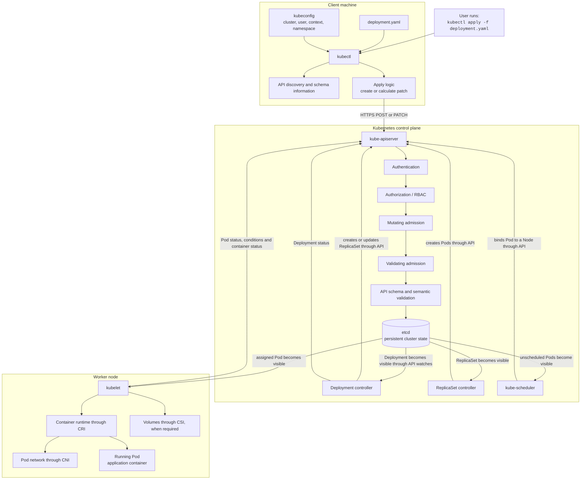
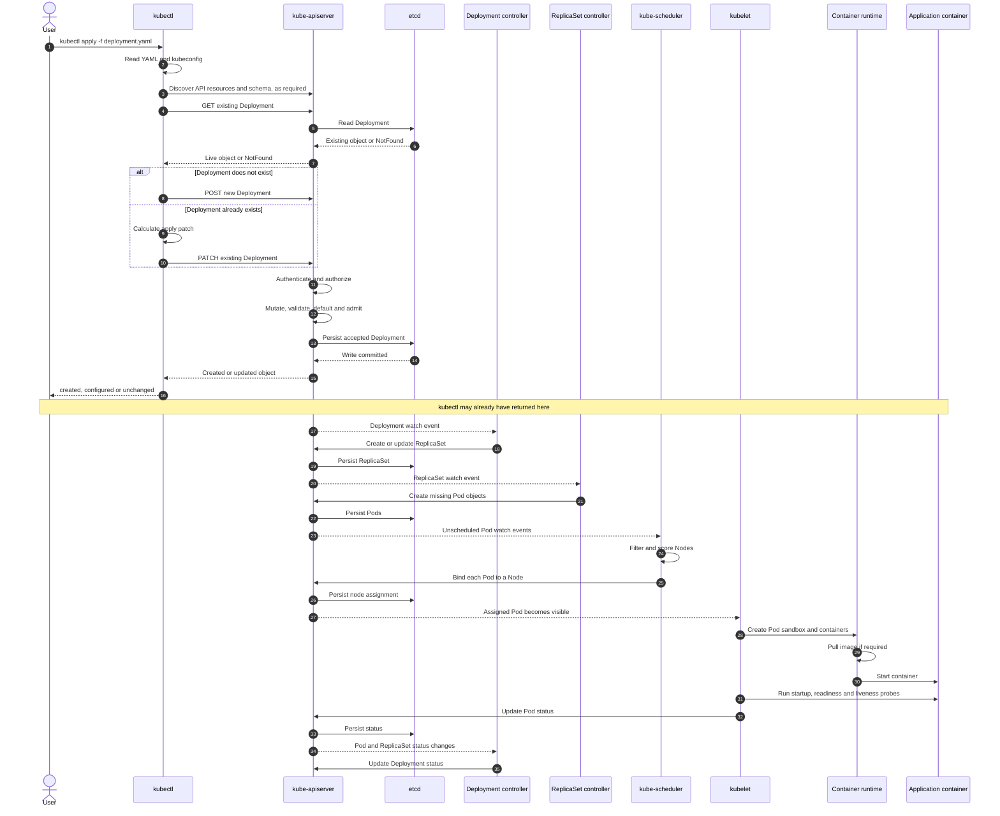
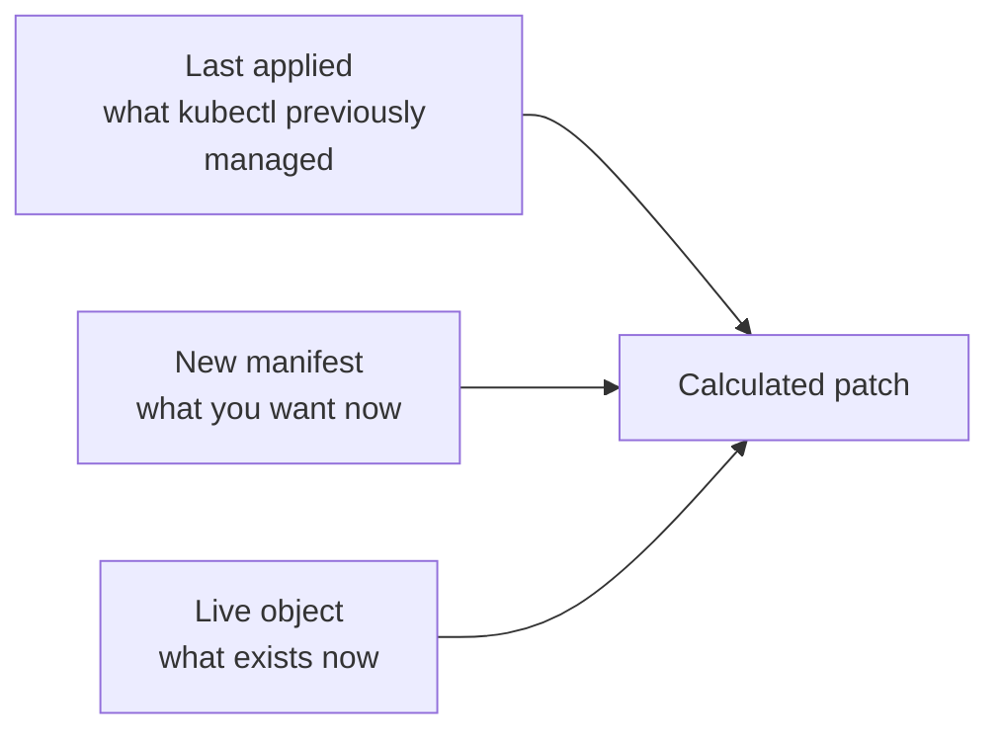
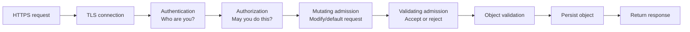
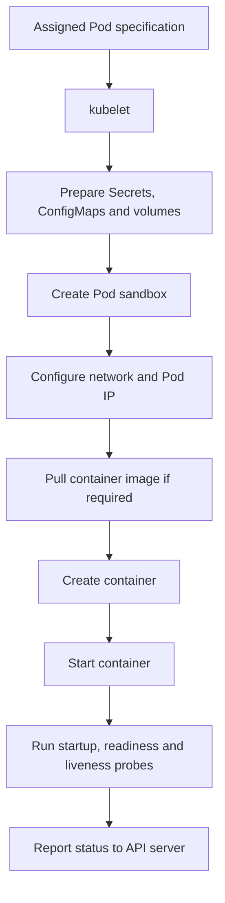

# What Happens Inside a Kubernetes Cluster When You Run `kubectl apply -f deployment.yaml`?

> **Core idea:** `kubectl apply` does not directly create containers. It submits a desired Kubernetes object to the API server. After that object is accepted and stored, a chain of independent control loops creates or updates ReplicaSets, Pods, node assignments, networks, volumes, and containers until the observed state matches the declared state.

---

## Table of Contents

1. [Example Deployment](#1-example-deployment)
2. [End-to-End Architecture Diagram](#2-end-to-end-architecture-diagram)
3. [Detailed Sequence Diagram](#3-detailed-sequence-diagram)
4. [Phase 1: What Happens on the Client Machine](#4-phase-1-what-happens-on-the-client-machine)
5. [Phase 2: The Request Enters the API Server](#5-phase-2-the-request-enters-the-api-server)
6. [Phase 3: The Deployment Is Stored](#6-phase-3-the-deployment-is-stored)
7. [Phase 4: Controllers Start Reconciling](#7-phase-4-controllers-start-reconciling)
8. [Phase 5: Pods Are Scheduled](#8-phase-5-pods-are-scheduled)
9. [Phase 6: Kubelet Starts the Containers](#9-phase-6-kubelet-starts-the-containers)
10. [Phase 7: Status Flows Back to the Control Plane](#10-phase-7-status-flows-back-to-the-control-plane)
11. [What Changes Cause a New Rollout?](#11-what-changes-cause-a-new-rollout)
12. [Client-Side Apply vs Server-Side Apply](#12-client-side-apply-vs-server-side-apply)
13. [What `kubectl apply` Does Not Wait For](#13-what-kubectl-apply-does-not-wait-for)
14. [Failure Points and Troubleshooting](#14-failure-points-and-troubleshooting)
15. [Useful Commands to Watch Every Stage](#15-useful-commands-to-watch-every-stage)
16. [Compact Interview Answer](#16-compact-interview-answer)

---

## 1. Example Deployment

Assume that `deployment.yaml` contains:

```yaml
apiVersion: apps/v1
kind: Deployment
metadata:
  name: web
  namespace: demo
spec:
  replicas: 3
  selector:
    matchLabels:
      app: web
  strategy:
    type: RollingUpdate
    rollingUpdate:
      maxSurge: 1
      maxUnavailable: 0
  template:
    metadata:
      labels:
        app: web
    spec:
      containers:
        - name: web
          image: nginx:1.27
          ports:
            - containerPort: 80
          readinessProbe:
            httpGet:
              path: /
              port: 80
            initialDelaySeconds: 2
            periodSeconds: 5
```

You run:

```bash
kubectl apply -f deployment.yaml
```

Possible immediate output:

```text
deployment.apps/web created
```

On a later apply:

```text
deployment.apps/web configured
```

If the effective configuration has not changed:

```text
deployment.apps/web unchanged
```

These messages mean that the API operation succeeded. They do **not** necessarily mean that all application Pods are already running and ready.

---

## 2. End-to-End Architecture Diagram



### The most important architectural fact

Every major component talks through the **Kubernetes API**.

- The Deployment controller does not directly contact a worker node.
- The scheduler does not directly start a container.
- The API server does not directly run the application.
- etcd does not run controllers.
- Controllers read desired and observed state through the API, make a decision, and write a new object or status back through the API.

Kubernetes is therefore an **API-driven, asynchronous, eventually consistent control system**.

---

## 3. Detailed Sequence Diagram



---

## 4. Phase 1: What Happens on the Client Machine

## 4.1 `kubectl` resolves the target cluster

`kubectl` reads its configuration from one or more of these sources:

- The file specified by `--kubeconfig`
- Files listed in the `KUBECONFIG` environment variable
- By default, `$HOME/.kube/config`

The selected context supplies:

```text
Context
├── Cluster
│   ├── API server URL
│   └── Certificate authority information
├── User
│   └── Client certificate, token, exec plugin or another credential
└── Namespace
    └── Default namespace for namespaced resources
```

Command-line options override the context:

```bash
kubectl apply -f deployment.yaml \
  --context=production \
  --namespace=demo
```

For a namespaced object, the namespace is determined from:

1. `metadata.namespace` in the file, when present
2. `--namespace` / `-n`
3. The namespace configured in the current context
4. Usually `default` when no other namespace is selected

---

## 4.2 `kubectl` reads and decodes the YAML

The YAML is converted into a Kubernetes object representation.

Important identity fields are:

```yaml
apiVersion: apps/v1
kind: Deployment
metadata:
  name: web
  namespace: demo
```

Together, these tell `kubectl` and the API server:

- API group: `apps`
- API version: `v1`
- Resource kind: `Deployment`
- Object name: `web`
- Namespace: `demo`

The REST endpoint is conceptually:

```text
/apis/apps/v1/namespaces/demo/deployments/web
```

The file can also contain multiple YAML documents separated by `---`. Each object is processed as its own API operation. Applying ten objects is not a single atomic database transaction. Earlier objects may succeed even if a later object fails.

---

## 4.3 API discovery and schema information are used

`kubectl` may use cached or freshly retrieved discovery information to determine:

- Whether `apps/v1` exists
- Whether `Deployment` is namespaced
- Its plural REST resource name, `deployments`
- Supported operations
- Schema information used for validation and patch construction

The API server remains authoritative. A locally valid-looking manifest can still be rejected because of:

- RBAC
- Admission policies
- Resource quotas
- Invalid immutable-field changes
- Cluster-specific webhooks
- Unsupported API versions
- Semantic validation errors

By default, current `kubectl apply` uses strict field validation. Unknown or duplicate fields can therefore cause the request to fail instead of becoming an exciting typo-shaped production incident.

---

## 4.4 `kubectl` determines whether this is a create or update

For ordinary client-side apply, `kubectl` checks the live object.

### Case A: The object does not exist

The API returns `NotFound`.

`kubectl` sends a `POST` request to create the Deployment. It also records the submitted configuration in this annotation:

```yaml
metadata:
  annotations:
    kubectl.kubernetes.io/last-applied-configuration: |
      {...JSON representation of the applied manifest...}
```

### Case B: The object already exists

`kubectl` obtains three pieces of information:

1. **Desired configuration**  
   The current `deployment.yaml`

2. **Live configuration**  
   The Deployment currently stored in the cluster

3. **Last-applied configuration**  
   The configuration saved during the previous client-side apply

It then performs a **three-way comparison**.



Conceptually:

- A field present in the new manifest is set to the desired value.
- A field that was previously managed by apply but has now been removed can be cleared.
- A live field that was never managed by this manifest can often remain untouched.

### Example

Previous manifest:

```yaml
spec:
  replicas: 3
  minReadySeconds: 10
```

Current manifest:

```yaml
spec:
  replicas: 5
```

Possible patch intent:

```text
Set spec.replicas to 5
Remove spec.minReadySeconds
Update last-applied-configuration
```

The update is sent as a scoped `PATCH`, not usually as a blind replacement of the entire Deployment.

---

## 5. Phase 2: The Request Enters the API Server

The API server is the front door of the cluster. A write request must pass several gates.



## 5.1 TLS

`kubectl` normally communicates with the API server over HTTPS.

It verifies the server certificate using the configured certificate authority unless insecure verification was explicitly enabled, which is generally a poor life choice.

---

## 5.2 Authentication

Authentication answers:

> Who made this request?

The identity may come from:

- A client certificate
- A bearer token
- An OpenID Connect token
- A cloud authentication plugin
- An executable credential plugin
- Another configured authenticator

The result is a user identity plus groups.

Example:

```text
User: alice@example.com
Groups:
- developers
- system:authenticated
```

If authentication fails, `kubectl` receives an error such as:

```text
Unauthorized
```

No Deployment is stored, and no controller work begins.

---

## 5.3 Authorization

Authorization answers:

> Is this identity permitted to create or patch this Deployment in this namespace?

In many clusters this is handled by RBAC.

Conceptual permission check:

```text
verb: patch or create
apiGroup: apps
resource: deployments
namespace: demo
name: web
```

A denied request commonly produces:

```text
Error from server (Forbidden): deployments.apps "web" is forbidden
```

You can inspect the effective permission with:

```bash
kubectl auth can-i patch deployments -n demo
kubectl auth can-i create deployments -n demo
```

---

## 5.4 Mutating admission

Mutating admission runs after authentication and authorization but before persistence.

It may modify the incoming object. Examples include:

- Injecting a sidecar
- Adding labels or annotations
- Setting defaults
- Applying security-related settings
- Injecting environment variables
- Modifying resource requests
- Applying cluster-specific policy

Therefore, the stored Deployment can contain fields that were not present in your original YAML.

This is one reason to inspect the live object:

```bash
kubectl get deployment web -n demo -o yaml
```

---

## 5.5 Validating admission

Validating admission can accept or reject the final proposed object.

It can enforce rules such as:

- Only approved image registries are allowed
- Every container must have CPU and memory requests
- Privileged containers are forbidden
- Required labels must be present
- Replica counts must remain within an organizational limit

If a validating policy or webhook rejects the request, the object is not persisted.

---

## 5.6 Built-in API validation

The API server checks the resource's schema and semantic rules.

For a Deployment, examples include:

- `spec.selector` must match the Pod template labels
- Required fields must exist
- Field types must be correct
- Values must be within valid ranges
- Immutable fields cannot be changed
- The object name must be valid

For example, changing an immutable Deployment selector after creation is normally rejected.

---

## 5.7 Defaulting and API conversion

Kubernetes can fill omitted defaults and convert the external API representation into its internal form.

Examples of defaults may include:

- Deployment strategy defaults
- Revision history limit
- Progress deadline
- Pod restart policy
- DNS policy
- Scheduler name
- Termination grace period
- Image pull policy, based partly on the image reference

Exact defaults depend on the API type and Kubernetes version.

---

## 6. Phase 3: The Deployment Is Stored

Once accepted, the API server persists the Deployment's desired state in **etcd**, Kubernetes' backing key-value store.

Stored metadata includes fields such as:

```yaml
metadata:
  uid: 2af2...
  resourceVersion: "481923"
  generation: 1
  creationTimestamp: "..."
```

### Important metadata

| Field | Meaning |
|---|---|
| `uid` | Unique identity for this exact object instance |
| `resourceVersion` | Version used for watches and optimistic concurrency |
| `generation` | Version of the object's desired specification |
| `creationTimestamp` | Server-recorded creation time |
| `managedFields` | Field-management information |
| `annotations` | Includes the last-applied configuration for client-side apply |

The API server then returns a response to `kubectl`.

At this moment:

- The Deployment object exists.
- It may have no ReplicaSet yet.
- It may have no Pods yet.
- No image may have been pulled yet.
- The application may be completely unavailable.

The declaration has been accepted. Reconciliation comes next.

---

## 7. Phase 4: Controllers Start Reconciling

Controllers run inside `kube-controller-manager` or as separate controller processes. They continuously compare:

```text
Desired state
versus
Observed state
```

Their basic pattern is:

```text
watch → compare → act → update status → repeat
```

This is called a **reconciliation loop**.

Controllers are generally level-driven. They care about the state that should exist, not merely about receiving one perfect event. If a watch event is missed, a later list or resync can still reveal the mismatch.

---

## 7.1 Deployment controller observes the Deployment

The Deployment controller watches Deployment and ReplicaSet objects through the API server.

For the example:

```yaml
spec:
  replicas: 3
  template:
    ...
```

It determines that a ReplicaSet representing the Pod template must exist.

### On initial creation

The controller creates a ReplicaSet whose name includes a hash:

```text
web-7c8f6d9b64
```

Simplified ownership:

```text
Deployment/web
└── ReplicaSet/web-7c8f6d9b64
    ├── Pod/web-7c8f6d9b64-a1b2c
    ├── Pod/web-7c8f6d9b64-d3e4f
    └── Pod/web-7c8f6d9b64-g5h6i
```

The ReplicaSet contains:

- An `ownerReference` pointing to the Deployment
- A label and selector containing a Pod-template hash
- The Pod template copied from the Deployment
- A desired replica count controlled by the Deployment rollout strategy

The ownership chain is important for garbage collection and rollout management.

---

## 7.2 Does every Deployment update create a new ReplicaSet?

No.

A new ReplicaSet is normally created when the Deployment's **Pod template** changes:

```text
.spec.template
```

Examples:

- Container image changes
- Environment variable changes
- Command or arguments change
- Resource requests or limits change
- Probe configuration changes
- Pod-template labels or annotations change
- Volume mounts change
- Security context changes

A pure change to `spec.replicas` normally scales the relevant ReplicaSet and does not require a new Pod-template revision.

A change only to Deployment metadata, outside `.spec.template`, does not by itself replace Pods.

---

## 7.3 ReplicaSet controller creates Pod objects

The ReplicaSet controller watches ReplicaSets and Pods.

Suppose it sees:

```text
Desired Pods: 3
Existing matching Pods: 0
Difference: 3
```

It creates three Pod API objects.

At this stage, those Pods usually have no assigned node:

```yaml
spec:
  nodeName: ""
status:
  phase: Pending
```

The ReplicaSet controller creates Pod records. It still does not directly start containers.

---

## 7.4 Rolling update behavior

When `.spec.template` changes, the Deployment controller creates a new ReplicaSet and gradually shifts replicas.

Example:

```text
Old ReplicaSet: nginx:1.26
New ReplicaSet: nginx:1.27
Desired replicas: 3
maxSurge: 1
maxUnavailable: 0
```

Possible progression:

```text
Step 0: old=3, new=0, available=3
Step 1: old=3, new=1, available=3 or 4
Step 2: old=2, new=2, available=3 or 4
Step 3: old=1, new=3, available=3 or 4
Step 4: old=0, new=3, available=3
```

The exact sequence depends on readiness, scheduling, termination, and controller timing.

Kubernetes does not simply delete every old Pod and then hope the new version develops confidence.

---

## 8. Phase 5: Pods Are Scheduled

The scheduler watches for Pods that have no assigned node.

For every pending Pod, it performs two broad steps.

## 8.1 Filtering

Nodes that cannot run the Pod are removed from consideration.

Reasons can include:

- Insufficient CPU or memory
- Node selector mismatch
- Required node affinity mismatch
- Taints not tolerated
- Pod anti-affinity requirements
- Volume topology restrictions
- Unschedulable or unhealthy node
- Host port conflicts
- Other scheduling constraints

## 8.2 Scoring

The remaining feasible nodes are scored according to configured scheduling plugins.

Factors can include:

- Resource balance
- Affinity preferences
- Image locality
- Topology spreading
- Requested resource fit
- Custom scheduler configuration

## 8.3 Binding

The scheduler writes a binding decision through the API server.

Conceptually:

```yaml
spec:
  nodeName: worker-2
```

The updated Pod assignment is persisted. The scheduler's responsibility is now largely complete for that Pod.

If no node is suitable, the Pod remains `Pending`, commonly with an event such as:

```text
0/5 nodes are available: 3 Insufficient memory, 2 node(s) had untolerated taint
```

---

## 9. Phase 6: Kubelet Starts the Containers

Every worker node runs a kubelet.

The kubelet watches for Pods assigned to its node. When it notices the newly assigned Pod, it works to realize that Pod specification locally.



## 9.1 Volumes and configuration are prepared

Depending on the Pod, kubelet may need to:

- Retrieve referenced Secrets and ConfigMaps
- Mount projected service-account credentials
- Mount local or network volumes
- Coordinate with CSI node plugins
- Wait for a volume attachment controller and CSI attach operation
- Create container filesystem mounts

A missing Secret or unmountable volume can prevent the container from starting even though the Deployment was accepted successfully.

---

## 9.2 Pod sandbox is created

The kubelet asks the container runtime through the Container Runtime Interface, or CRI, to create the Pod sandbox.

The sandbox normally supplies the shared Pod-level environment, including:

- Network namespace
- Pod IP context
- Linux namespaces
- Shared settings used by containers in the Pod

---

## 9.3 Networking is configured

The runtime and node networking stack invoke the configured CNI implementation.

This can involve:

- Allocating a Pod IP address
- Creating virtual interfaces
- Connecting the Pod to the node network
- Installing routes
- Applying network policy or dataplane rules
- Configuring overlay or routed networking

The exact implementation differs among CNI plugins.

---

## 9.4 Image is pulled

If the image is not usable from the local cache, the runtime pulls it from the registry:

```text
nginx:1.27
```

Possible failures include:

- Wrong image name or tag
- Registry authentication failure
- Rate limiting
- Network failure
- Missing architecture variant
- Invalid image
- Certificate problems

These often appear as:

```text
ErrImagePull
ImagePullBackOff
```

---

## 9.5 Containers are created and started

The runtime creates the container with:

- Command and arguments
- Environment variables
- Resource constraints
- Mounts
- Linux security settings
- User and group settings
- Capabilities
- Namespace configuration

It then starts the container process.

---

## 9.6 Probes determine health and readiness

The kubelet executes configured probes.

### Startup probe

Answers:

> Has the application completed startup?

While a startup probe is failing, liveness and readiness handling can be delayed according to probe semantics.

### Readiness probe

Answers:

> Should this Pod currently receive normal traffic?

A running container can still be **NotReady**.

### Liveness probe

Answers:

> Is the container unhealthy enough that kubelet should restart it?

The Deployment's availability depends heavily on readiness, not merely on whether a process exists.

---

## 10. Phase 7: Status Flows Back to the Control Plane

Kubelet reports Pod status through the API server.

Example:

```yaml
status:
  phase: Running
  podIP: 10.244.2.18
  conditions:
    - type: PodScheduled
      status: "True"
    - type: Initialized
      status: "True"
    - type: ContainersReady
      status: "True"
    - type: Ready
      status: "True"
```

The status is persisted separately from the user's desired specification.

Controllers then aggregate state upward:

```text
Container status
      ↓
Pod status
      ↓
ReplicaSet status
      ↓
Deployment status
```

A Deployment status can include:

```yaml
status:
  observedGeneration: 1
  replicas: 3
  updatedReplicas: 3
  readyReplicas: 3
  availableReplicas: 3
```

### `generation` vs `observedGeneration`

- `metadata.generation` represents a version of desired specification.
- `status.observedGeneration` indicates the generation the controller has processed.

If:

```text
observedGeneration < generation
```

the controller has not yet fully observed the newest desired specification.

### Optional Service integration

A Deployment does not automatically create a Service.

If a matching Service already exists:

- EndpointSlice controllers track matching Pods.
- Readiness normally affects whether a Pod is considered a usable endpoint.
- The cluster networking dataplane routes Service traffic to eligible endpoints.

Without a Service or another ingress mechanism, the Pods can be healthy but not conveniently reachable by clients.

---

## 11. What Changes Cause a New Rollout?

| Manifest change | Deployment API updated? | New ReplicaSet? | Existing Pods replaced? |
|---|---:|---:|---:|
| First creation | Yes | Yes | New Pods created |
| Change container image | Yes | Yes | Yes, according to strategy |
| Change environment variable | Yes | Yes | Yes |
| Change CPU or memory settings | Yes | Yes | Yes |
| Change readiness probe | Yes | Yes | Yes |
| Change `.spec.template.metadata.annotations` | Yes | Yes | Yes |
| Change only `spec.replicas` | Yes | Usually no | Pods added or removed |
| Change only Deployment metadata label | Yes | No | No |
| Reapply identical effective manifest | No meaningful spec change | No | No |
| Keep the same image tag without changing template | Possibly unchanged | No | Existing Pods are not restarted |
| Attempt to change immutable selector | Rejected | No | No |

### Important image-tag trap

Assume the Deployment still contains:

```yaml
image: myapp:latest
```

You push a new image to the same tag and run:

```bash
kubectl apply -f deployment.yaml
```

If the Pod template did not change, Kubernetes may report:

```text
unchanged
```

Existing Pods are not restarted merely because a registry tag now points to different bytes.

To deliberately trigger a restart:

```bash
kubectl rollout restart deployment/web -n demo
```

A stronger production practice is to use immutable image references, such as a unique version tag or digest.

---

## 12. Client-Side Apply vs Server-Side Apply

The plain command:

```bash
kubectl apply -f deployment.yaml
```

uses the traditional client-side apply behavior unless server-side apply is requested.

## 12.1 Client-side apply

```bash
kubectl apply -f deployment.yaml
```

Main characteristics:

- `kubectl` calculates the patch.
- It compares the new manifest, live object, and last-applied annotation.
- It stores `kubectl.kubernetes.io/last-applied-configuration`.
- The default field manager is associated with client-side apply.
- Field ownership is less precise than server-side apply.

## 12.2 Server-side apply

```bash
kubectl apply --server-side -f deployment.yaml
```

Main characteristics:

- The API server performs apply merging.
- Field ownership is tracked in `metadata.managedFields`.
- Multiple managers can own different fields.
- Conflicting changes to another manager's field can be rejected.
- A conflict can be overridden explicitly, with care:

```bash
kubectl apply \
  --server-side \
  --force-conflicts \
  --field-manager=my-deployer \
  -f deployment.yaml
```

## 12.3 Comparison

| Area | Client-side apply | Server-side apply |
|---|---|---|
| Merge performed by | `kubectl` | API server |
| Historical basis | Last-applied annotation | Managed field ownership |
| Ownership granularity | Less explicit | Field-level |
| Conflict behavior | Often overwrite-oriented | Explicit ownership conflicts |
| Collaboration among tools | Easier to trip over | Better modeled |
| Command | `kubectl apply -f ...` | `kubectl apply --server-side -f ...` |

Whichever mode is used, the downstream Deployment, ReplicaSet, scheduler, kubelet, runtime, CNI, and status-reconciliation path is broadly the same after the object is stored.

---

## 13. What `kubectl apply` Does Not Wait For

`kubectl apply` primarily waits for the API request to be accepted or rejected.

It does not normally wait until:

- The Deployment controller creates the ReplicaSet
- The ReplicaSet controller creates all Pods
- The scheduler assigns nodes
- Images finish pulling
- Volumes finish mounting
- Containers start
- Readiness probes succeed
- The Deployment reaches full availability

Therefore this can happen:

```text
$ kubectl apply -f deployment.yaml
deployment.apps/web configured

$ kubectl get pods -n demo
NAME                   READY   STATUS             RESTARTS   AGE
web-7c8f6d9b64-x2abc   0/1     ImagePullBackOff   0          8s
```

The first command was not lying. The desired object was accepted. It simply did not promise that the application would behave itself.

To wait for rollout completion:

```bash
kubectl rollout status deployment/web -n demo --timeout=5m
```

Or wait for the Deployment's Available condition:

```bash
kubectl wait \
  --for=condition=Available \
  deployment/web \
  -n demo \
  --timeout=5m
```

A practical CI/CD pattern is:

```bash
set -euo pipefail

kubectl apply -f deployment.yaml
kubectl rollout status deployment/web -n demo --timeout=5m
```

---

## 14. Failure Points and Troubleshooting

## 14.1 Local YAML or client validation failure

Example:

```text
error: error parsing deployment.yaml
```

Check:

```bash
kubectl apply --dry-run=client -f deployment.yaml
```

This checks client-side processing but does not exercise all server policies.

---

## 14.2 Server-side schema or admission rejection

Check without persisting:

```bash
kubectl apply --dry-run=server -f deployment.yaml
```

This sends the request through server-side processing but does not store it.

Useful because it can catch:

- Admission policy failures
- Unsupported fields
- Namespace-specific restrictions
- Cluster-side validation
- Defaults and mutations

---

## 14.3 Authentication failure

Typical symptom:

```text
You must be logged in to the server
```

Check:

```bash
kubectl config current-context
kubectl config view --minify
kubectl cluster-info
```

---

## 14.4 Authorization failure

Typical symptom:

```text
Error from server (Forbidden)
```

Check:

```bash
kubectl auth can-i create deployments -n demo
kubectl auth can-i patch deployments -n demo
```

---

## 14.5 Admission webhook failure

Typical symptoms:

```text
failed calling webhook
context deadline exceeded
admission webhook denied the request
```

The API object is not stored if the request is rejected.

---

## 14.6 ResourceQuota or LimitRange rejection

Typical symptoms:

```text
exceeded quota
must specify limits.cpu
```

Check:

```bash
kubectl get resourcequota -n demo
kubectl describe resourcequota -n demo
kubectl get limitrange -n demo
kubectl describe limitrange -n demo
```

---

## 14.7 Deployment accepted but Pod is Pending

Possible reasons:

- Insufficient resources
- Taints and tolerations
- Affinity rules
- Unbound persistent volume claim
- Topology restrictions
- No suitable node

Check:

```bash
kubectl describe pod <pod-name> -n demo
kubectl get events -n demo --sort-by=.lastTimestamp
```

---

## 14.8 Image pull failure

Possible statuses:

```text
ErrImagePull
ImagePullBackOff
```

Check:

```bash
kubectl describe pod <pod-name> -n demo
kubectl get secret -n demo
```

Inspect:

- Image name
- Tag or digest
- Registry credentials
- `imagePullSecrets`
- Node-to-registry connectivity

---

## 14.9 Container starts but crashes

Possible statuses:

```text
CrashLoopBackOff
Error
OOMKilled
```

Check:

```bash
kubectl logs <pod-name> -n demo
kubectl logs <pod-name> -n demo --previous
kubectl describe pod <pod-name> -n demo
```

---

## 14.10 Pod runs but is not Ready

Check:

```bash
kubectl get pod <pod-name> -n demo
kubectl describe pod <pod-name> -n demo
kubectl logs <pod-name> -n demo
```

Common reasons:

- Readiness endpoint returns failure
- Wrong probe port
- Application startup takes longer than probe settings allow
- Dependency unavailable
- Network policy blocks a dependency
- Required configuration is missing

---

## 14.11 Rollout stalls

Check:

```bash
kubectl rollout status deployment/web -n demo
kubectl describe deployment web -n demo
kubectl get rs -n demo
kubectl get pods -n demo -o wide
```

A stalled Deployment can be marked as failing to progress after `progressDeadlineSeconds`.

Rollback:

```bash
kubectl rollout undo deployment/web -n demo
```

---

## 15. Useful Commands to Watch Every Stage

## 15.1 Preview the difference

```bash
kubectl diff -f deployment.yaml
```

## 15.2 Server-side validation without persistence

```bash
kubectl apply --dry-run=server -f deployment.yaml
```

## 15.3 Apply the Deployment

```bash
kubectl apply -f deployment.yaml
```

## 15.4 Watch the Deployment

```bash
kubectl get deployment web -n demo -w
```

## 15.5 Watch ReplicaSets

```bash
kubectl get replicasets -n demo -w
```

## 15.6 Watch Pods

```bash
kubectl get pods -n demo -w
```

## 15.7 Follow rollout progress

```bash
kubectl rollout status deployment/web -n demo --timeout=5m
```

## 15.8 Inspect ownership

```bash
kubectl get deployment web -n demo -o yaml
kubectl get rs -n demo -o yaml
kubectl get pods -n demo -o yaml
```

Look for:

```yaml
metadata:
  ownerReferences:
```

## 15.9 Inspect events

```bash
kubectl get events -n demo --sort-by=.metadata.creationTimestamp
```

## 15.10 Inspect the three apply states

Current manifest:

```bash
cat deployment.yaml
```

Live object:

```bash
kubectl get deployment web -n demo -o yaml
```

Last client-side applied configuration:

```bash
kubectl apply view-last-applied deployment/web -n demo
```

## 15.11 Inspect server-side field ownership

```bash
kubectl get deployment web -n demo \
  -o yaml \
  --show-managed-fields
```

---

## 16. Compact Interview Answer

When I run:

```bash
kubectl apply -f deployment.yaml
```

the following happens:

1. `kubectl` reads the YAML and kubeconfig.
2. It resolves the Deployment's API endpoint, namespace, and credentials.
3. For client-side apply, it compares the new manifest with the live object and the previous last-applied configuration.
4. It sends either a create request or an apply patch to the Kubernetes API server over HTTPS.
5. The API server authenticates the caller and authorizes the operation.
6. Mutating and validating admission controls process the request.
7. The API server performs object validation, defaulting, and conversion.
8. The accepted Deployment is persisted in etcd.
9. The Deployment controller observes it and creates or updates a ReplicaSet.
10. The ReplicaSet controller creates the required Pod objects.
11. The scheduler assigns each unscheduled Pod to a suitable node.
12. The kubelet on that node prepares volumes and networking, asks the container runtime to pull the image, and starts the containers.
13. The kubelet reports Pod conditions and container status back through the API server.
14. ReplicaSet and Deployment controllers update their status until the observed state matches the declared state.

The central point is that `kubectl apply` changes the **desired state** stored in the cluster. Controllers and node agents then reconcile the real system asynchronously. A successful `apply` confirms API acceptance, not necessarily application readiness.

---

## One-Line Mental Model

```text
YAML → API request → authenticated and admitted object → etcd → controllers → ReplicaSet → Pods → scheduler → kubelet → runtime → ready application
```

---

## Reference Basis

This guide was checked against the official Kubernetes documentation for:

- `kubectl apply`
- Declarative management of Kubernetes objects
- Kubernetes components and cluster architecture
- Admission control
- Deployments and ReplicaSets
- Kubernetes scheduler
- Pod lifecycle
- Server-Side Apply
- `kubectl rollout status`

Checked in July 2026.
